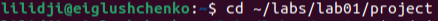
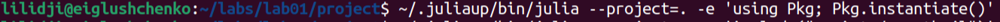
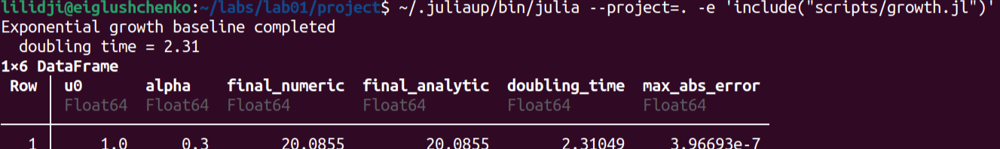
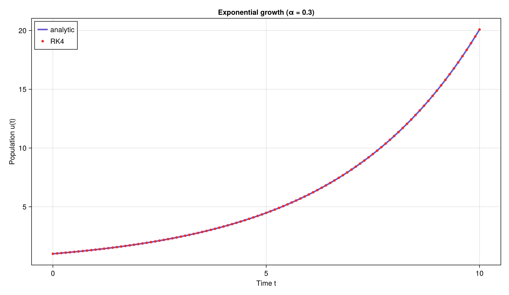
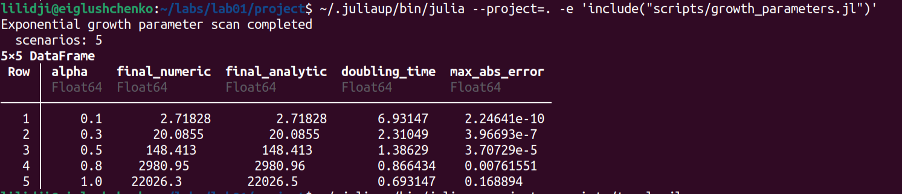
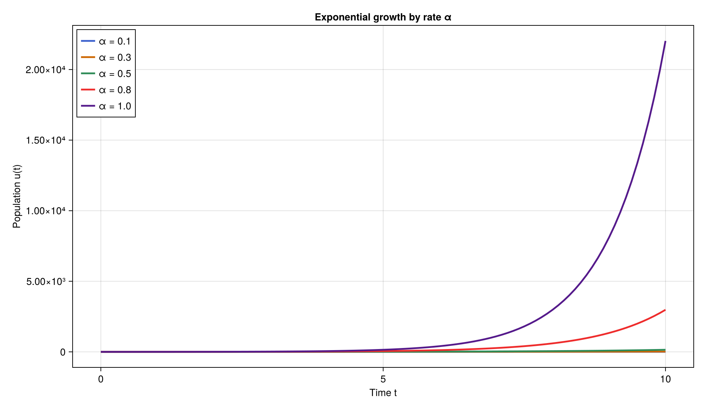
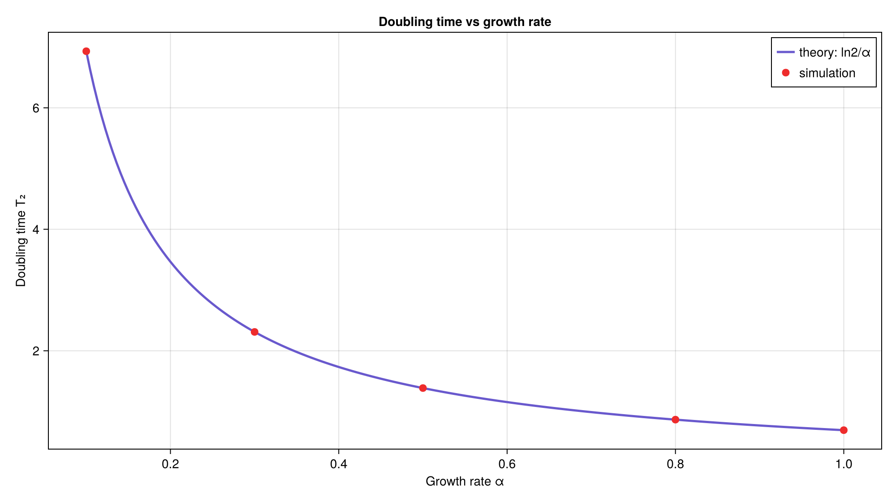
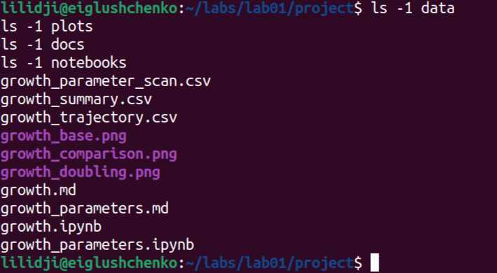

# Отчёт по лабораторной работе №1
Глущенко Евгений Игоревич
2026-05-29

- [<span class="toc-section-number">1</span> Цель работы](#цель-работы)
- [<span class="toc-section-number">2</span> Задание](#задание)
- [<span class="toc-section-number">3</span> Теоретическое
  введение](#теоретическое-введение)
  - [<span class="toc-section-number">3.1</span> Программная
    инженерия](#программная-инженерия)
  - [<span class="toc-section-number">3.2</span> Системы контроля
    версий](#системы-контроля-версий)
  - [<span class="toc-section-number">3.3</span> Модель
    экспоненциального роста](#модель-экспоненциального-роста)
  - [<span class="toc-section-number">3.4</span> Литературное
    программирование](#литературное-программирование)
- [<span class="toc-section-number">4</span> Выполнение лабораторной
  работы](#выполнение-лабораторной-работы)
  - [<span class="toc-section-number">4.1</span> Подготовка
    стенда](#подготовка-стенда)
  - [<span class="toc-section-number">4.2</span> Структура
    проекта](#структура-проекта)
  - [<span class="toc-section-number">4.3</span> Команды
    воспроизведения](#команды-воспроизведения)
  - [<span class="toc-section-number">4.4</span> Реализация
    модели](#реализация-модели)
  - [<span class="toc-section-number">4.5</span> Базовый
    эксперимент](#базовый-эксперимент)
  - [<span class="toc-section-number">4.6</span> Параметрическое
    исследование](#параметрическое-исследование)
  - [<span class="toc-section-number">4.7</span> Генерация
    literate-материалов](#генерация-literate-материалов)
- [<span class="toc-section-number">5</span> Выводы](#выводы)
- [<span class="toc-section-number">6</span> Приложение. Команды
  воспроизведения](#приложение-команды-воспроизведения)

# Цель работы

Освоить инструменты программной инженерии (git, семантическое
версионирование, общепринятые коммиты), подготовить рабочее пространство
курса «Имитационное моделирование», познакомиться с языком Julia и
пакетом DrWatson, реализовать модель экспоненциального роста в
литературном стиле программирования, сгенерировать из единого источника
производные форматы и провести параметрическое исследование модели.

Исполнитель работы: Глущенко Евгений Игоревич. Группа: НФИбд-01-23.
Студенческий билет: 1132239110.

# Задание

1.  Создать рабочий каталог курса и рабочее пространство лабораторной
    работы.
2.  Освоить семантическое версионирование и общепринятые коммиты.
3.  Настроить git, ssh- и gpg-ключи.
4.  Установить язык Julia и необходимые пакеты.
5.  Выполнить предложенный код модели экспоненциального роста.
6.  Преобразовать код в литературный стиль.
7.  Сгенерировать из литературного кода чистый код, Jupyter notebook и
    документацию Quarto.
8.  Выполнить код из notebook и интегрировать документацию в отчёт.
9.  Добавить вычисление для набора параметров и повторить генерацию
    артефактов.

# Теоретическое введение

## Программная инженерия

Семантическое версионирование задаёт номер версии в виде
`МАЖОРНАЯ.МИНОРНАЯ.ПАТЧ` \[1\]: мажорная версия увеличивается при
обратно несовместимых изменениях API, минорная — при добавлении
функциональности с сохранением совместимости, патч — при обратно
совместимых исправлениях.

Спецификация общепринятых коммитов (Conventional Commits) регламентирует
структуру сообщений фиксации \[2\]. Сообщение имеет вид
`<тип>(<область>): <описание>`, где основные типы — `feat` (новая
функция, соответствует MINOR), `fix` (исправление, соответствует PATCH),
а также `docs`, `style`, `refactor`, `perf`, `test`, `build`, `ci`.
Критические изменения помечаются `BREAKING CHANGE` и соответствуют
MAJOR.

## Системы контроля версий

Git — распределённая система контроля версий, в которой каждый участник
хранит полную копию истории. Базовые операции: `git init`, `git add`,
`git commit`, `git push`, `git pull`, ветвление через `git checkout -b`
и слияние `git merge --no-ff`. Для идентификации на сервере репозиториев
применяются ssh-ключи (рекомендуется `ed25519` или `rsa` 4096 бит), а
для подтверждения авторства — подпись коммитов ключами gpg.

## Модель экспоненциального роста

Экспоненциальный рост — процесс, в котором скорость роста величины
пропорциональна её текущему значению \[3\]. Модель задаётся
дифференциальным уравнением

$$\frac{du}{dt} = \alpha u, \qquad u(0) = u_0,$$

где `u` — растущая величина (численность популяции, капитал), `α` —
константа роста (мальтузианский параметр). Аналитическое решение

$$u(t) = u_0 e^{\alpha t}.$$

Время удвоения величины — время `T₂`, за которое значение удваивается:

$$T_2 = \frac{\ln 2}{\alpha} \approx \frac{0{,}693}{\alpha}.$$

При `α > 0` наблюдается рост, при `α < 0` — экспоненциальное затухание.
Модель применяется в биологии, финансах и в начальной фазе
распространения инфекции \[4\].

## Литературное программирование

Литературное программирование объединяет код и его описание в одном
документе \[5\]. Проект организован на `DrWatson.jl` \[6\], а из единого
литературного источника пакет `Literate.jl` \[7\] порождает чистый
скрипт, документ Markdown и исполняемый Jupyter notebook. Расчёты
выполнены на языке Julia \[8\].

# Выполнение лабораторной работы

## Подготовка стенда

Базовая настройка git — имя, почта, кодировка вывода и ветка по
умолчанию:

``` bash
git config --global user.name "Name Surname"
git config --global user.email "work@mail"
git config --global core.quotepath false
git config --global init.defaultBranch master
git config --global core.autocrlf input
git config --global core.safecrlf warn
```

Генерация ssh-ключа для идентификации на сервере репозиториев:

``` bash
ssh-keygen -t ed25519 -C "Name Surname <work@mail>"
```

Генерация gpg-ключа для подписи коммитов и его экспорт:

``` bash
gpg --full-generate-key
gpg --list-secret-keys --keyid-format LONG
gpg --armor --export <PGP Fingerprint>
```

## Структура проекта

Рабочий каталог лабораторной работы организован в структуре `DrWatson`:

- `project/src/ExponentialGrowth.jl` — модуль с численным решением,
  аналитикой, временем удвоения, параметрическим сканированием и
  графиками;
- `project/scripts/growth.jl` — базовый эксперимент;
- `project/scripts/growth_parameters.jl` — параметрическое исследование;
- `project/scripts/growth_literate.jl`, `growth_parameters_literate.jl`
  — литературные источники;
- `project/scripts/tangle.jl` — генератор literate-артефактов;
- `project/data/`, `project/plots/`, `project/docs/`,
  `project/notebooks/` — таблицы, графики, markdown- и
  notebook-материалы;
- `report/` и `presentation/` — отчёт и презентация на Quarto.

## Команды воспроизведения

``` bash
cd ~/labs/lab01/project
~/.juliaup/bin/julia --project=. -e 'using Pkg; Pkg.instantiate()'
~/.juliaup/bin/julia --project=. -e 'include("scripts/growth.jl")'
~/.juliaup/bin/julia --project=. -e 'include("scripts/growth_parameters.jl")'
~/.juliaup/bin/julia --project=. scripts/tangle.jl
```

### Фактическое выполнение команд

Переход в каталог проекта
(<a href="#fig-cd" class="quarto-xref">Рисунок 1</a>) и активация
зависимостей через `Pkg.instantiate()`
(<a href="#fig-instantiate" class="quarto-xref">Рисунок 2</a>).

<div id="fig-cd">



Рисунок 1: Переход в каталог проекта `lab01`

</div>

<div id="fig-instantiate">



Рисунок 2: Активация окружения проекта через `Pkg.instantiate()`

</div>

Окружение поднято из `Project.toml` и `Manifest.toml`, после чего все
сценарии запускались в одном воспроизводимом окружении.

## Реализация модели

Аналитическое решение и время удвоения заданы напрямую, а численное
решение получено методом Рунге–Кутты 4-го порядка:

``` julia
analytic_growth(u0, α, t) = u0 * exp(α * t)
doubling_time(α) = log(2) / α

function run_growth(u0, α, tspan; dt = 0.1)
    t0, tf = tspan
    nsteps = Int(round((tf - t0) / dt))
    u = Float64(u0)
    # ... массивы ts, us, ua ...
    for step in 1:nsteps
        k1 = α * u
        k2 = α * (u + dt / 2 * k1)
        k3 = α * (u + dt / 2 * k2)
        k4 = α * (u + dt * k3)
        u = u + dt / 6 * (k1 + 2k2 + 2k3 + k4)
        # запись ts, us, ua = analytic_growth(u0, α, t + dt)
    end
    return DataFrame(t = ts, u = us, u_analytic = ua, abs_error = abs.(us .- ua))
end
```

## Базовый эксперимент

Для базового сценария использованы параметры `u0 = 1.0`, `α = 0.3`,
интервал `t ∈ [0, 10]`, шаг `dt = 0.1`. Вывод запуска:

``` text
Exponential growth baseline completed
  doubling time = 2.31
```

На <a href="#fig-growth-run" class="quarto-xref">Рисунок 3</a> показан
фактический запуск базового сценария `scripts/growth.jl` с выводом
сводной таблицы.

<div id="fig-growth-run">



Рисунок 3: Запуск базового сценария `scripts/growth.jl`

</div>

Сводка прогона приведена в
<a href="#tbl-growth-summary" class="quarto-xref">Таблица 1</a>.

<div id="tbl-growth-summary">

Таблица 1: Сводка базового эксперимента

| `u0` | `α` | `final_numeric` | `final_analytic` | `doubling_time` | `max_abs_error` |
|-----:|----:|----------------:|-----------------:|----------------:|----------------:|
|  1.0 | 0.3 |         20.0855 |          20.0855 |          2.3105 |       3.97·10⁻⁷ |

</div>

Численное решение совпадает с аналитическим `u(10) = e³ ≈ 20.0855` с
максимальной абсолютной погрешностью порядка `10⁻⁷`, что подтверждает
корректность реализации метода Рунге–Кутты. График приведён на
<a href="#fig-growth-base" class="quarto-xref">Рисунок 4</a>.

<div id="fig-growth-base">



Рисунок 4: Экспоненциальный рост при `α = 0.3`: численное решение и
аналитическая кривая

</div>

Точки численного решения ложатся точно на аналитическую кривую
`u(t) = u0 e^{α t}`.

### Фрагмент временного ряда `growth_trajectory.csv`

Первые строки временного ряда приведены в
<a href="#tbl-growth-traj" class="quarto-xref">Таблица 2</a>.

<div id="tbl-growth-traj">

Таблица 2: Начало временного ряда `growth_trajectory.csv`

| `t` |     `u` | `u_analytic` | `abs_error` |
|----:|--------:|-------------:|------------:|
| 0.0 | 1.00000 |      1.00000 |         0.0 |
| 0.1 | 1.03045 |      1.03045 |   2.0·10⁻¹⁰ |
| 0.2 | 1.06184 |      1.06184 |   4.2·10⁻¹⁰ |
| 0.3 | 1.09417 |      1.09417 |   6.5·10⁻¹⁰ |
| 0.4 | 1.12750 |      1.12750 |   8.9·10⁻¹⁰ |

</div>

## Параметрическое исследование

В сценарии `scripts/growth_parameters.jl` исследуется влияние скорости
роста на сетке `α ∈ {0.1, 0.3, 0.5, 0.8, 1.0}`. Вывод сценария:

``` text
Exponential growth parameter scan completed
  scenarios: 5
```

На <a href="#fig-growth-params-run" class="quarto-xref">Рисунок 5</a>
показан фактический запуск параметрического исследования
`scripts/growth_parameters.jl`.

<div id="fig-growth-params-run">



Рисунок 5: Запуск сценария `scripts/growth_parameters.jl`

</div>

Результаты приведены в
<a href="#tbl-growth-scan" class="quarto-xref">Таблица 3</a>.

<div id="tbl-growth-scan">

Таблица 3: Результаты параметрического сканирования

| `α` | `final_numeric` | `final_analytic` | `doubling_time` | `max_abs_error` |
|----:|----------------:|-----------------:|----------------:|----------------:|
| 0.1 |          2.7183 |           2.7183 |          6.9315 |       2.2·10⁻¹⁰ |
| 0.3 |         20.0855 |          20.0855 |          2.3105 |        4.0·10⁻⁷ |
| 0.5 |         148.413 |          148.413 |          1.3863 |        3.7·10⁻⁵ |
| 0.8 |         2980.95 |          2980.96 |          0.8664 |        7.6·10⁻³ |
| 1.0 |         22026.3 |          22026.5 |          0.6931 |        1.7·10⁻¹ |

</div>

С ростом `α` итоговая численность растёт экспоненциально (от `e¹ ≈ 2.72`
до `e¹⁰ ≈ 22026`), а время удвоения убывает по закону `T₂ = ln2/α`.
Абсолютная погрешность численного решения растёт вместе с величиной `u`,
но относительная погрешность остаётся малой (порядка `10⁻⁶` даже при
`α = 1.0`). Сравнение траекторий приведено на
<a href="#fig-growth-comparison" class="quarto-xref">Рисунок 6</a>.

<div id="fig-growth-comparison">



Рисунок 6: Траектории экспоненциального роста для разных `α`

</div>

Чем больше `α`, тем круче кривая роста. На
<a href="#fig-growth-doubling" class="quarto-xref">Рисунок 7</a>
показана зависимость времени удвоения от `α`.

<div id="fig-growth-doubling">



Рисунок 7: Зависимость времени удвоения от `α`: имитация и теория
`ln2/α`

</div>

Имитационные точки точно ложатся на теоретическую гиперболу
`T₂ = ln2/α`, что подтверждает согласованность численного решения с
аналитикой.

## Генерация literate-материалов

Сценарий `scripts/tangle.jl` формирует производные представления из
литературных источников:

``` julia
for script_path in scripts
    name = replace(splitext(basename(script_path))[1], "_literate" => "")
    Literate.script(script_path, scriptsdir(); name = "$(name)_clean", credit = false)
    Literate.notebook(script_path, projectdir("notebooks"); name = name, execute = true, credit = false)
    Literate.markdown(script_path, projectdir("docs"); name = name, credit = false)
end
```

После запуска были получены `docs/growth.md`,
`docs/growth_parameters.md`, `notebooks/growth.ipynb`,
`notebooks/growth_parameters.ipynb`, `scripts/growth_clean.jl`,
`scripts/growth_parameters_clean.jl`. Вывод сценария:

``` text
generated for growth
generated for growth_parameters
```

На <a href="#fig-tangle-run" class="quarto-xref">Рисунок 8</a> показан
фактический запуск `scripts/tangle.jl` с генерацией `clean`-скриптов,
`markdown`-документов и исполняемых notebook-файлов.

<div id="fig-tangle-run">


Рисунок 8: Запуск сценария `scripts/tangle.jl`

</div>

Notebook-файлы выполняются при генерации (`execute = true`), что
подтверждает работоспособность кода. После генерации выполнена проверка
состава каталогов `data/`, `plots/`, `docs/` и `notebooks/`
(<a href="#fig-check-files" class="quarto-xref">Рисунок 9</a>).

<div id="fig-check-files">



Рисунок 9: Проверка содержимого каталогов результатов

</div>

# Выводы

В ходе работы освоены инструменты программной инженерии (семантическое
версионирование, общепринятые коммиты, git, ssh, gpg) и подготовлено
рабочее пространство курса. Реализована модель экспоненциального роста
`du/dt = α·u` методом Рунге–Кутты 4-го порядка; численное решение
совпало с аналитическим `u(t) = u0 e^{α t}` с погрешностью порядка
`10⁻⁷` для базового сценария. Параметрическое исследование на сетке `α`
подтвердило закон убывания времени удвоения `T₂ = ln2/α`. Код оформлен в
литературном стиле, из единого источника с помощью `Literate.jl`
получены чистые скрипты, markdown-документы и исполняемые
notebook-файлы.

# Приложение. Команды воспроизведения

``` bash
cd ~/labs/lab01/project
~/.juliaup/bin/julia --project=. -e 'using Pkg; Pkg.instantiate()'
~/.juliaup/bin/julia --project=. -e 'include("scripts/growth.jl")'
~/.juliaup/bin/julia --project=. -e 'include("scripts/growth_parameters.jl")'
~/.juliaup/bin/julia --project=. scripts/tangle.jl
cd ~/labs/lab01/report
quarto render simulation-modeling-lab01-report.qmd --to pdf
quarto render simulation-modeling-lab01-report.qmd --to docx
cd ~/labs/lab01/presentation
quarto render simulation-modeling-lab01-presentation.qmd --to beamer
quarto render simulation-modeling-lab01-presentation.qmd --to revealjs
quarto render simulation-modeling-lab01-presentation.qmd --to pptx
```

<div id="refs" class="references csl-bib-body" entry-spacing="0">

<div id="ref-semver_2013" class="csl-entry">

<span class="csl-left-margin">1.
</span><span class="csl-right-inline">Preston-Werner T. [Semantic
Versioning 2.0.0](https://semver.org/). 2013.</span>

</div>

<div id="ref-conventional_commits" class="csl-entry">

<span class="csl-left-margin">2.
</span><span class="csl-right-inline">Conventional Commits.
[Conventional Commits 1.0.0](https://www.conventionalcommits.org/).
2023.</span>

</div>

<div id="ref-malthus_1798" class="csl-entry">

<span class="csl-left-margin">3.
</span><span class="csl-right-inline">Malthus T. R. An Essay on the
Principle of Population. London: J. Johnson, 1798.</span>

</div>

<div id="ref-strogatz_2014" class="csl-entry">

<span class="csl-left-margin">4.
</span><span class="csl-right-inline">Strogatz S. H. Nonlinear Dynamics
and Chaos. 2-е изд. Boulder, CO: Westview Press, 2014.</span>

</div>

<div id="ref-knuth_1984" class="csl-entry">

<span class="csl-left-margin">5.
</span><span class="csl-right-inline">Knuth D. E. [Literate
Programming](https://doi.org/10.1093/comjnl/27.2.97) // The Computer
Journal. 1984. Т. 27, № 2. С. 97–111.</span>

</div>

<div id="ref-drwatson" class="csl-entry">

<span class="csl-left-margin">6.
</span><span class="csl-right-inline"><span class="nocase">Datseris G. и
др.</span> [DrWatson.jl
Documentation](https://juliadynamics.github.io/DrWatson.jl/stable/).
2024.</span>

</div>

<div id="ref-literate_jl" class="csl-entry">

<span class="csl-left-margin">7.
</span><span class="csl-right-inline"><span class="nocase">Ekre F.,
contributors</span>. [Literate.jl
Documentation](https://fredrikekre.github.io/Literate.jl/v2/).
2024.</span>

</div>

<div id="ref-julia_2017" class="csl-entry">

<span class="csl-left-margin">8.
</span><span class="csl-right-inline">Bezanson J. и др. [Julia: A Fresh
Approach to Numerical Computing](https://doi.org/10.1137/141000671).
2017.</span>

</div>

</div>
