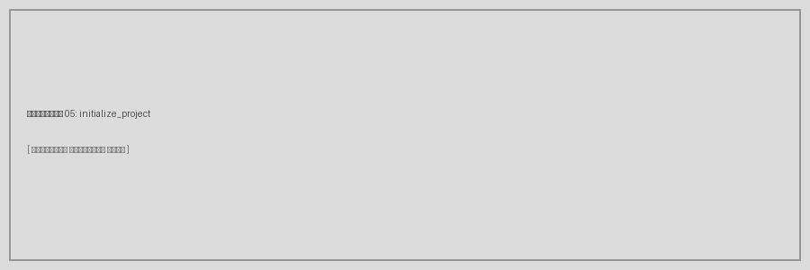
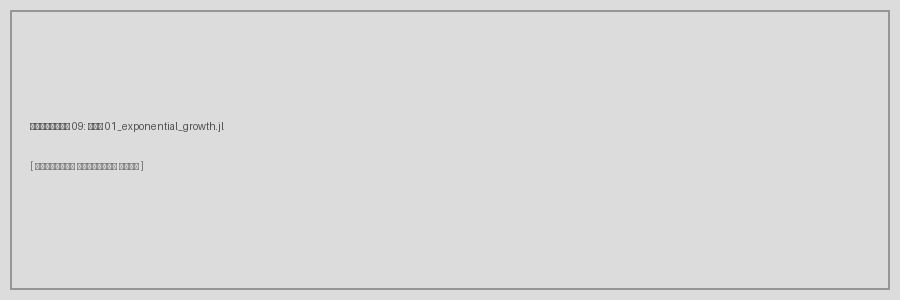

---
## Author
author:
  name: Имя Фамилия
  degrees: Студент
  email: 1132239110@rudn.ru
  affiliation:
    - name: Российский университет дружбы народов
      country: Российская Федерация
      postal-code: 117198
      city: Москва
      address: ул. Миклухо-Маклая, д. 6

## Title
title: "Лабораторная работа №1"
subtitle: "Подготовка рабочего пространства. Модель экспоненциального роста"
license: "CC BY"
---

# Цель работы

Целью данной лабораторной работы является:

- освоение инструментов программной инженерии (git, семантическое версионирование,
  общепринятые коммиты);
- создание рабочего каталога курса «Имитационное моделирование»;
- знакомство с языком программирования Julia и пакетом DrWatson;
- реализация модели экспоненциального роста в литературном стиле программирования;
- генерация производных форматов (чистый код, Jupyter Notebook, Quarto-документация);
- проведение параметрического исследования модели.

# Задание

1. Создать рабочий каталог для всего курса.
2. Создать рабочее пространство для программ в рамках лабораторной работы.
3. Выполнить все задания по тексту лабораторной работы.
4. Установить необходимые пакеты.
5. Выполнить предложенный код.
6. Преобразовать код в литературный стиль.
7. Сгенерировать из литературного кода: чистый код, Jupyter notebook,
   документацию в формате Quarto.
8. Выполнить код из Jupyter notebook.
9. Интегрировать документацию в формате Quarto в отчёт.
10. Добавить в код в литературном стиле вычисление для набора параметров.
11. Сгенерировать из литературного кода с параметрами: чистый код, Jupyter notebook,
    документацию в формате Quarto.
12. Выполнить код из Jupyter notebook с параметрами.
13. Интегрировать документацию с параметрами в формате Quarto в отчёт.

# Теоретическое введение

## Модель экспоненциального роста

Экспоненциальный рост — это процесс увеличения величины, при котором скорость
роста в каждый момент времени пропорциональна текущему значению этой величины.

**Дифференциальное уравнение:**

$$\frac{du}{dt} = \alpha u, \quad u(0) = u_0$$

где:

- $u$ — текущее значение растущей величины (численность популяции, капитал и т.д.);
- $t$ — время;
- $du/dt$ — скорость роста;
- $\alpha$ — константа роста (мальтузианский параметр): если $\alpha > 0$ — рост,
  если $\alpha < 0$ — экспоненциальное затухание.

**Аналитическое решение:**

$$u(t) = u_0 e^{\alpha t}$$

**Время удвоения** — время $T_2$, за которое величина удваивается:

$$T_2 = \frac{\ln 2}{\alpha} \approx \frac{0.693}{\alpha}$$

Модель применяется в биологии (рост популяций), финансах (сложный процент),
эпидемиологии (начальная фаза распространения инфекции) и других областях [@tanenbaum_book_modern-os_ru].

## Литературное программирование

Литературное программирование (Literate Programming) — подход, при котором
программный код и его описание объединяются в одном документе. Из такого
документа можно автоматически извлечь как исполняемый код, так и
документацию [@robbins_book_bash_en].

В данной работе используется пакет `Literate.jl` для языка Julia, который
позволяет генерировать:

- чистый исполняемый `.jl`-скрипт;
- Jupyter Notebook (`.ipynb`);
- документ в формате Quarto (`.qmd`).

# Выполнение лабораторной работы

## 1. Настройка git

Перед началом работы была выполнена базовая настройка системы контроля
версий git: заданы имя пользователя, email и параметры переноса строк.

{#fig-01 width=90%}

## 2. Создание рабочего каталога курса

Создана иерархия каталогов для курса «Имитационное моделирование»
в соответствии со стандартом именования Denote:

```
~/work/study/2026-1/2026-1==study--simulation-modeling/
```

{#fig-02 width=90%}

{#fig-03 width=90%}

## 3. Создание проекта DrWatson

В каталоге `labs/lab01` создан проект DrWatson — пакет Julia для
организации научных вычислительных проектов.

{#fig-04 width=90%}

{#fig-05 width=90%}

{#fig-06 width=90%}

## 4. Установка необходимых пакетов

Установлены все необходимые Julia-пакеты: DrWatson, DifferentialEquations,
Plots, DataFrames, CSV, JLD2, Literate, IJulia, BenchmarkTools.

{#fig-07 width=90%}

{#fig-08 width=90%}

## 5. Литературная реализация модели (скрипт 01)

Создан скрипт `scripts/01_exponential_growth.jl` в литературном стиле.
Скрипт содержит как код, так и описание на естественном языке.

{#fig-09 width=90%}

## 6. Запуск базового скрипта

Скрипт выполнен командой `julia --project=project scripts/01_exponential_growth.jl`.
Выведена таблица результатов и аналитическое время удвоения популяции.

{#fig-10 width=90%}

{#fig-11 width=90%}

## 7. Скрипт tangle.jl для генерации форматов

Создан скрипт `scripts/tangle.jl`, который генерирует из литературного
кода три формата: чистый скрипт, Quarto-документ и Jupyter Notebook.

{#fig-12 width=90%}

## 8. Генерация производных форматов (скрипт 01)

Из литературного скрипта 01 сгенерированы три производных формата.

{#fig-13 width=90%}

{#fig-14 width=90%}

## 9. Выполнение Jupyter Notebook (скрипт 01)

Jupyter Notebook выполнен командой `jupyter nbconvert --execute`.

{#fig-15 width=90%}

## 10. Параметрическая реализация модели (скрипт 02)

Создан скрипт `scripts/02_exponential_growth.jl` с параметрическим
исследованием. Используется сетка значений $\alpha \in \{0.1, 0.3, 0.5, 0.8, 1.0\}$.

{#fig-16 width=90%}

## 11. Запуск параметрического скрипта 02

Скрипт выполняет 5 экспериментов, сохраняет результаты и строит сравнительные графики.

{#fig-17 width=90%}

{#fig-18 width=90%}

{#fig-19 width=90%}

## 12. Генерация производных форматов (скрипт 02)

{#fig-20 width=90%}

## 13. Выполнение Jupyter Notebook (скрипт 02)

{#fig-21 width=90%}

## 14. Итоговая структура проекта

{#fig-22 width=90%}

## 15. Результаты моделирования

### Базовая модель (α = 0.3)

{#fig-23 width=80%}

### Параметрическое исследование

{#fig-24 width=80%}

{#fig-25 width=80%}

# Выводы

В ходе выполнения лабораторной работы были получены следующие результаты:

1. Создана структура рабочего пространства курса в соответствии с требованиями
   методического пособия (стандарт Denote, Git Flow).

2. Установлен язык программирования Julia и все необходимые пакеты для работы
   с моделями имитационного моделирования.

3. Реализована модель экспоненциального роста $\frac{du}{dt} = \alpha u$ с
   использованием пакета `DifferentialEquations.jl`.

4. Код преобразован в литературный стиль с помощью пакета `Literate.jl`.
   Из него успешно сгенерированы: чистый скрипт, Jupyter Notebook и
   Quarto-документ.

5. Проведено параметрическое исследование: показано, что при увеличении $\alpha$
   скорость роста возрастает, а время удвоения убывает по закону
   $T_2 = \ln(2)/\alpha$.

6. Численное решение полностью согласуется с аналитическим $u(t) = u_0 e^{\alpha t}$.

# Список литературы{.unnumbered}

::: {#refs}
:::
