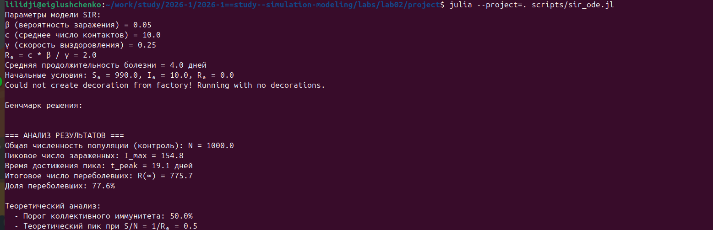
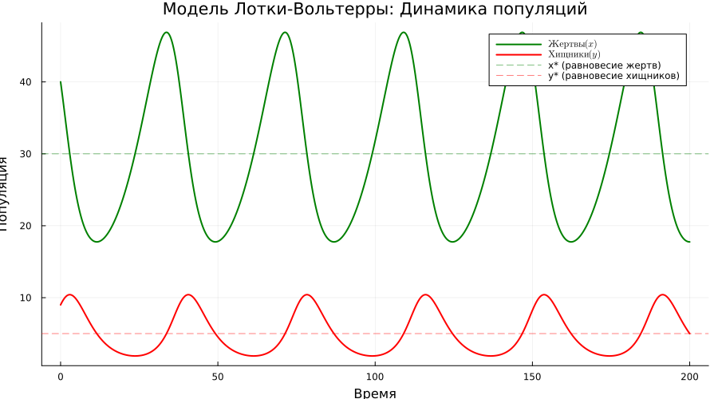
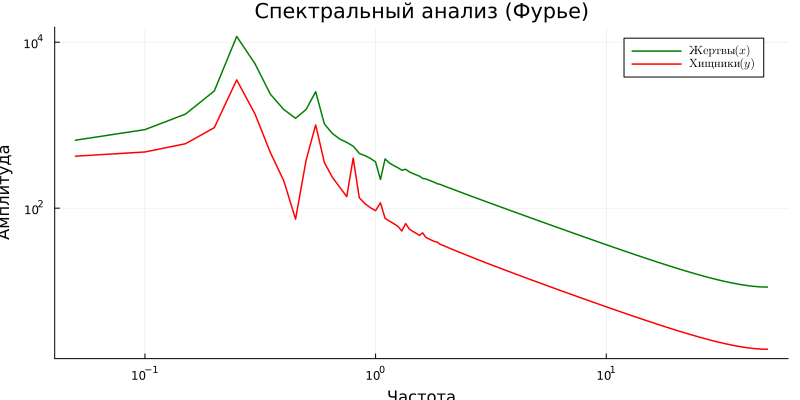
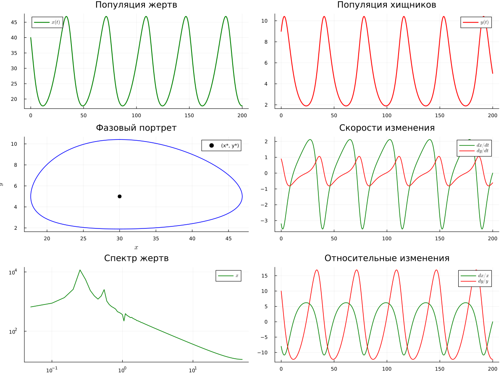
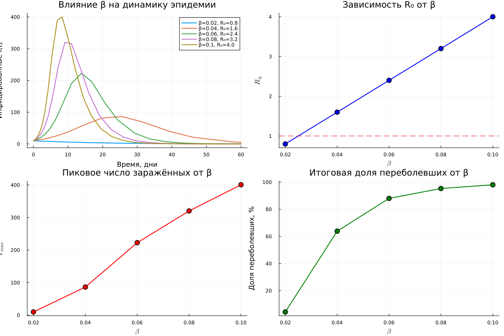
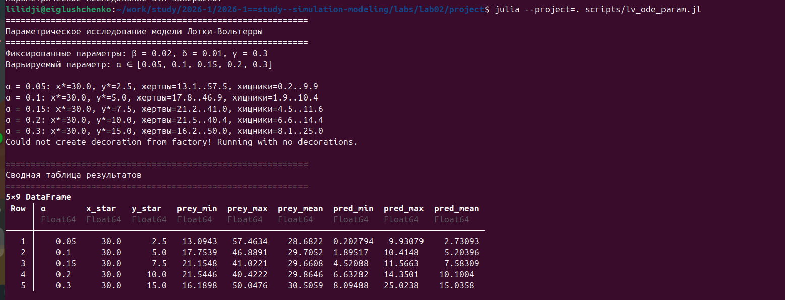
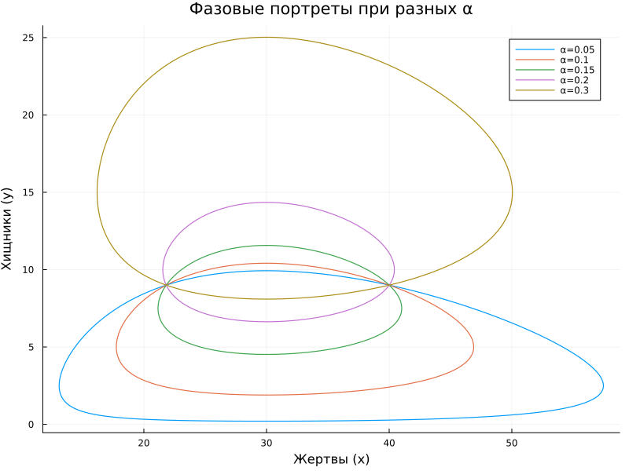
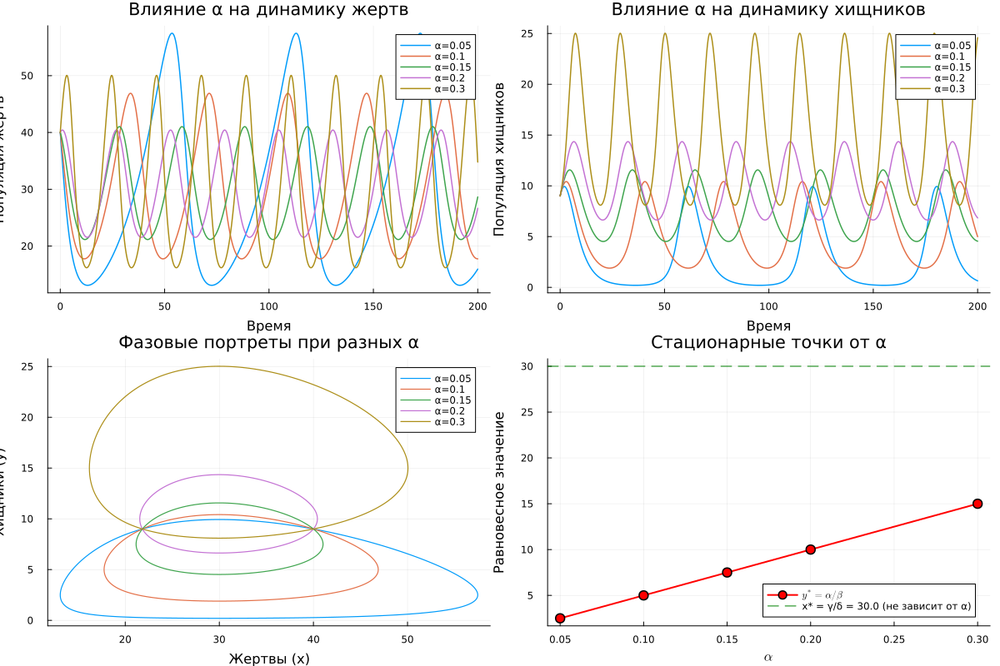
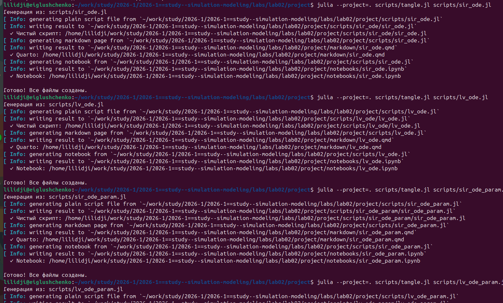

---
## Author
author:
  name: Глущенко Евгений
  affiliation:
    - name: Российский университет дружбы народов
      country: Российская Федерация
      postal-code: 117198
      city: Москва
      address: ул. Миклухо-Маклая, д. 6
## Title
title: "Лабораторная работа №2"
subtitle: "Основные модели: SIR и Лотки-Вольтерры"
license: CC BY
date: today
date-format: "YYYY-MM-DD"
---

# Цель работы

## Цель работы

- Изучить модель SIR (эпидемиология)
- Изучить модель Лотки-Вольтерры (хищник-жертва)
- Реализовать модели на Julia (DifferentialEquations.jl)
- Преобразовать код в литературный стиль (Literate.jl)
- Сгенерировать Jupyter Notebook и Quarto-документацию

# Модель SIR

## Модель SIR --- теория

**Трёхпараметрическая модель:**

$$\frac{dS}{dt} = -\beta c \frac{IS}{N}, \quad \frac{dI}{dt} = \beta c \frac{IS}{N} - \gamma I, \quad \frac{dR}{dt} = \gamma I$$

| Параметр | Смысл |
|----------|-------|
| $\beta$ | вероятность заражения (0--1) |
| $c$ | число контактов в день |
| $\gamma$ | скорость выздоровления |
| $R_0 = c\beta/\gamma$ | базовое репродуктивное число |

## Параметры SIR

| Параметр | Значение |
|----------|---------|
| $\beta$ | 0.05 |
| $c$ | 10 |
| $\gamma$ | 0.25 |
| $R_0$ | **2.0** |
| $S_0, I_0, R_0$ | 990, 10, 0 |

## Запуск SIR модели

{width=90%}

## Результаты SIR

| Показатель | Значение |
|-----------|---------|
| Пик заражённых $I_{max}$ | 154.8 |
| Время пика | 19.1 дней |
| Переболело $R(\infty)$ | 775.7 (77.6%) |
| Порог иммунитета | 50% |

## Динамика эпидемии SIR

{width=95%}

## Кривая заражённых I(t)

{width=95%}

## Доли населения и порог иммунитета

{width=95%}

## Фазовый портрет SIR

{width=90%}

## Эффективное репродуктивное число

{width=95%}

## Панель графиков SIR

{width=95%}

# Модель Лотки-Вольтерры

## Модель Лотки-Вольтерры --- теория

**Система хищник-жертва:**

$$\frac{dx}{dt} = \alpha x - \beta xy, \quad \frac{dy}{dt} = \delta xy - \gamma y$$

| Параметр | Смысл |
|----------|-------|
| $\alpha$ | рождаемость жертв |
| $\beta$ | поедание жертв |
| $\delta$ | конверсия пищи в хищников |
| $\gamma$ | смертность хищников |

Стационарные точки: $x^* = \gamma/\delta$, $y^* = \alpha/\beta$

## Параметры Лотки-Вольтерры

| Параметр | Значение |
|----------|---------|
| $\alpha$ | 0.1 |
| $\beta$ | 0.02 |
| $\delta$ | 0.01 |
| $\gamma$ | 0.3 |
| $x_0, y_0$ | 40, 9 |
| $x^*, y^*$ | 30.0, 5.0 |

## Запуск модели Лотки-Вольтерры

{width=90%}

## Результаты Лотки-Вольтерры

| Показатель | Значение |
|-----------|---------|
| Жертвы: мин/макс/среднее | 17.75 / 46.89 / 29.71 |
| Хищники: мин/макс/среднее | 1.90 / 10.41 / 5.20 |
| Период колебаний | ~36.4 ед. |

## Динамика популяций

{width=95%}

## Фазовый портрет с изоклинами

{width=90%}

## Спектральный анализ Фурье

{width=95%}

## Панель графиков Лотки-Вольтерры

{width=95%}

# Параметрические исследования

## Параметрическое исследование SIR

Варьируемый параметр: $\beta \in [0.02, 0.04, 0.06, 0.08, 0.1]$

| $\beta$ | $R_0$ | $I_{max}$ | $t_{peak}$ | $R(\infty)$, % |
|---------|-------|-----------|-----------|----------------|
| 0.02 | 0.8 | 10.0 | 0.0 | 4.4 |
| 0.04 | 1.6 | 86.4 | 25.5 | 63.9 |
| 0.06 | 2.4 | 222.7 | 13.8 | 88.0 |
| 0.10 | 4.0 | 400.6 | 8.3 | 98.0 |

## Запуск параметрического SIR

{width=90%}

## Влияние β на динамику эпидемии

{width=95%}

## Панель параметрического исследования SIR

{width=95%}

## Параметрическое исследование Лотки-Вольтерры

Варьируемый параметр: $\alpha \in [0.05, 0.1, 0.15, 0.2, 0.3]$

| $\alpha$ | $y^*$ | Жертвы: мин--макс | Хищники: мин--макс |
|----------|-------|-------------------|-------------------|
| 0.05 | 2.5 | 13.1--57.5 | 0.2--9.9 |
| 0.10 | 5.0 | 17.8--46.9 | 1.9--10.4 |
| 0.20 | 10.0 | 21.5--40.4 | 6.6--14.4 |
| 0.30 | 15.0 | 16.2--50.0 | 8.1--25.0 |

## Запуск параметрического Лотки-Вольтерры

{width=90%}

## Фазовые портреты при разных α

{width=90%}

## Панель параметрического исследования Лотки-Вольтерры

{width=95%}

# Литературное программирование

## Генерация литературных версий

{width=90%}

## Выполнение Jupyter Notebooks

{width=90%}

## Итоговая структура проекта

{width=90%}

# Выводы

## Выводы

1. Реализована модель SIR: $R_0 = 2.0$, пик --- 154.8 на 19.1 день, переболело 77.6%
2. Реализована модель Лотки-Вольтерры: циклические колебания с периодом ~36 ед.
3. Параметрическое исследование SIR: при $R_0 < 1$ эпидемия не развивается
4. Параметрическое исследование ЛВ: $y^*$ растёт линейно с $\alpha$
5. Сгенерированы литературные версии и выполнены Jupyter Notebooks
6. Результаты согласуются с теорией
