---
## Author
author:
  name: Глущенко Евгений
  affiliation:
    - name: Российский университет дружбы народов
      country: Российская Федерация
      postal-code: 117198
      city: Москва
      address: ул. Миклухо-Маклая, д. 6

## Title
title: "Лабораторная работа №2"
subtitle: "Основные модели. Модель SIR и модель Лотки-Вольтерры"
license: "CC BY"
---

# Цель работы

Целью данной лабораторной работы является:

- изучение трёхпараметрической модели SIR (эпидемиология);
- изучение модели Лотки-Вольтерры (экология, хищник-жертва);
- реализация моделей на языке Julia с использованием пакета DifferentialEquations.jl;
- выполнение кода в литературном стиле программирования с помощью Literate.jl;
- генерация производных форматов (чистый код, Jupyter Notebook, Quarto-документация);
- анализ результатов моделирования и построение графиков.

# Задание

1. Создать рабочий каталог для кода.
2. Установить необходимые пакеты.
3. Выполнить предложенный код.
4. Преобразовать код в литературный стиль.
5. Сгенерировать из литературного кода: чистый код, Jupyter notebook, документацию в формате Quarto.
6. Выполнить код из Jupyter notebook.
7. Интегрировать документацию в формате Quarto в отчёт.

# Теоретическое введение

## Модель SIR

Модель SIR --- классическая математическая модель эпидемиологии, описывающая распространение инфекционного заболевания в закрытой популяции.

Модель делит популяцию на три группы:

- $S$ --- восприимчивые (Susceptible): не болеют, могут заразиться;
- $I$ --- инфицированные (Infectious): больны и заразны;
- $R$ --- выздоровевшие (Recovered): переболели и имеют иммунитет.

### Трёхпараметрическая модель

Система уравнений:

$$\frac{dS}{dt} = -\beta c \frac{IS}{N}, \quad \frac{dI}{dt} = \beta c \frac{IS}{N} - \gamma I, \quad \frac{dR}{dt} = \gamma I$$

Параметры:

- $\beta$ --- вероятность передачи инфекции при контакте (0--1);
- $c$ --- среднее число контактов в единицу времени;
- $\gamma$ --- скорость выздоровления ($1/\gamma$ --- средняя продолжительность болезни).

Базовое репродуктивное число: $R_0 = \frac{c \cdot \beta}{\gamma}$. При $R_0 > 1$ эпидемия растёт, при $R_0 < 1$ --- затухает.

Порог коллективного иммунитета: $1 - 1/R_0$.

## Модель Лотки-Вольтерры

Модель Лотки-Вольтерры --- фундаментальная модель экологии, описывающая динамику взаимодействия двух видов: хищников и жертв.

Система уравнений:

$$\frac{dx}{dt} = \alpha x - \beta xy, \quad \frac{dy}{dt} = \delta xy - \gamma y$$

Параметры:

- $x$ --- популяция жертв, $y$ --- популяция хищников;
- $\alpha$ --- скорость размножения жертв;
- $\beta$ --- коэффициент поедания жертв хищниками;
- $\delta$ --- эффективность конверсии пищи в потомство хищников;
- $\gamma$ --- естественная смертность хищников.

Стационарные точки: $x^* = \gamma/\delta$, $y^* = \alpha/\beta$.

Система демонстрирует циклические колебания численности обоих видов.

# Выполнение лабораторной работы

## 1. Создание рабочего каталога

Создана структура каталогов проекта DrWatson для лабораторной работы №2:

```
labs/lab02/project/
  Project.toml, scripts/, plots/, data/, notebooks/, markdown/
```

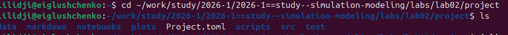{#fig-01 width=90%}

## 2. Установка пакетов Julia

Установлены необходимые пакеты командой:

```bash
cd ~/work/study/2026-1/2026-1==study--simulation-modeling/labs/lab02/project
julia --project=. -e 'using Pkg; Pkg.instantiate()'
```

Установленные пакеты: DifferentialEquations, SimpleDiffEq, DrWatson, Plots, StatsPlots, DataFrames, LaTeXStrings, BenchmarkTools, Tables, Statistics, FFTW, Literate, IJulia, JLD2.

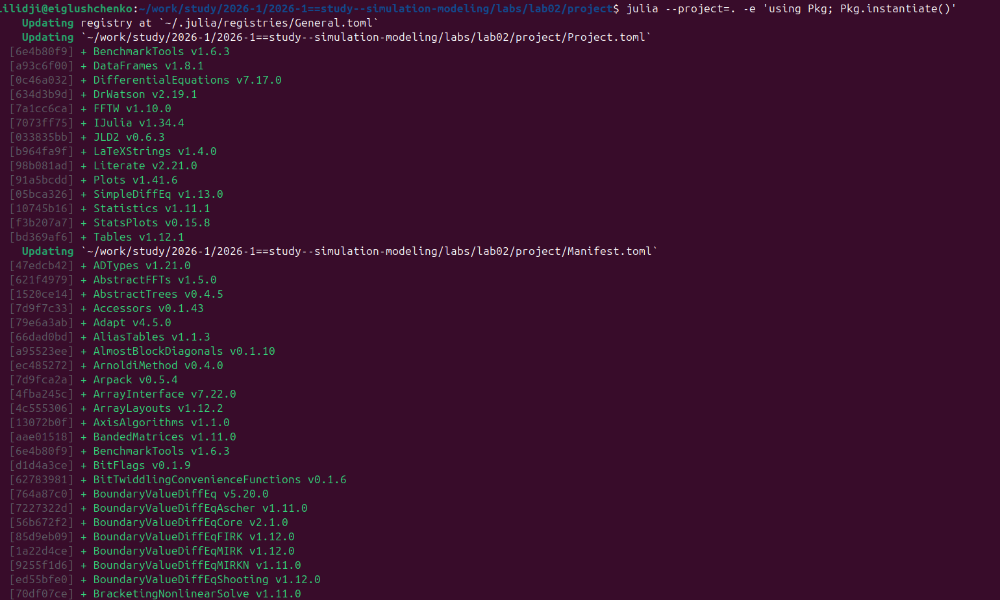{#fig-02 width=90%}

## 3. Реализация модели SIR

### Код модели

Создан скрипт `scripts/sir_ode.jl` в литературном стиле. Основная функция модели:

```julia
function sir_ode!(du, u, p, t)
    (S, I, R) = u
    (beta, c, gamma) = p
    N = S + I + R
    @inbounds begin
        du[1] = -beta * c * I / N * S
        du[2] = beta * c * I / N * S - gamma * I
        du[3] = gamma * I
    end
    nothing
end
```

Параметры модели: $\beta = 0.05$, $c = 10$, $\gamma = 0.25$, начальные условия: $S_0 = 990$, $I_0 = 10$, $R_0 = 0$.

### Запуск модели SIR

Скрипт выполнен командой:

```bash
julia --project=. scripts/sir_ode.jl
```

{#fig-03 width=90%}

### Результаты SIR

Получены следующие результаты:

| Показатель | Значение |
|-----------|---------|
| $R_0$ | 2.0 |
| Пиковое число заражённых $I_{max}$ | 154.8 |
| Время достижения пика | 19.1 дней |
| Итого переболело $R(\infty)$ | 775.7 (77.6%) |
| Порог коллективного иммунитета | 50% |

### Графики SIR

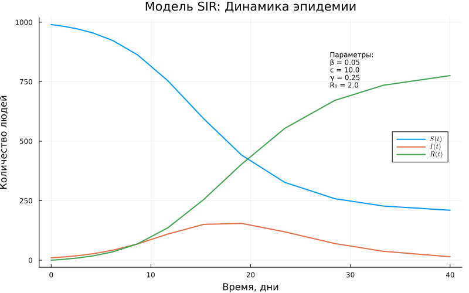{#fig-04 width=85%}

{#fig-05 width=85%}

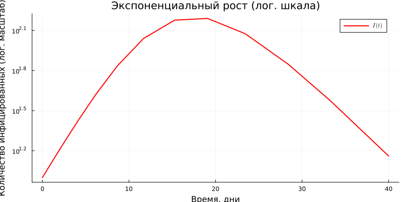{#fig-06 width=85%}

{#fig-07 width=85%}

{#fig-08 width=85%}

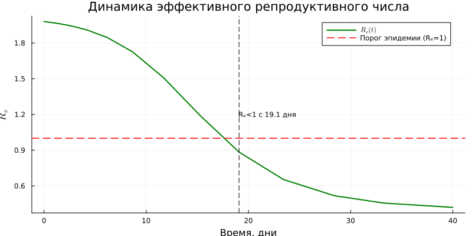{#fig-09 width=85%}

{#fig-10 width=95%}

## 4. Реализация модели Лотки-Вольтерры

### Код модели

Создан скрипт `scripts/lv_ode.jl` в литературном стиле. Основная функция:

```julia
function lotka_volterra!(du, u, p, t)
    x, y = u
    alpha, beta, delta, gamma = p
    @inbounds begin
        du[1] = alpha*x - beta*x*y
        du[2] = delta*x*y - gamma*y
    end
    nothing
end
```

Параметры: $\alpha = 0.1$, $\beta = 0.02$, $\delta = 0.01$, $\gamma = 0.3$. Начальные условия: $x_0 = 40$, $y_0 = 9$.

### Запуск модели Лотки-Вольтерры

```bash
julia --project=. scripts/lv_ode.jl
```

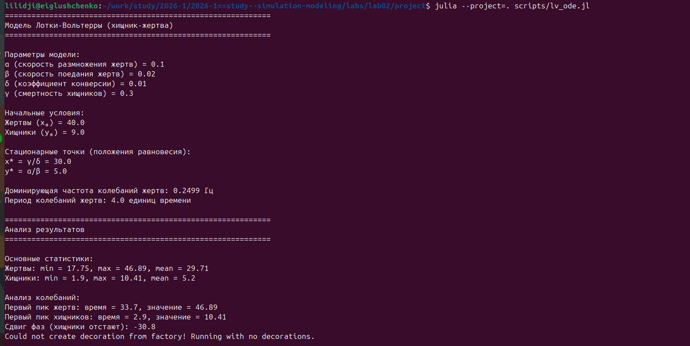{#fig-11 width=90%}

### Результаты Лотки-Вольтерры

| Показатель | Значение |
|-----------|---------|
| Стационарная точка $x^*$ | 30.0 |
| Стационарная точка $y^*$ | 5.0 |
| Жертвы: мин / макс / среднее | 17.75 / 46.89 / 29.71 |
| Хищники: мин / макс / среднее | 1.90 / 10.41 / 5.20 |
| Период колебаний | ~36.4 ед. времени |
| Сдвиг фаз (хищники отстают) | ~30.8 ед. |

### Графики Лотки-Вольтерры

{#fig-12 width=85%}

{#fig-13 width=85%}

{#fig-14 width=85%}

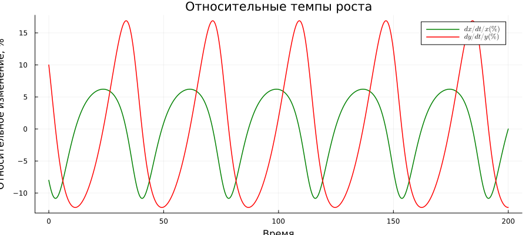{#fig-15 width=85%}

{#fig-16 width=85%}

{#fig-17 width=95%}

## 5. Параметрическое исследование модели SIR

### Описание эксперимента

Исследовано влияние вероятности заражения $\beta$ на динамику эпидемии. Параметр $\beta$ варьировался в диапазоне $[0.02, 0.04, 0.06, 0.08, 0.1]$ при фиксированных $c = 10$, $\gamma = 0.25$.

### Запуск параметрического сканирования

```bash
julia --project=. scripts/sir_ode_param.jl
```

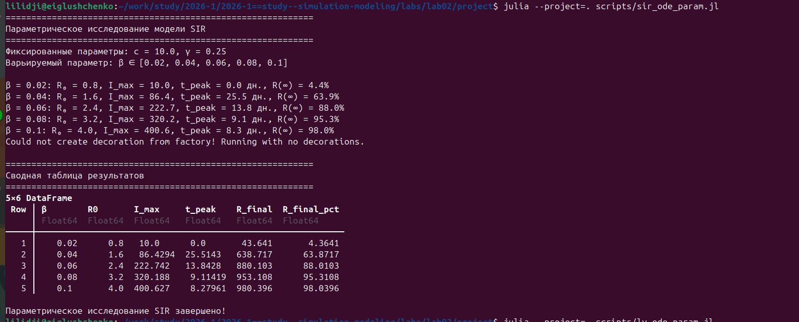{#fig-18 width=90%}

### Результаты параметрического сканирования SIR

| $\beta$ | $R_0$ | $I_{max}$ | $t_{peak}$, дн. | $R(\infty)$, % |
|---------|-------|-----------|-----------------|----------------|
| 0.02 | 0.8 | 10.0 | 0.0 | 4.4 |
| 0.04 | 1.6 | 86.4 | 25.5 | 63.9 |
| 0.06 | 2.4 | 222.7 | 13.8 | 88.0 |
| 0.08 | 3.2 | 320.2 | 9.1 | 95.3 |
| 0.10 | 4.0 | 400.6 | 8.3 | 98.0 |

При $R_0 < 1$ ($\beta = 0.02$) эпидемия не развивается. С ростом $\beta$ пик заражённых увеличивается, а время достижения пика уменьшается.

### Графики параметрического исследования SIR

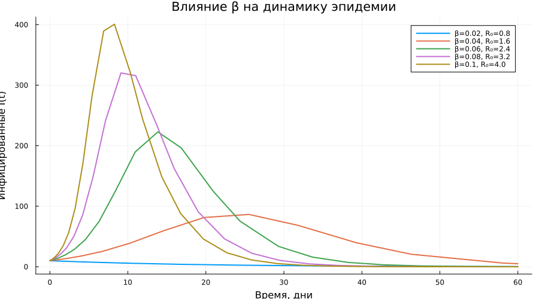{#fig-19 width=85%}

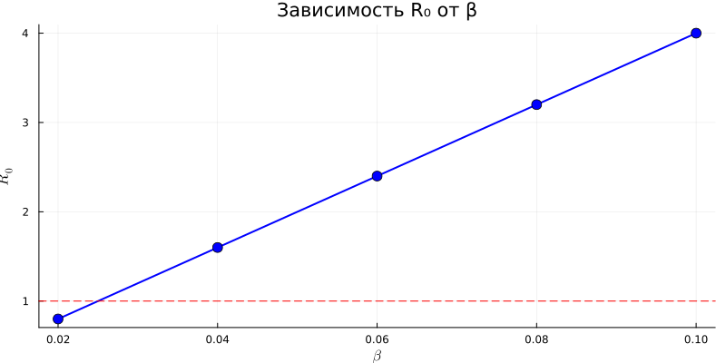{#fig-20 width=85%}

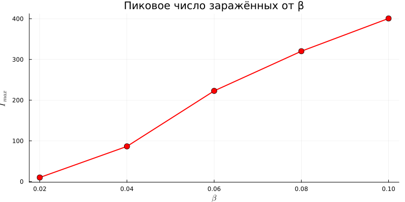{#fig-21 width=85%}

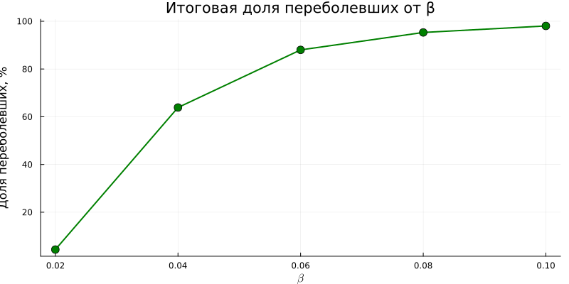{#fig-22 width=85%}

{#fig-23 width=95%}

## 6. Параметрическое исследование модели Лотки-Вольтерры

### Описание эксперимента

Исследовано влияние скорости размножения жертв $\alpha$ на динамику системы хищник-жертва. Параметр $\alpha$ варьировался в диапазоне $[0.05, 0.1, 0.15, 0.2, 0.3]$ при фиксированных $\beta = 0.02$, $\delta = 0.01$, $\gamma = 0.3$.

### Запуск параметрического сканирования

```bash
julia --project=. scripts/lv_ode_param.jl
```

{#fig-24 width=90%}

### Результаты параметрического сканирования Лотки-Вольтерры

| $\alpha$ | $x^*$ | $y^*$ | Жертвы: мин--макс | Хищники: мин--макс |
|----------|-------|-------|-------------------|-------------------|
| 0.05 | 30.0 | 2.5 | 13.1--57.5 | 0.2--9.9 |
| 0.10 | 30.0 | 5.0 | 17.8--46.9 | 1.9--10.4 |
| 0.15 | 30.0 | 7.5 | 21.2--41.0 | 4.5--11.6 |
| 0.20 | 30.0 | 10.0 | 21.5--40.4 | 6.6--14.4 |
| 0.30 | 30.0 | 15.0 | 16.2--50.0 | 8.1--25.0 |

Стационарная точка $x^* = \gamma/\delta = 30$ не зависит от $\alpha$, а $y^* = \alpha/\beta$ растёт линейно с $\alpha$.

### Графики параметрического исследования Лотки-Вольтерры

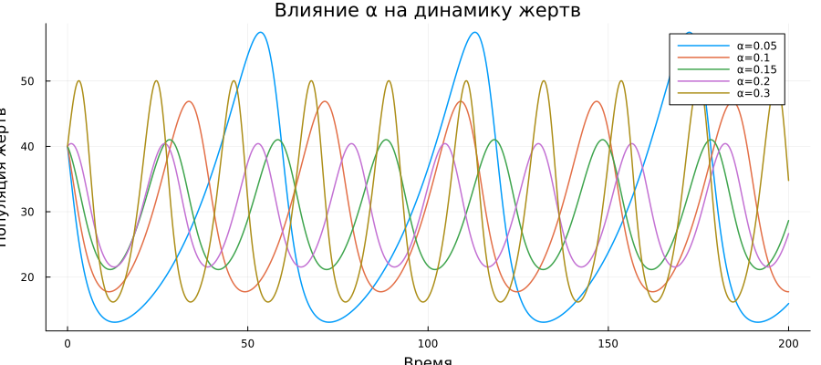{#fig-25 width=85%}

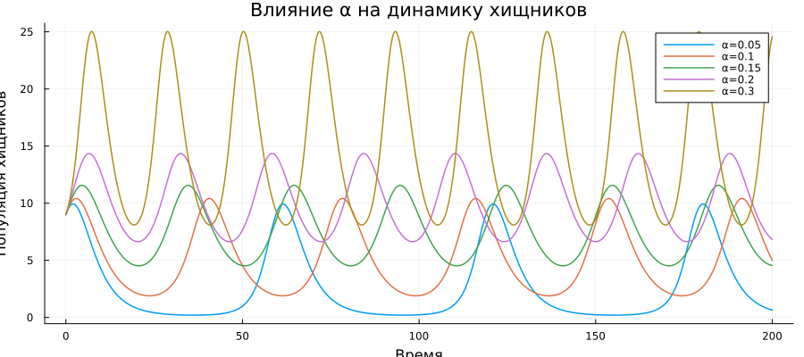{#fig-26 width=85%}

{#fig-27 width=85%}

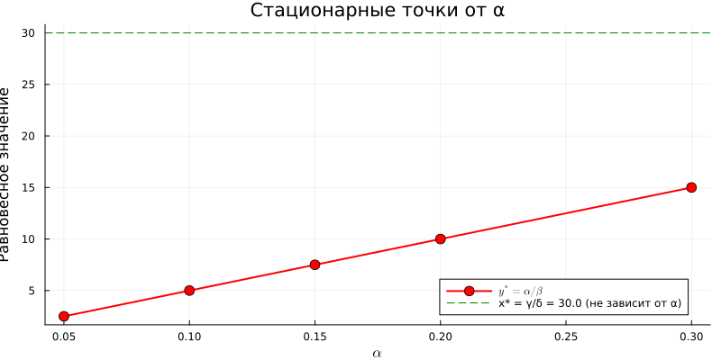{#fig-28 width=85%}

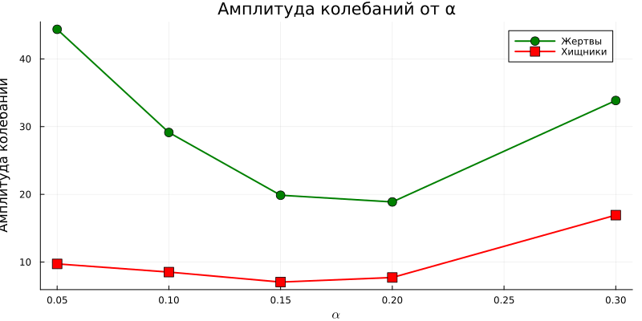{#fig-29 width=85%}

{#fig-30 width=95%}

## 7. Генерация литературных версий

Из всех четырёх скриптов сгенерированы производные форматы с помощью `tangle.jl`:

```bash
julia --project=. scripts/tangle.jl scripts/sir_ode.jl
julia --project=. scripts/tangle.jl scripts/lv_ode.jl
julia --project=. scripts/tangle.jl scripts/sir_ode_param.jl
julia --project=. scripts/tangle.jl scripts/lv_ode_param.jl
```

Для каждого скрипта создано:

- Чистый код: `scripts/<name>/<name>.jl`
- Jupyter notebook: `notebooks/<name>.ipynb`
- Quarto-документ: `markdown/<name>.qmd`

{#fig-31 width=90%}

## 8. Выполнение Jupyter Notebooks

Все четыре ноутбука выполнены с помощью `jupyter nbconvert`:

```bash
jupyter nbconvert --to notebook --execute notebooks/lv_ode.ipynb --output lv_ode_executed.ipynb
jupyter nbconvert --to notebook --execute notebooks/sir_ode_param.ipynb --output sir_ode_param_executed.ipynb
jupyter nbconvert --to notebook --execute notebooks/lv_ode_param.ipynb --output lv_ode_param_executed.ipynb
```

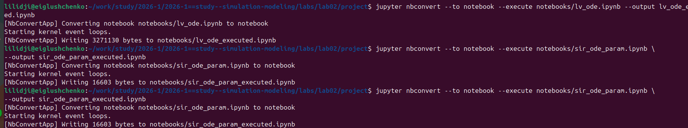{#fig-32 width=90%}

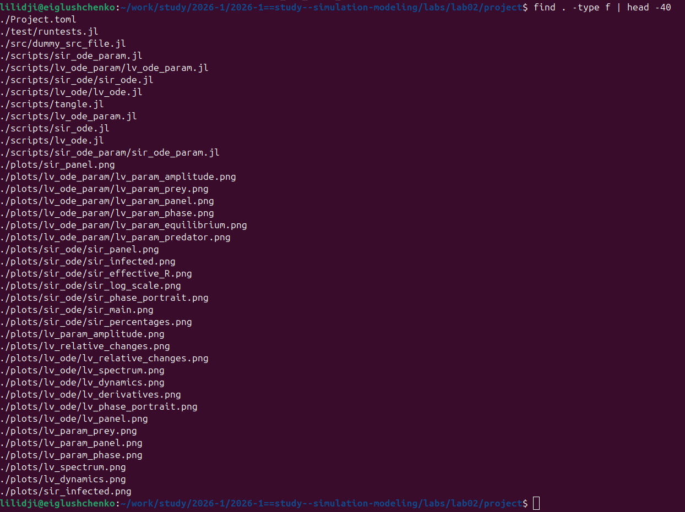{#fig-33 width=90%}

# Выводы

В ходе выполнения лабораторной работы были получены следующие результаты:

1. Создана структура рабочего пространства DrWatson для лабораторной работы №2 с необходимыми пакетами Julia.

2. Реализована трёхпараметрическая модель SIR ($\beta = 0.05$, $c = 10$, $\gamma = 0.25$). Получен $R_0 = 2.0$, пик эпидемии --- 154.8 заражённых на 19.1 день, итого переболело 77.6% популяции. Порог коллективного иммунитета --- 50%.

3. Реализована модель Лотки-Вольтерры ($\alpha = 0.1$, $\beta = 0.02$, $\delta = 0.01$, $\gamma = 0.3$). Стационарные точки: $x^* = 30$, $y^* = 5$. Система демонстрирует устойчивые циклические колебания с периодом ~36 единиц времени.

4. Проведено параметрическое исследование SIR: при варьировании $\beta$ от 0.02 до 0.1 показано, что при $R_0 < 1$ эпидемия не развивается, а при $R_0 = 4$ переболевает 98% популяции.

5. Проведено параметрическое исследование Лотки-Вольтерры: при варьировании $\alpha$ от 0.05 до 0.3 показано, что равновесное число хищников $y^*$ растёт линейно, а $x^*$ не зависит от $\alpha$.

6. Построены графики для обеих моделей: динамика во времени, фазовые портреты, логарифмические шкалы, спектральный анализ, параметрические зависимости, панельные графики.

7. Код преобразован в литературный стиль с помощью Literate.jl. Сгенерированы: чистые скрипты, Jupyter Notebooks и Quarto-документы для всех четырёх моделей.

8. Все четыре Jupyter Notebooks выполнены с помощью `jupyter nbconvert --execute`.

9. Численные результаты согласуются с теоретическими предсказаниями: в SIR модели пик эпидемии наступает при $S/N = 1/R_0$; в модели Лотки-Вольтерры средние значения популяций близки к стационарным точкам.
