---
author:
  name: Глущенко Евгений Игоревич
  affiliation:
    - name: Российский университет дружбы народов имени Патриса Лумумбы
      country: Российская Федерация
      postal-code: 117198
      city: Москва
      address: ул. Миклухо-Маклая, д. 6
title: Имитационное моделирование
subtitle: "Лабораторная работа №3. Агентное моделирование: модель Daisyworld"
license: CC BY
date: 2026-03-20
date-format: "YYYY-MM-DD"
---

# Информация

## Докладчик

:::::::::::::: {.columns align=center}
::: {.column width="70%"}

- Глущенко Евгений Игоревич
- студент группы НФИбд-01-23
- Российский университет дружбы народов имени Патриса Лумумбы
- студенческий билет: 1132239110

:::
::: {.column width="30%"}

{width=70%}

:::
::::::::::::::

## Информация о работе

- Дисциплина: имитационное моделирование
- Тема: агентная модель Daisyworld
- Средства реализации: Julia, Agents.jl, DrWatson, CairoMakie, Literate.jl
- Результат: воспроизводимый проект, отчёт и презентация

# Цель и задачи

## Цель работы

- Изучить принципы агентного моделирования
- Реализовать модель Daisyworld с использованием `Agents.jl`
- Исследовать саморегуляцию системы при разных параметрах
- Подготовить воспроизводимые материалы с помощью литературного программирования

## Задание

1. Подготовить Julia-проект и окружение `DrWatson`.
2. Реализовать базовую модель Daisyworld.
3. Построить статические визуализации и анимацию.
4. Исследовать динамику численности и полную динамику со светимостью.
5. Выполнить параметрическое исследование по `init_white` и `max_age`.
6. Сгенерировать производные форматы `script`, `notebook`, `markdown`.

# Теоретическое введение

## Агентное моделирование (ABM)

- Система описывается как множество взаимодействующих агентов
- Поведение каждого агента задаётся локальными правилами
- Глобальная динамика возникает как результат локальных взаимодействий
- Для реализации использован пакет `Agents.jl`

## Модель Daisyworld

- Рассматриваются два типа маргариток: чёрные и белые
- Чёрные маргаритки сильнее нагревают поверхность, белые сильнее отражают свет
- Через альбедо возникает обратная связь между популяцией и температурой
- Модель демонстрирует механизм климатической саморегуляции

## Основные соотношения

- Альбедо чёрных маргариток: $\alpha_b = 0.25$
- Альбедо белых маргариток: $\alpha_w = 0.75$
- Температура:

$$
T = 72 \ln((1-\alpha)\cdot L) + 80
$$

- Порог размножения:

$$
p = 0.1457T - 0.0032T^2 - 0.6443
$$

# Настройка окружения

## Запуск Julia

Запуск интерпретатора `Julia REPL` из каталога проекта.

{width=88%}

## Активация проекта и пакетов

Подключение `Pkg`, активация окружения проекта и проверка зависимостей.

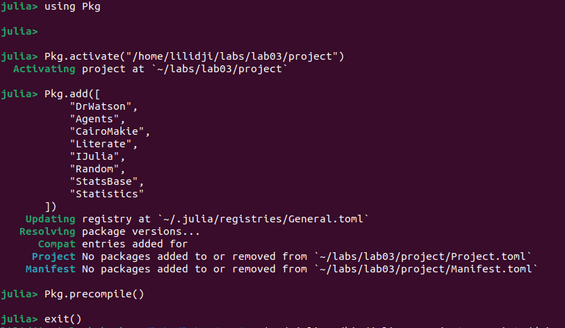{width=88%}

## Подготовленное окружение

- Использован проект на основе `DrWatson`
- Подключены `Agents`, `CairoMakie`, `Literate`, `IJulia`, `StatsBase`
- Выполнена предкомпиляция зависимостей
- Подготовлены каталоги `src`, `scripts`, `plots`, `notebooks`, `docs`

# Базовая визуализация

## Запуск `daisyworld.jl`

Скрипт строит тепловые карты состояния модели на выбранных шагах симуляции.

{width=88%}

## Тепловая карта: шаг 0

Начальное состояние модели: случайное распределение чёрных и белых маргариток.

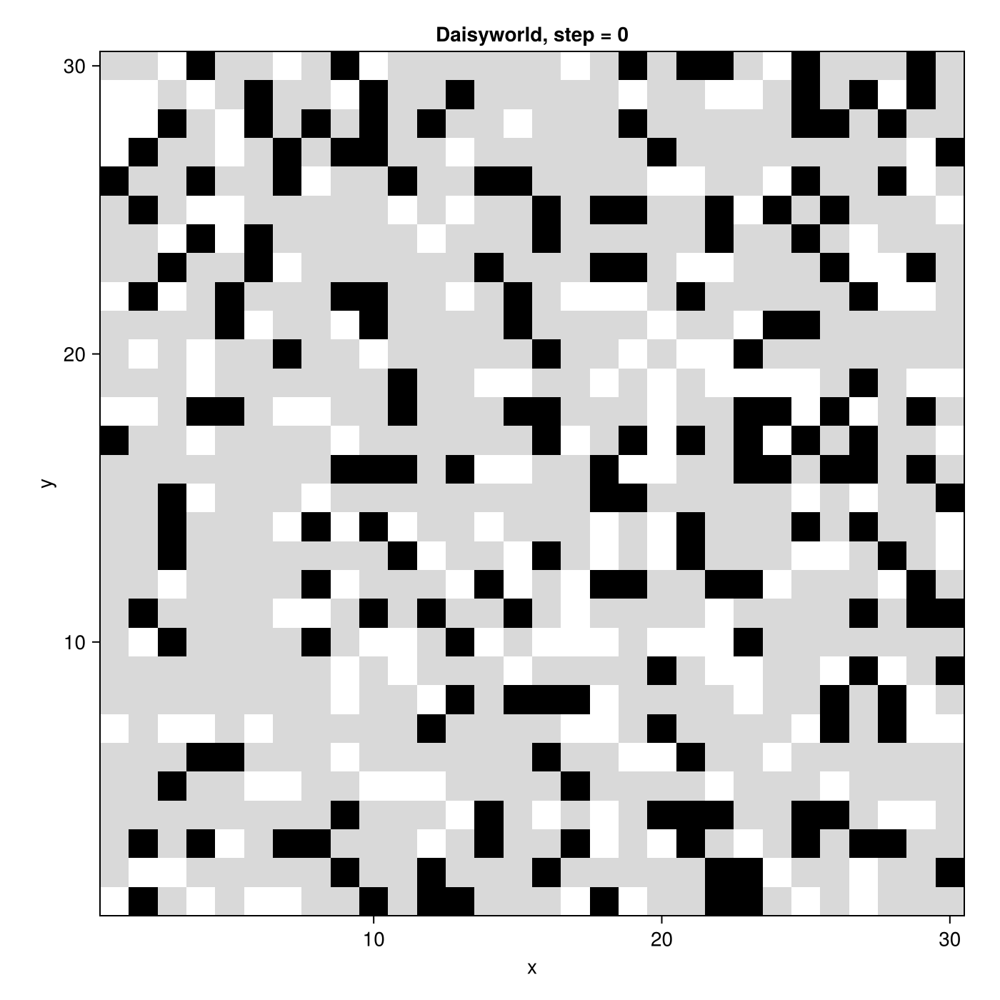{width=72%}

## Тепловая карта: шаг 1

После первого обновления уже заметны локальные перестройки распределения.

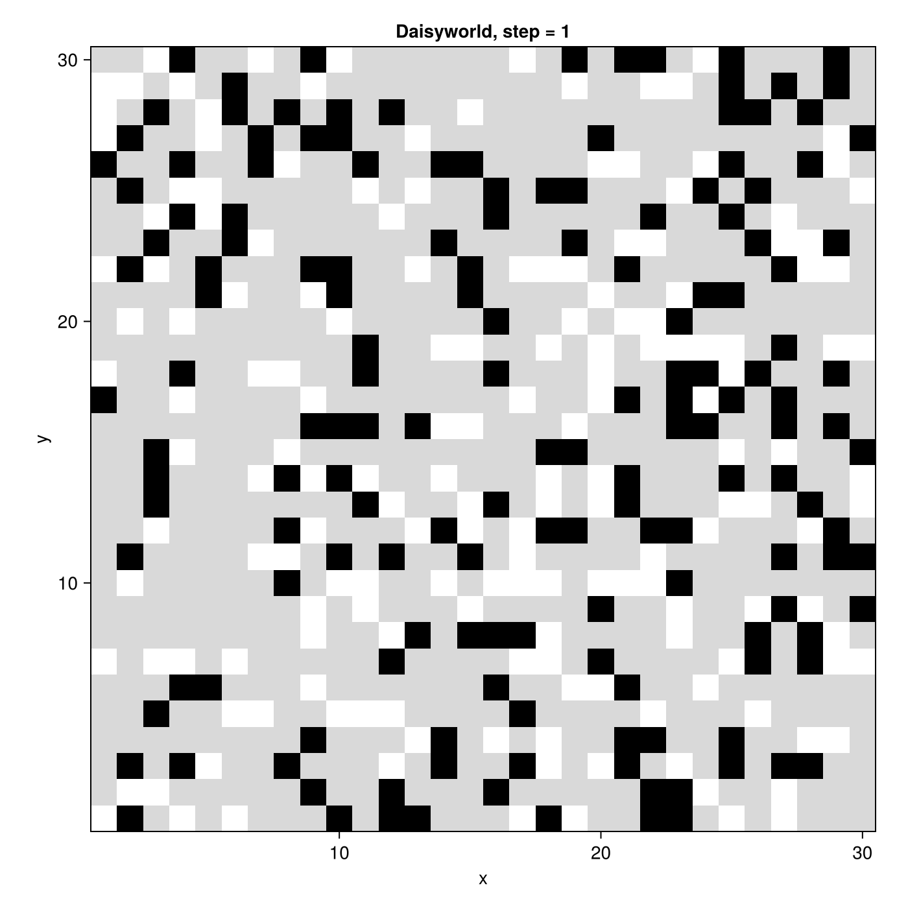{width=72%}

## Тепловая карта: шаг 5

Маргаритки начинают формировать устойчивые кластеры.

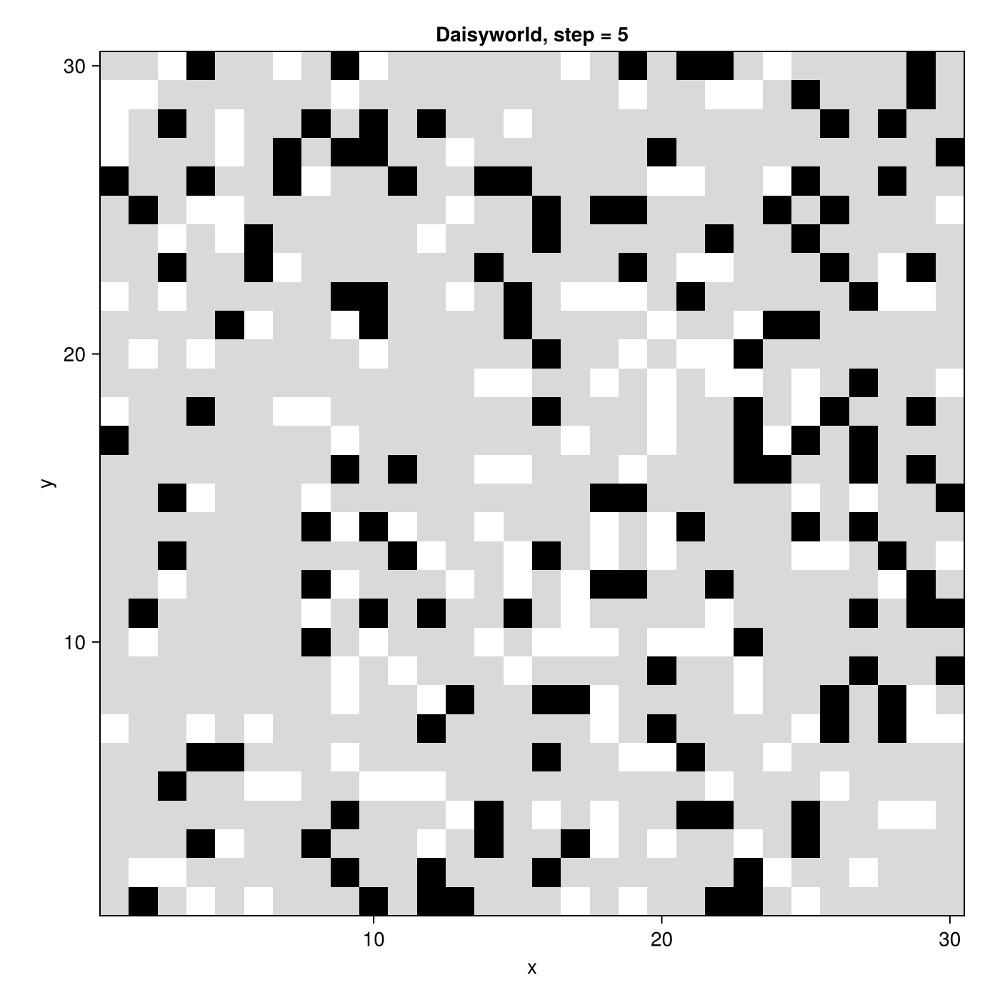{width=72%}

## Тепловая карта: шаг 40

Система выходит на режим динамического равновесия.

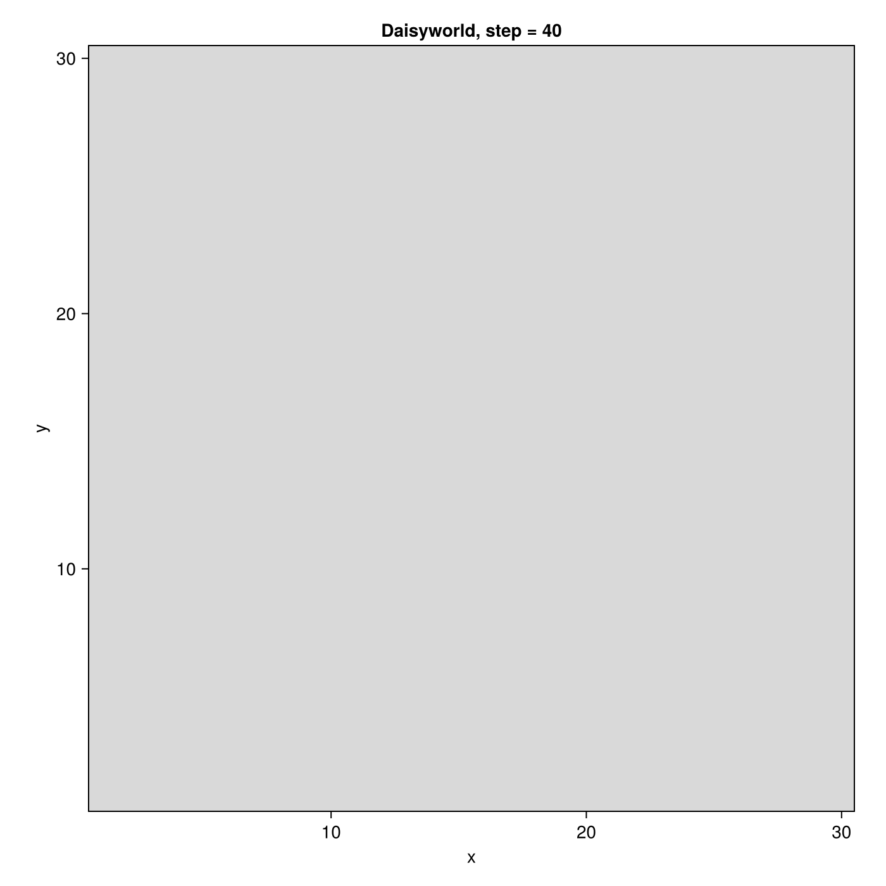{width=72%}

## `Literate.script`: `daisyworld`

- Сгенерирован чистый исполняемый скрипт
- Результат помещён в каталог `scripts/daisyworld/`
- Такой формат удобен для повторного запуска без комментариев

## `Literate.notebook`: `daisyworld`

- Сгенерирован `Jupyter notebook`
- Результат помещён в каталог `notebooks/daisyworld/`
- Формат подходит для интерактивного запуска и демонстрации

## `Literate.markdown`: `daisyworld`

- Сгенерирована Markdown-документация
- Результат помещён в каталог `docs/daisyworld/`
- Этот формат использован для литературного представления кода

# Анимация

## Запуск `daisyworld-animate.jl`

Скрипт создаёт анимацию эволюции модели во времени.

{width=88%}

## Результат анимации

- Получен файл `daisyworld_animation.mp4`
- Анимация содержит последовательность кадров эволюции пространственной структуры
- Видео показывает формирование и перестройку кластеров маргариток

{width=72%}

# Динамика числа маргариток

## Запуск `daisyworld-count.jl`

- Выполняется моделирование на 100 шагах
- Сохраняются временные ряды численности чёрных и белых маргариток
- Строится итоговый график популяционной динамики

## График динамики числа маргариток

Численности обоих типов маргариток изменяются и затем стабилизируются.

{width=88%}

## `Literate.script`: `daisyworld-count`

- Сгенерирован чистый скрипт динамики численности
- Файл помещён в `scripts/daisyworld-count/`
- Возможен независимый запуск вне литературной версии

## `Literate.markdown`: `daisyworld-count`

- Сформирована Markdown-документация сценария
- Файл помещён в `docs/daisyworld-count/`
- Текст содержит описание и код в одном документе

## `Literate.notebook`: `daisyworld-count`

- Сформирован `Jupyter notebook`
- Файл помещён в `notebooks/daisyworld-count/`
- Ноутбук можно использовать для интерактивного анализа

# Полная динамика (ramp)

## Запуск `daisyworld-luminosity.jl`

- Используется сценарий `ramp`
- Меняется светимость, строятся графики численности, температуры и светимости
- Выполняется длительное моделирование на 1000 шагах

## Трёхпанельный график динамики

Одновременно анализируются популяция, температура и внешняя светимость.

{width=88%}

## `Literate.script`: `daisyworld-luminosity`

- Сгенерирован исполняемый скрипт полной динамики
- Результат помещён в `scripts/daisyworld-luminosity/`
- Формат удобен для повторного пакетного запуска

## `Literate.markdown`: `daisyworld-luminosity`

- Сгенерирована Markdown-документация
- Результат помещён в `docs/daisyworld-luminosity/`
- Документ отражает логику построения полной динамики

## `Literate.notebook`: `daisyworld-luminosity`

- Сгенерирован `Jupyter notebook`
- Результат помещён в `notebooks/daisyworld-luminosity/`
- Формат удобен для покадрового анализа вычислений

# Визуализация с параметрами

## Запуск `daisyworld__param.jl`

Исследуются четыре комбинации параметров:

- `init_white = 0.2`, `max_age = 25`
- `init_white = 0.2`, `max_age = 40`
- `init_white = 0.8`, `max_age = 25`
- `init_white = 0.8`, `max_age = 40`

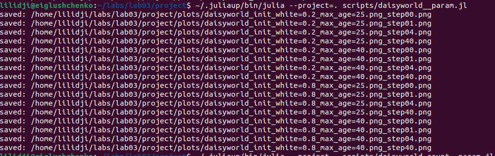{width=88%}

## `init_white = 0.2`, `max_age = 25`: шаг 1

Распределение начинает перестраиваться от исходного случайного состояния.

{width=72%}

## `init_white = 0.2`, `max_age = 25`: шаг 4

Появляются выраженные локальные кластеры.

{width=72%}

## `init_white = 0.2`, `max_age = 25`: шаг 40

Базовый вариант выходит на устойчивое распределение.

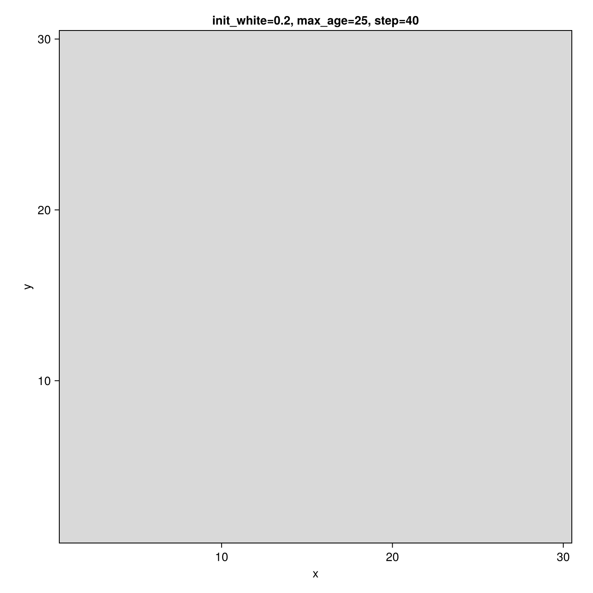{width=72%}

## `init_white = 0.2`, `max_age = 40`: шаг 1

Увеличенный возраст делает систему более инерционной уже в начале процесса.

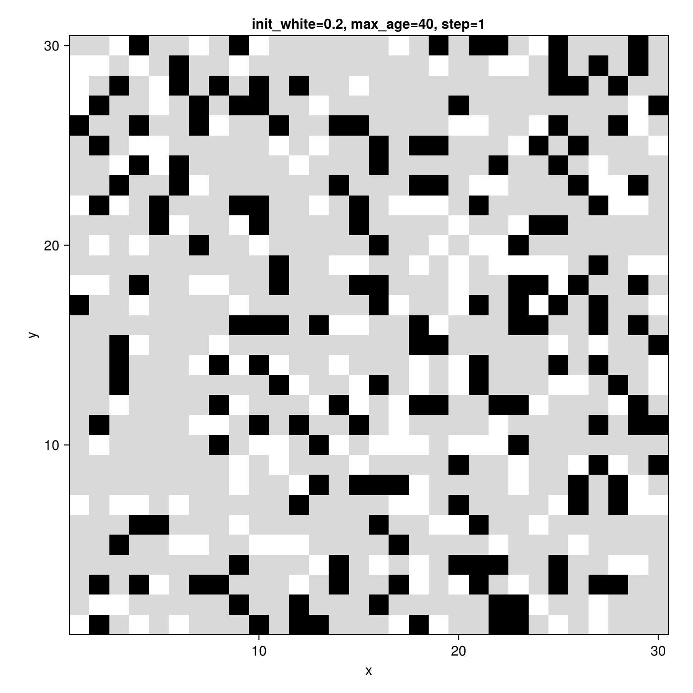{width=72%}

## `init_white = 0.2`, `max_age = 40`: шаг 4

Кластеры формируются при более долгом жизненном цикле агентов.

{width=72%}

## `init_white = 0.2`, `max_age = 40`: шаг 40

Заполнение пространства становится более плотным.

{width=72%}

## `init_white = 0.8`, `max_age = 25`: шаг 1

Высокая доля белых маргариток охлаждает поверхность в начальный момент.

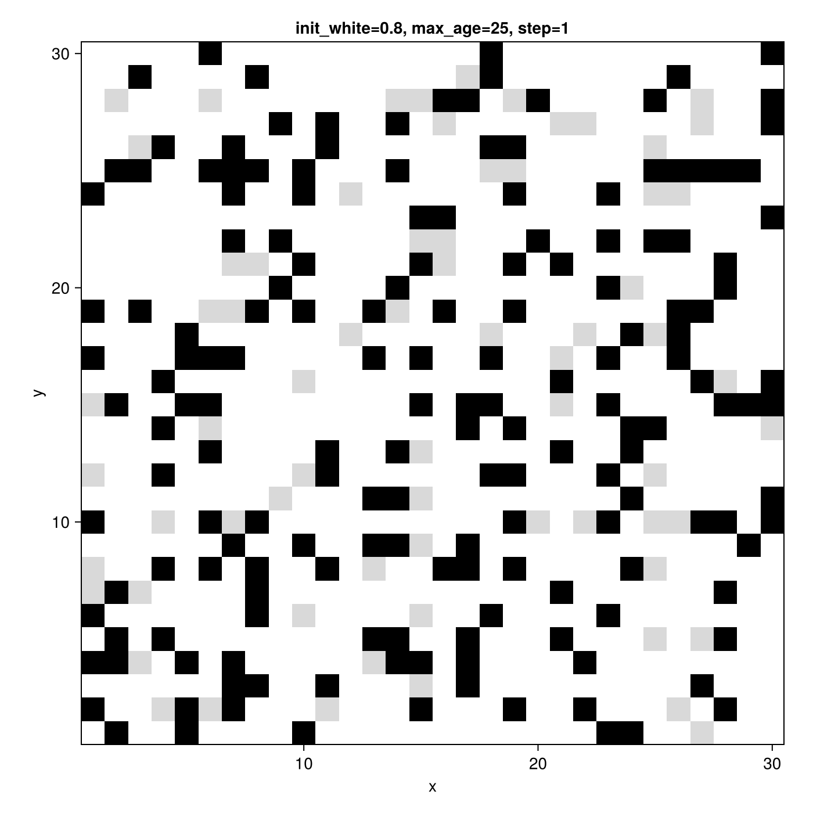{width=72%}

## `init_white = 0.8`, `max_age = 25`: шаг 4

Чёрные маргаритки постепенно компенсируют начальное смещение.

{width=72%}

## `init_white = 0.8`, `max_age = 25`: шаг 40

Система стремится к конфигурации, близкой к базовому равновесию.

{width=72%}

## `init_white = 0.8`, `max_age = 40`: шаг 1

Белые маргаритки преобладают почти на всём поле.

{width=72%}

## `init_white = 0.8`, `max_age = 40`: шаг 4

При большом возрасте начальные условия сохраняются дольше.

{width=72%}

## `init_white = 0.8`, `max_age = 40`: шаг 40

Это наиболее медленный переход к равновесию среди рассмотренных случаев.

{width=72%}

## `Literate.script`: `daisyworld__param`

- Сгенерирован чистый скрипт параметрических heatmap
- Результат помещён в `scripts/daisyworld__param/`
- Формат удобен для серийного воспроизведения эксперимента

## `Literate.markdown`: `daisyworld__param`

- Сгенерирована Markdown-документация параметрического исследования
- Результат помещён в `docs/daisyworld__param/`
- Документация содержит описание хода эксперимента и код

## `Literate.notebook`: `daisyworld__param`

- Сгенерирован `Jupyter notebook`
- Результат помещён в `notebooks/daisyworld__param/`
- Ноутбук позволяет удобно просматривать все комбинации параметров

# Динамика с параметрами

## Запуск `daisyworld-count__param.jl`

Для каждой комбинации параметров строится график динамики численности.

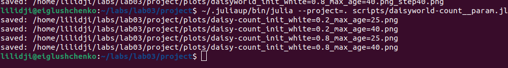{width=88%}

## `init_white = 0.2`, `max_age = 25`: динамика

Быстрое установление равновесия при стандартном возрасте агентов.

{width=88%}

## `init_white = 0.2`, `max_age = 40`: динамика

Увеличение `max_age` делает колебания более плавными.

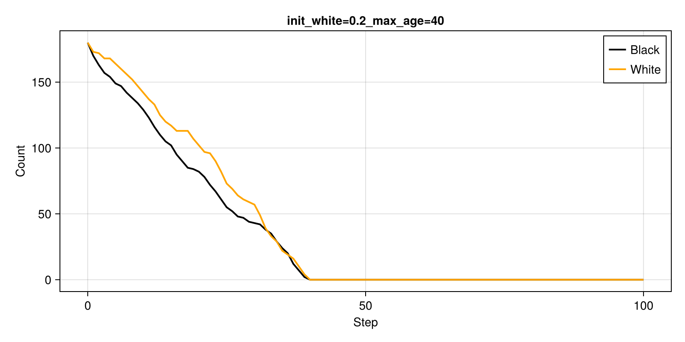{width=88%}

## `init_white = 0.8`, `max_age = 25`: динамика

Начальное преобладание белых влияет только на переходный режим.

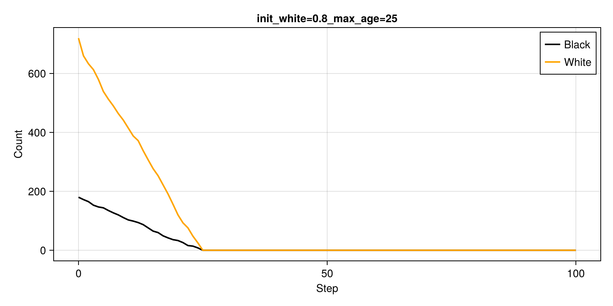{width=88%}

## `init_white = 0.8`, `max_age = 40`: динамика

Наиболее инерционный переход к устойчивому состоянию.

{width=88%}

## `Literate.script`: `daisyworld-count__param`

- Сгенерирован чистый скрипт параметрической динамики численности
- Результат помещён в `scripts/daisyworld-count__param/`
- Поддерживается воспроизводимый запуск всех серий

## `Literate.markdown`: `daisyworld-count__param`

- Сгенерирована Markdown-документация
- Результат помещён в `docs/daisyworld-count__param/`
- Формат описывает полный параметрический сценарий

## `Literate.notebook`: `daisyworld-count__param`

- Сгенерирован `Jupyter notebook`
- Результат помещён в `notebooks/daisyworld-count__param/`
- Ноутбук удобен для сравнения кривых между сериями

# Полная динамика с параметрами (ramp)

## Запуск `daisyworld-luminosity__param.jl`

Для всех комбинаций параметров строятся трёхпанельные графики в сценарии `ramp`.

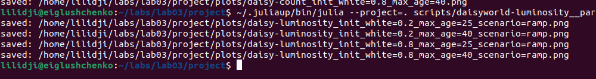{width=88%}

## `init_white = 0.2`, `max_age = 25` (`ramp`)

Система достаточно быстро адаптируется к изменениям светимости.

{width=88%}

## `init_white = 0.2`, `max_age = 40` (`ramp`)

Рост максимального возраста повышает инерционность отклика.

{width=88%}

## `init_white = 0.8`, `max_age = 25` (`ramp`)

Начальные условия быстро забываются, и система возвращается к типичной динамике.

{width=88%}

## `init_white = 0.8`, `max_age = 40` (`ramp`)

Это наиболее инерционный вариант полной динамики.

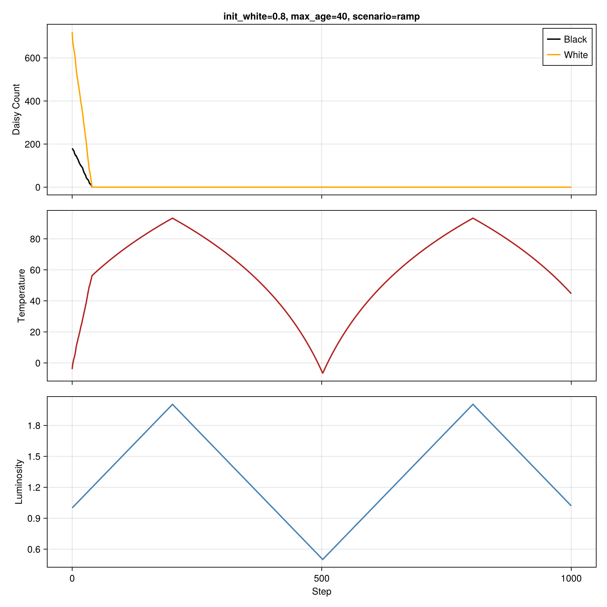{width=88%}

## `Literate.script`: `daisyworld-luminosity__param`

- Сгенерирован чистый скрипт параметрической полной динамики
- Результат помещён в `scripts/daisyworld-luminosity__param/`
- Сценарий готов к повторному прогону в пакетном режиме

## `Literate.markdown`: `daisyworld-luminosity__param`

- Сгенерирована Markdown-документация
- Результат помещён в `docs/daisyworld-luminosity__param/`
- Документ описывает сценарий `ramp` и параметры модели

## `Literate.notebook`: `daisyworld-luminosity__param`

- Сгенерирован `Jupyter notebook`
- Результат помещён в `notebooks/daisyworld-luminosity__param/`
- Формат удобен для интерактивного исследования полной динамики

# Результаты

## Генерация производных материалов

После расчётов был запущен скрипт `tangle.jl`, который создал производные форматы для всех литературных сценариев.

{width=86%}

## Итоговая структура файлов

В каталоге проекта сформированы:

- результаты моделирования в `plots`
- чистые скрипты в `scripts/<name>/`
- ноутбуки в `notebooks/<name>/`
- Markdown-документация в `docs/<name>/`

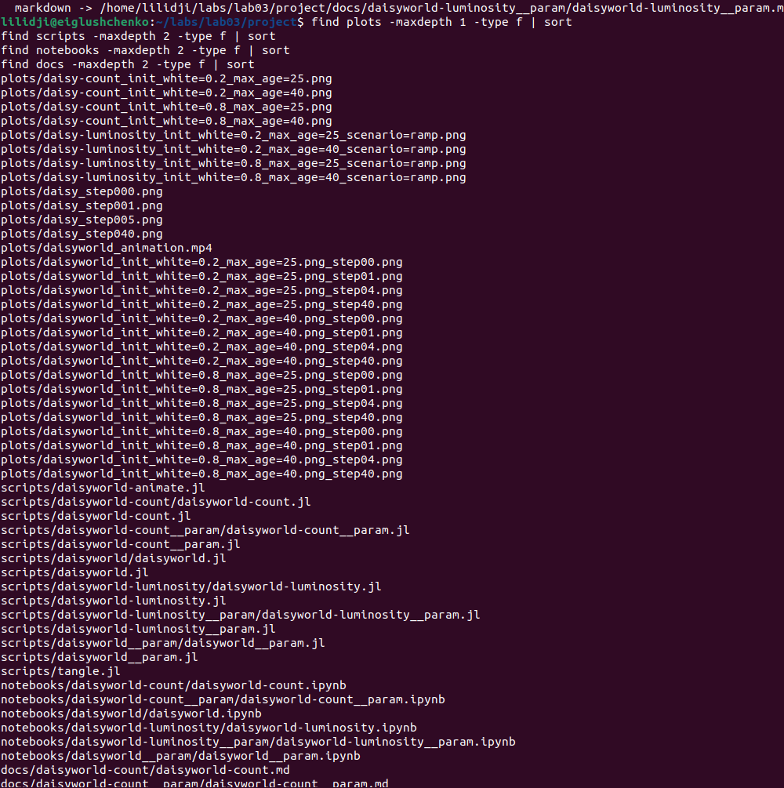{width=82%}

## Выводы

- Реализована агентная модель Daisyworld на Julia с использованием `Agents.jl`
- Получены статические визуализации, анимация и графики динамики
- Параметр `init_white` влияет прежде всего на переходную фазу
- Параметр `max_age` увеличивает инерционность и плотность заполнения
- Сценарий `ramp` показывает способность модели к саморегуляции
- Проект оформлен в воспроизводимом виде с поддержкой `Literate.jl`
