---
author:
  name: Глущенко Евгений Игоревич
  affiliation:
    - name: Российский университет дружбы народов имени Патриса Лумумбы
      country: Российская Федерация
      postal-code: 117198
      city: Москва
      address: ул. Миклухо-Маклая, д. 6
title: Имитационное моделирование
subtitle: "Лабораторная работа №4. Агентная SIR-модель"
license: CC BY
date: 2026-04-03
date-format: "YYYY-MM-DD"
---

# Информация

## Докладчик

:::::::::::::: {.columns align=center}
::: {.column width="70%"}

- Глущенко Евгений Игоревич
- студент группы НФИбд-01-23
- Российский университет дружбы народов имени Патриса Лумумбы
- студенческий билет: 1132239110

:::
::: {.column width="30%"}

{width=70%}

:::
::::::::::::::

## Информация о работе

- Дисциплина: имитационное моделирование
- Тема: агентная реализация эпидемиологической модели SIR
- Средства реализации: Julia, Agents.jl, DrWatson, CairoMakie, Literate.jl
- Результат: воспроизводимый проект, отчёт и презентация

# Цель и задачи

## Цель работы

- Реализовать SIR-модель в агентном подходе
- Исследовать влияние заразности и миграции на эпидемическую динамику
- Рассмотреть дополнительные сценарии: гетерогенность, карантин, оптимизация
- Подготовить literate-версии скриптов и воспроизводимые материалы

## Задание

1. Подготовить `Julia`-проект и окружение `DrWatson`
2. Реализовать базовую агентную SIR-модель
3. Выполнить базовый запуск, beta-scan и исследование миграции
4. Провести оптимизацию параметров и итоговую визуализацию
5. Выполнить дополнительные задания: `R_0`, порог, гетерогенность, карантин
6. Сгенерировать `.jl`, `.ipynb`, `.qmd`

# Теоретическое введение

## Модель SIR

- Популяция делится на три класса: `S`, `I`, `R`
- В агентной постановке каждый человек моделируется отдельным агентом
- Возможны миграция между городами и неоднородные параметры заражения
- Такая модель удобна для добавления логических правил, например карантина

## Основные параметры

- `Ns = [1000, 1000, 1000]`
- `beta_und = 0.5`, `beta_det = 0.05`
- `infection_period = 14`, `detection_time = 7`
- `death_rate = 0.02`, `reinfection_probability = 0.1`

## Базовое репродуктивное число

$$
R_0 = \frac{\beta}{\gamma}, \qquad \gamma = \frac{1}{14}
$$

Для базовых параметров:

$$
R_0 = \frac{0.5}{1/14} = 7
$$

Это соответствует режиму уверенного развития эпидемии.

# Настройка окружения

## Запуск Julia

Запуск `Julia REPL` из каталога проекта.

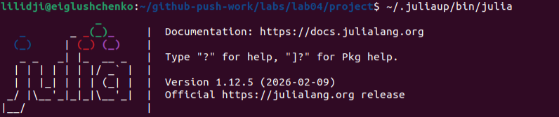{width=88%}

## Активация проекта

Подключение `Pkg`, активация окружения проекта и предкомпиляция зависимостей.

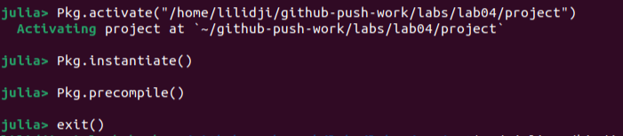{width=88%}

## Подготовленное окружение

- Использован проект на основе `DrWatson`
- Подключены `Agents`, `CairoMakie`, `Literate`, `IJulia`, `BlackBoxOptim`
- Подготовлены каталоги `src`, `scripts`, `plots`, `notebooks`, `docs`

# Базовый эксперимент

## Запуск `sir_run_basic.jl`

Скрипт моделирует базовый эпидемический сценарий и сохраняет график динамики.

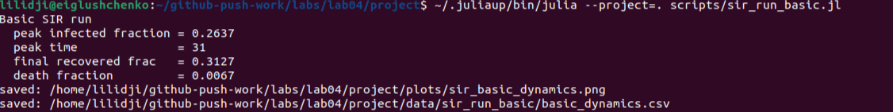{width=88%}

## График базовой динамики

На графике показаны `S(t)`, `I(t)`, `R(t)` и общая численность популяции.

{width=88%}

## Интерпретация базового результата

- число инфицированных быстро растёт;
- затем достигается пик эпидемии;
- после этого большинство агентов переходит в класс выздоровевших;
- общая численность немного уменьшается из-за смертности.

# Исследование коэффициента заразности

## Запуск `sir_scan_beta.jl`

Параметрическое исследование выполняется по значениям `beta`.

{width=88%}

## Итоговый график по `beta`

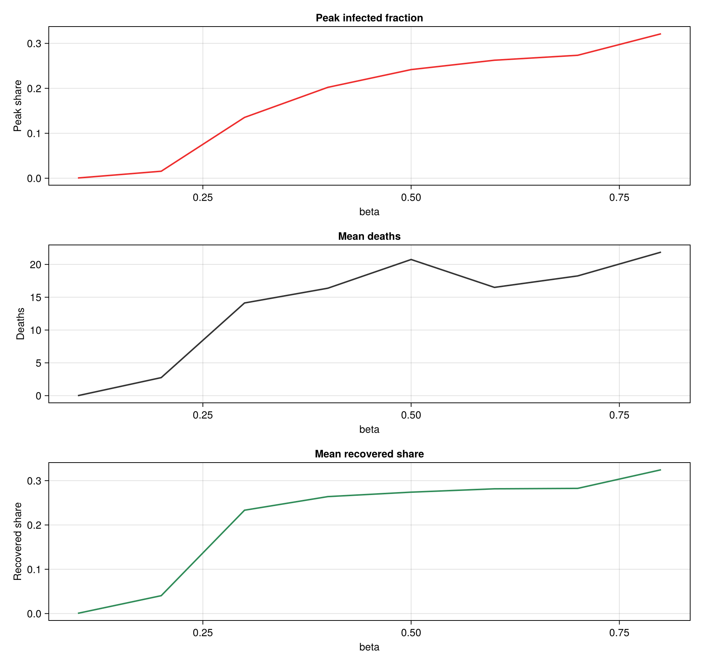{width=88%}

## Вывод по `beta`

- при малых значениях `beta` вспышка слабая;
- начиная с области около `0.2` наблюдается резкий рост пика;
- увеличение заразности повышает и смертность, и долю переболевших.

# Исследование миграции

## Запуск `sir_migration_effect.jl`

Анализируется влияние интенсивности миграции между тремя городами.

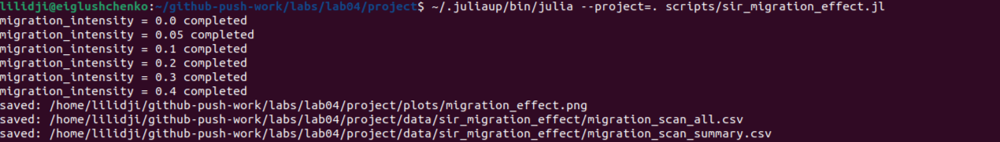{width=88%}

## График влияния миграции

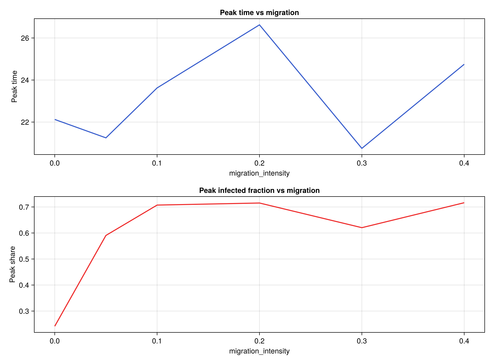{width=88%}

## Таблица результатов по миграции

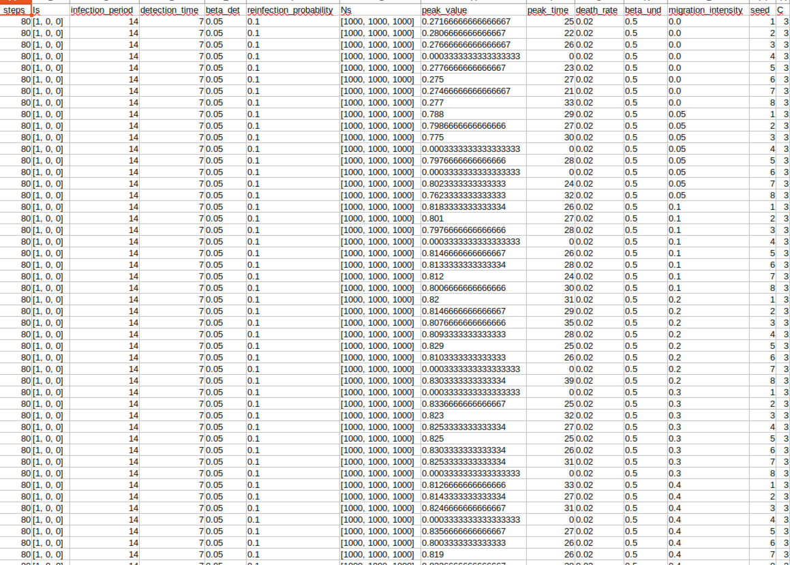{width=88%}

## Вывод по миграции

- при нулевой миграции вспышка остаётся локальной;
- при положительной миграции инфекция охватывает все города;
- наиболее показательный режим переноса наблюдается около `migration_intensity = 0.2`.

# Оптимизация и итоговая визуализация

## Запуск базовой оптимизации

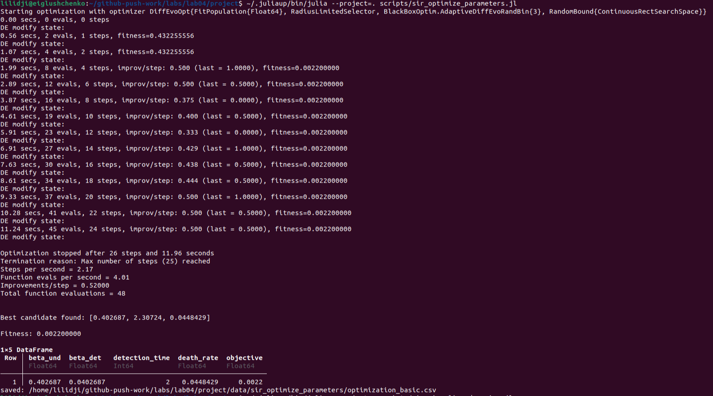{width=88%}

## Таблица базовой оптимизации

{width=88%}

## Запуск итоговой визуализации

{width=88%}

## Сводный график

{width=88%}

## Вывод

- верхняя панель показывает пороговое возникновение эпидемии;
- средняя панель отражает рост смертности с ростом `beta`;
- нижняя панель показывает насыщение доли выздоровевших.

# Дополнительные задания

## Эффект гетерогенности

Запуск сценария с различными значениями заражения по городам.

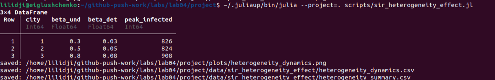{width=88%}

## Динамика по городам

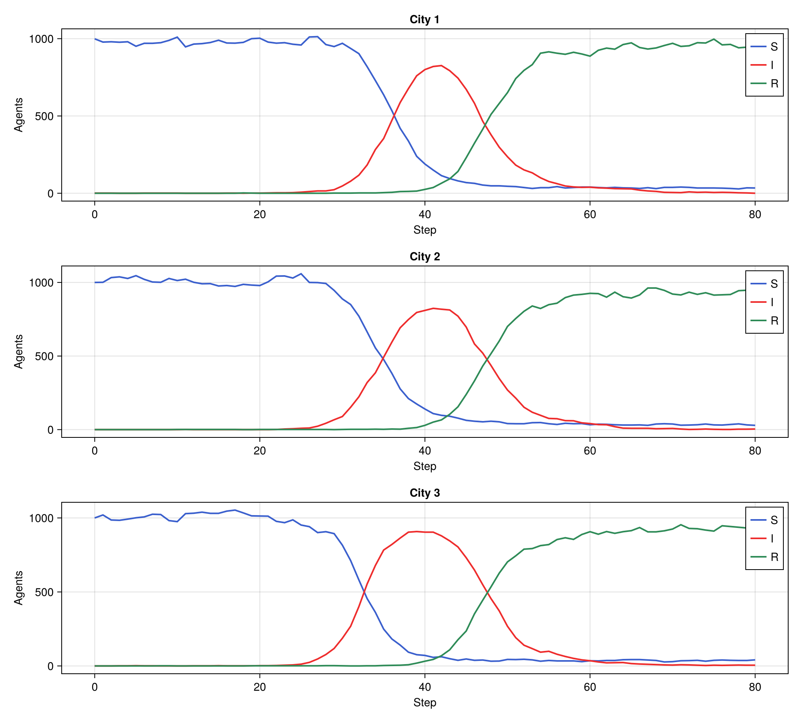{width=88%}

## Вывод по гетерогенности

- более высокий `beta` приводит к более быстрому и более высокому пику;
- различия по городам хорошо видны на раздельных кривых `S`, `I`, `R`.

## Карантинный сценарий

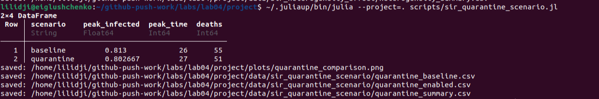{width=88%}

## Сравнение сценариев

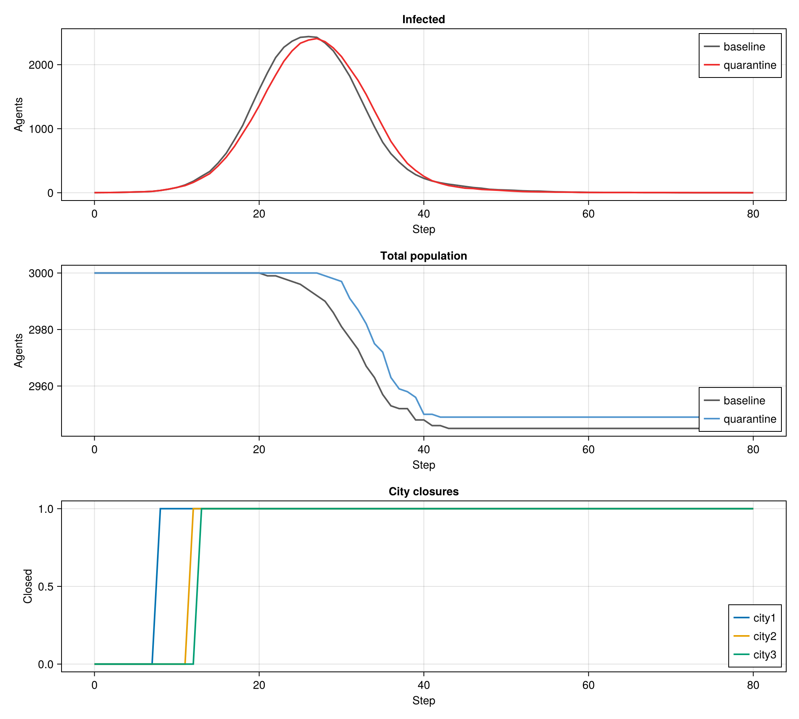{width=88%}

## Вывод по карантину

- карантин немного сдвигает пик эпидемии вправо;
- число умерших уменьшается;
- закрытие городов ограничивает межгородской перенос инфекции.

## Оптимизация с ограничением на пик

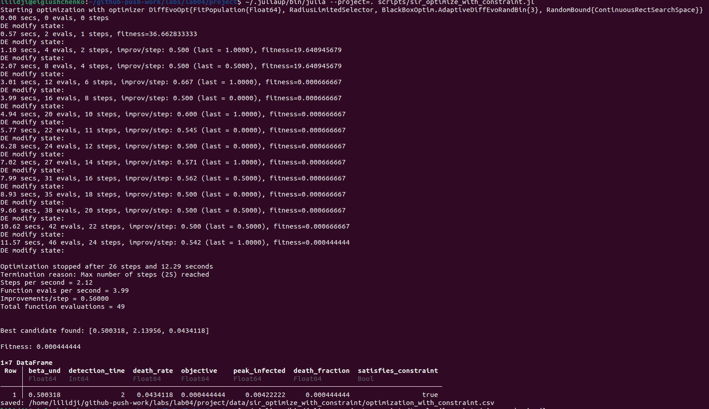{width=88%}

## Таблица ограниченной оптимизации

{width=92%}

## Вывод по ограниченной оптимизации

- найдено решение, удовлетворяющее ограничению на пик;
- оптимизатор подбирает параметры раннего выявления и умеренной заразности;
- это позволяет удерживать вспышку под контролем.

# Literate и воспроизводимость

## Генерация производных форматов

{width=88%}

## Выполнение notebook

{width=88%}

## Итоговая структура файлов

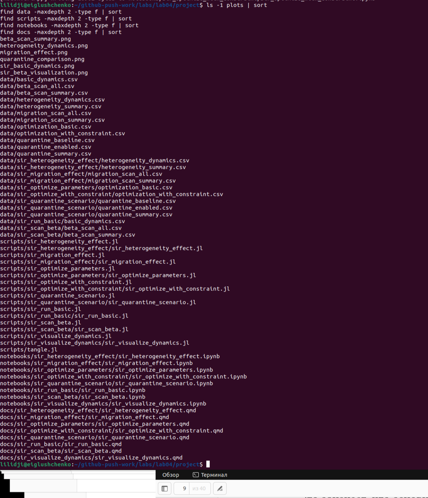{width=72%}

## Результат воспроизводимости

- сгенерированы clean-скрипты `.jl`
- сгенерированы `Jupyter notebook`-файлы `.ipynb`
- сгенерированы `Quarto`-документы `.qmd`
- выполнены notebook-файлы через `nbconvert`

# Итоги

## Выводы

- Реализована агентная SIR-модель для трёх городов
- Исследованы базовый запуск, `beta`, миграция и оптимизация
- Выполнены дополнительные задания: `R_0`, порог, гетерогенность, карантин
- Подготовлены воспроизводимые literate-материалы

## Спасибо за внимание

Вопросы?
