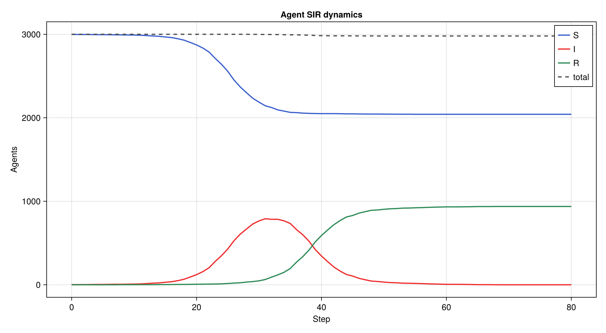
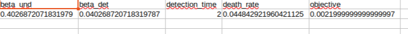
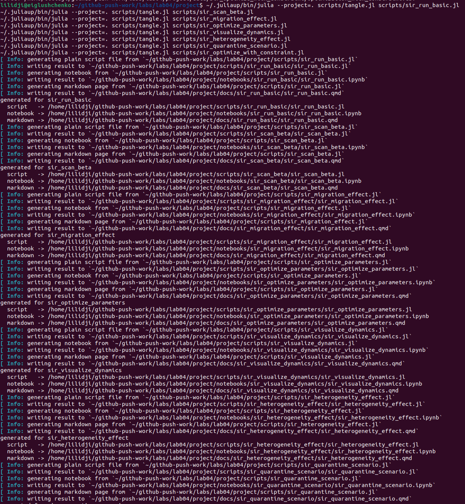
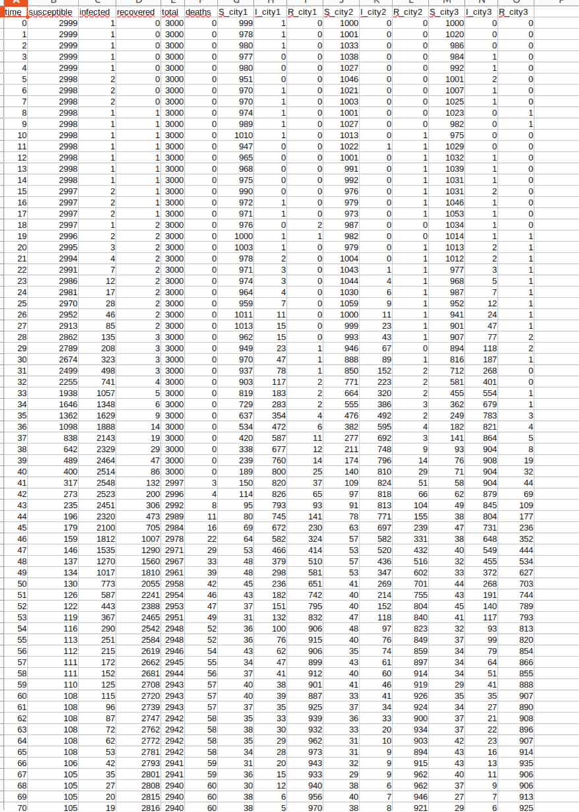
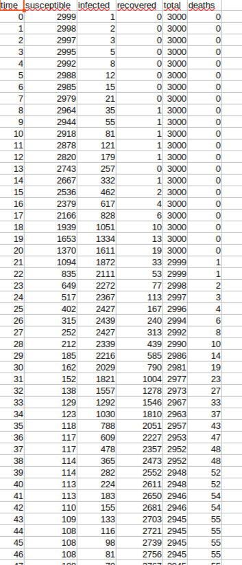
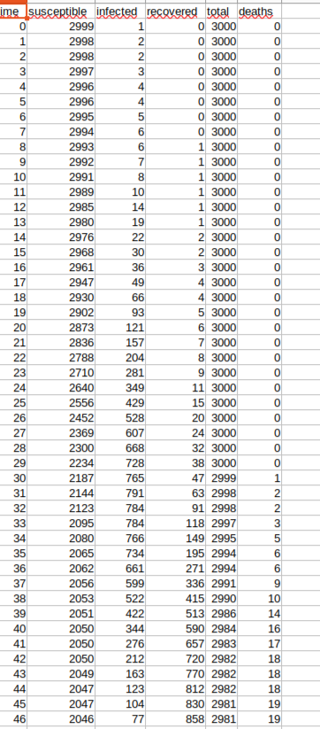
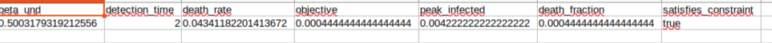

---
author:
  - name: Глущенко Евгений Игоревич
    affiliation:
      - name: Российский университет дружбы народов имени Патриса Лумумбы
        country: Российская Федерация
        city: Москва
title: "Отчёт по лабораторной работе №4"
subtitle: "Имитационное моделирование: реализация SIR-модели в агентном подходе"
license: "CC BY"
---

# Цель работы

[Кратко переписать цель работы.]

Исполнитель работы: Глущенко Евгений Игоревич.  
Группа: НФИбд-01-23.  
Студенческий билет: 1132239110.

# Задание

1. [Пункт 1.]
2. [Пункт 2.]
3. [Пункт 3.]
4. [Пункт 4.]
5. [Пункт 5.]
6. [Пункт 6.]
7. [Пункт 7.]

# Теоретическое введение

## Модель SIR

[Кратко переписать, что такое SIR.]

## Агентное моделирование и инструменты

[Кратко переписать про Agents.jl, DrWatson.jl, Literate.jl.]

## Литературное программирование

[Кратко переписать идею literate programming.]

## Параметры модели

[Переписать таблицу параметров.]

# Выполнение лабораторной работы

## Настройка окружения

[Текст про запуск Julia и активацию проекта.]

{width=85%}

{width=85%}

## Реализация базовой SIR-модели

[Текст про `src/sir_model.jl`.]

## Базовый эксперимент

[Текст про `sir_run_basic.jl`.]

{width=85%}

{width=90%}

## Исследование коэффициента заразности

[Текст про `sir_scan_beta.jl`.]

{width=85%}

{width=90%}

## Исследование миграции

[Текст про `sir_migration_effect.jl`.]

{width=85%}

{width=90%}

{width=92%}

## Базовая оптимизация и итоговая визуализация

[Текст про оптимизацию и сводный график.]

{width=92%}

{width=92%}

{width=85%}

{width=90%}

## Генерация производных форматов и выполнение notebook

[Текст про `tangle.jl` и `nbconvert`.]

{width=90%}

{width=90%}

{width=75%}

# Дополнительные задания

## Задание 1. Базовый уровень

[Переписать вывод по `R_0`.]

## Задание 2. Исследование порога

[Переписать вывод про порог.]

## Задание 3. Эффект гетерогенности

[Текст про неоднородность.]

{width=85%}

{width=90%}

{width=75%}

## Задание 4. Миграция

[Переписать вывод по миграции.]

## Задание 5. Карантинные меры

[Текст про карантин.]

{width=85%}

{width=90%}

{width=60%}

{width=60%}

## Задание 6. Оптимизация с ограничением на пик

[Текст про ограниченную оптимизацию.]

{width=92%}

{width=95%}

# Выводы

[Кратко переписать выводы.]
