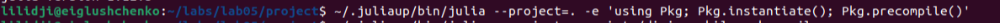
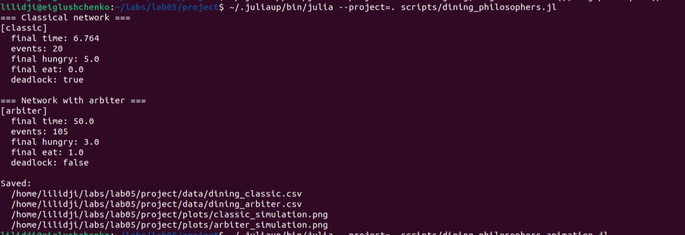
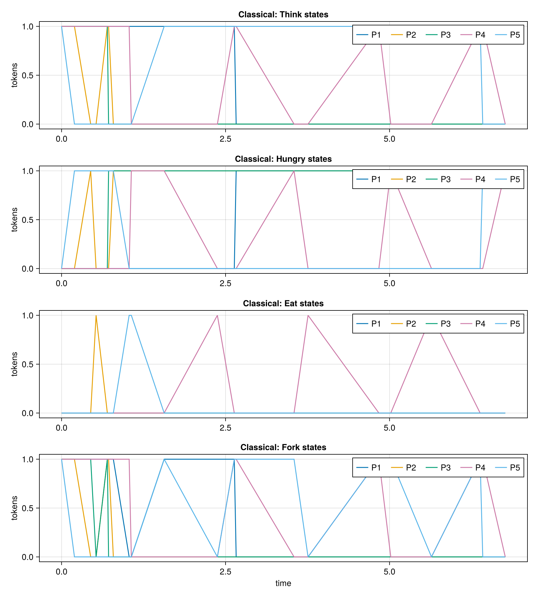
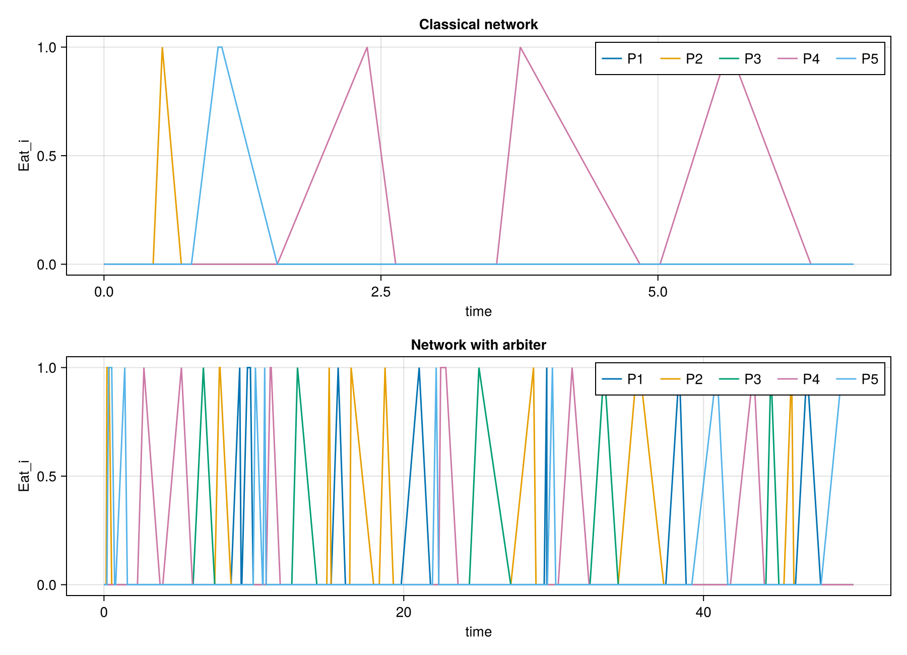
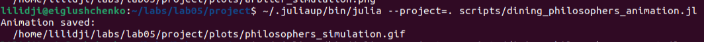
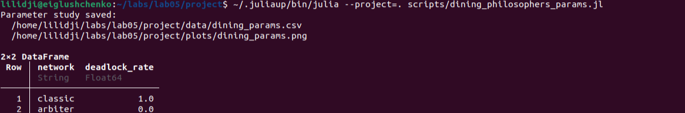
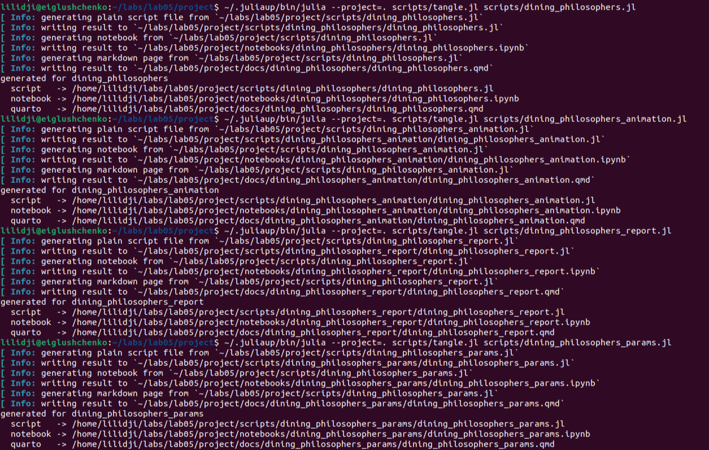
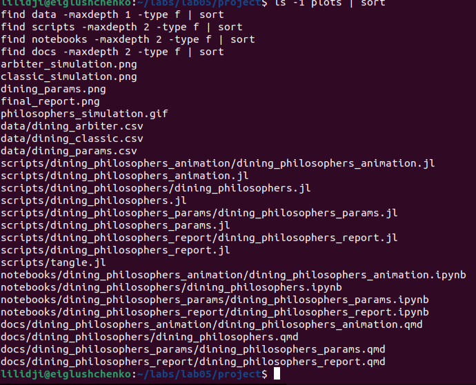

---
author:
  name: Глущенко Евгений Игоревич
  affiliation:
    - name: Российский университет дружбы народов имени Патриса Лумумбы
      country: Российская Федерация
      postal-code: 117198
      city: Москва
      address: ул. Миклухо-Маклая, д. 6
title: Имитационное моделирование
subtitle: "Лабораторная работа №5. Аппарат сетей Петри"
license: CC BY
date: 2026-04-17
date-format: "YYYY-MM-DD"
---

# Информация

## Докладчик и работа

:::::::::::::: {.columns align=center}
::: {.column width="67%"}

- Глущенко Евгений Игоревич
- студент группы НФИбд-01-23
- студенческий билет: 1132239110
- РУДН имени Патриса Лумумбы
- тема: сети Петри и задача обедающих философов
- средства: Julia, DrWatson, CairoMakie, CSV, DataFrames, Literate.jl

:::
::: {.column width="30%"}

{width=72%}

:::
::::::::::::::

# Цель и задачи

## Цель работы

- Изучить аппарат сетей Петри
- Реализовать классическую сеть для задачи обедающих философов
- Реализовать модификацию с арбитром
- Сравнить наличие deadlock в двух сетях
- Подготовить literate-версии скриптов и документацию

## Задание

1. Создать проект Julia в структуре `DrWatson`
2. Реализовать модель сети Петри
3. Выполнить базовый эксперимент и анимацию
4. Построить итоговый график по `Eat_i`
5. Провести параметрическое исследование по `N`, `tmax`, `seed`
6. Сгенерировать `.jl`, `.ipynb`, `.qmd`

# Теоретическое введение

## Сеть Петри

:::::::::::::: {.columns}
::: {.column width="50%"}

$$
N = (P, T, F, M_0)
$$

- `P` -- позиции
- `T` -- переходы
- `F` -- дуги
- `M_0` -- начальная маркировка

:::
::: {.column width="50%"}

- позиции описывают состояния
- переходы описывают события
- фишки задают текущую маркировку
- переход срабатывает при наличии входных фишек
- срабатывание меняет маркировку

:::
::::::::::::::

## Задача обедающих философов

- `N` философов сидят за круглым столом
- Между соседями лежит одна вилка
- Чтобы есть, нужны левая и правая вилки
- В классической постановке возможен deadlock
- Позиция Arbiter с N-1 фишками предотвращает тупик

## Позиции модели

:::::::::::::: {.columns}
::: {.column width="50%"}

- `Think_i` -- философ размышляет
- `Hungry_i` -- философ ждёт вторую вилку
- `Eat_i` -- философ ест

:::
::: {.column width="50%"}

- `Fork_i` -- вилка свободна
- `Arbiter` -- дополнительный ресурс
- deadlock фиксируется, если нет разрешённых переходов

:::
::::::::::::::

# Настройка окружения

## Рабочий каталог и Julia

:::::::::::::: {.columns}
::: {.column width="50%"}

{width=100%}

:::
::: {.column width="50%"}

{width=100%}

:::
::::::::::::::

## Подготовка проекта

{width=95%}

## Структура проекта

:::::::::::::: {.columns}
::: {.column width="50%"}

- `src/DiningPhilosophers.jl`
- `scripts/dining_philosophers.jl`
- `scripts/dining_philosophers_animation.jl`

:::
::: {.column width="50%"}

- `scripts/dining_philosophers_report.jl`
- `scripts/dining_philosophers_params.jl`
- `scripts/tangle.jl`

:::
::::::::::::::

# Реализация модели

## Структура и функции

```julia
struct PetriNet
    n_places::Int
    n_transitions::Int
    incidence::Matrix{Int}
    place_names::Vector{Symbol}
    transition_names::Vector{Symbol}
end
```

Основные функции: `build_classical_network`, `build_arbiter_network`, `simulate_stochastic`, `detect_deadlock`.

# Базовый эксперимент

## Запуск базового эксперимента

{width=95%}

## Классическая сеть

:::::::::::::: {.columns}
::: {.column width="45%"}

- финальное время: `6.764`
- число событий: `20`
- `final_hungry = 5`
- `final_eat = 0`
- `deadlock: true`

:::
::: {.column width="55%"}

{width=100%}

:::
::::::::::::::

## Сеть с арбитром

:::::::::::::: {.columns}
::: {.column width="45%"}

- финальное время: `50.0`
- число событий: `105`
- `final_hungry = 3`
- `final_eat = 1`
- `deadlock: false`

:::
::: {.column width="55%"}

{width=100%}

:::
::::::::::::::

## Сравнение `Eat_i`

{width=88%}

## Вывод по базовому эксперименту

- в классической сети `Eat_i` быстро исчезают
- все философы оказываются в состоянии ожидания
- все вилки становятся недоступны
- в сети с арбитром переходы продолжают срабатывать
- арбитр устраняет тупиковую конфигурацию

# Анимация и параметры

## Анимация маркировки

:::::::::::::: {.columns}
::: {.column width="58%"}

{width=100%}

:::
::: {.column width="42%"}

- используется классическая сеть с `N = 3`
- каждый кадр показывает текущую маркировку
- результат: `plots/philosophers_simulation.gif`

:::
::::::::::::::

## Параметрическое исследование

:::::::::::::: {.columns}
::: {.column width="50%"}

{width=100%}

:::
::: {.column width="50%"}

- `N = [3, 5, 7]`
- `tmax = [30.0, 50.0, 80.0]`
- `seed = [123, 124, 125]`
- всего `54` запуска

:::
::::::::::::::

## Deadlock rate

{width=76%}

## Результат параметрического исследования

- `classic`: deadlock rate равен `1.0`
- `arbiter`: deadlock rate равен `0.0`
- результат устойчив для всех рассмотренных `N`, `tmax` и `seed`
- сеть с арбитром сохраняет активность

# Literate-форматы

## Генерация производных форматов

{width=95%}

## Итоговая структура файлов

:::::::::::::: {.columns}
::: {.column width="48%"}

{width=100%}

:::
::: {.column width="52%"}

- clean-скрипты `.jl`
- Quarto-документы `.qmd`
- notebook-файлы `.ipynb`
- CSV-таблицы
- PNG-графики
- GIF-анимация

:::
::::::::::::::

# Выводы

## Основные результаты

- Реализована сеть Петри для задачи обедающих философов
- Классическая сеть пришла к deadlock
- Сеть с арбитром не заблокировалась
- Получены CSV-файлы, графики и GIF-анимация
- Подготовлены literate-версии и производные форматы

## Итоговый вывод

Классическая постановка задачи обедающих философов допускает взаимную блокировку. Добавление позиции Arbiter с N-1 фишками предотвращает конфигурацию, в которой все философы одновременно удерживают по одной вилке. Поэтому сеть с арбитром сохраняет активность на всём интервале моделирования.
