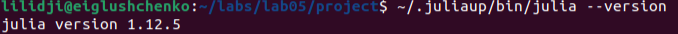
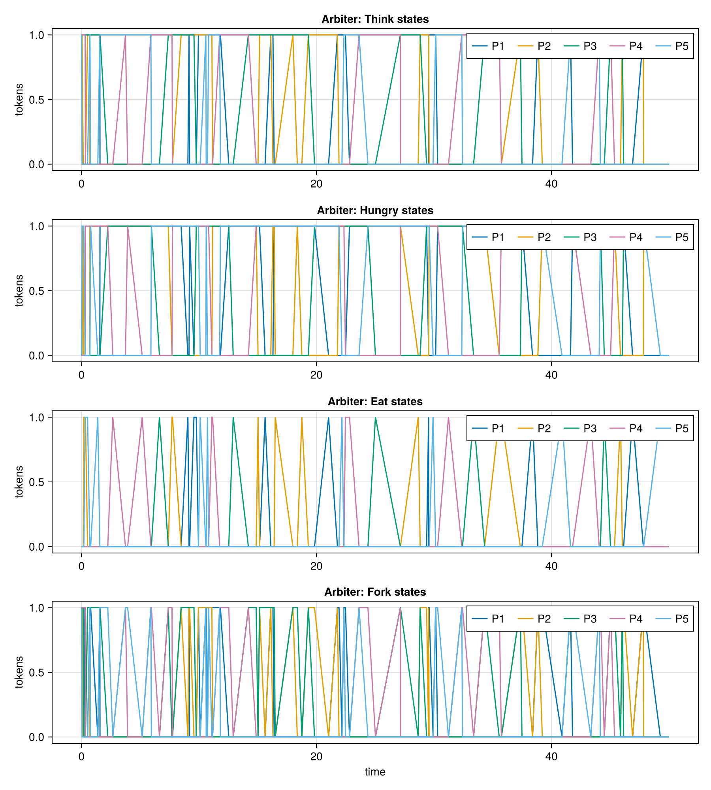
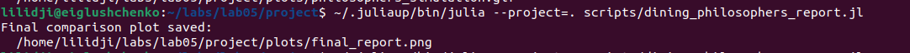
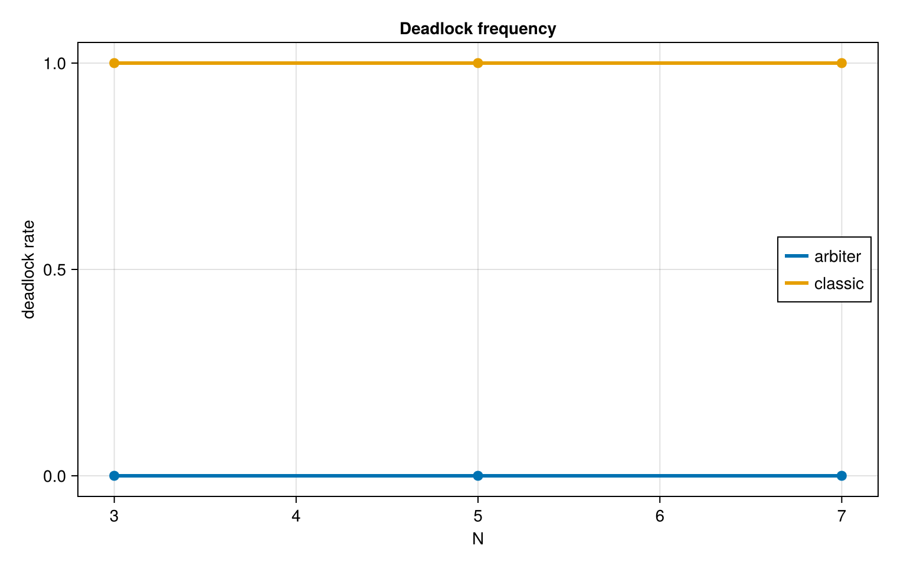

---
author:
  - name: Глущенко Евгений Игоревич
    affiliation:
      - name: Российский университет дружбы народов имени Патриса Лумумбы
        country: Российская Федерация
        city: Москва
title: "Отчёт по лабораторной работе №5"
subtitle: "Имитационное моделирование: аппарат сетей Петри"
license: "CC BY"
date: 2026-04-17
date-format: "YYYY-MM-DD"
---

# Цель работы

Изучить аппарат сетей Петри на примере задачи обедающих философов, реализовать классическую и модифицированную модель на языке Julia, выполнить вычислительные эксперименты, получить графики и таблицы результатов, подготовить literate-версии скриптов и собрать итоговую документацию по лабораторной работе.

Исполнитель работы: Глущенко Евгений Игоревич.  
Группа: НФИбд-01-23.  
Студенческий билет: 1132239110.

# Задание

В рамках лабораторной работы требовалось:

1. Создать рабочий каталог и проект Julia в структуре `DrWatson`.
2. Установить необходимые пакеты для моделирования, визуализации и документирования.
3. Реализовать модель сети Петри для задачи обедающих философов.
4. Выполнить базовый эксперимент для классической сети и сети с арбитром.
5. Построить анимацию изменения маркировки.
6. Сформировать итоговый сравнительный график по состояниям `Eat_i`.
7. Выполнить параметрическое исследование по `N`, `tmax` и `seed`.
8. Подготовить literate-версии скриптов и производные форматы `clean`, `md`, `ipynb`.
9. Описать все полученные графики, CSV-таблицы и листинги кода.

# Теоретическое введение

## Сети Петри

Сеть Петри представляет собой двудольный ориентированный граф, в котором вершины разделены на два типа: позиции и переходы. Позиции описывают состояния системы или наличие ресурсов, переходы задают события, а дуги определяют условия срабатывания переходов. Текущее состояние сети называется маркировкой и задаётся числом фишек в каждой позиции [@peterson_1981].

Формально сеть Петри можно записать как

$$
N = (P, T, F, M_0),
$$

где `P` -- множество позиций, `T` -- множество переходов, `F` -- множество дуг, а `M_0` -- начальная маркировка.

Переход считается разрешённым, если во всех его входных позициях есть нужное число фишек. При срабатывании переход удаляет фишки из входных позиций и добавляет фишки в выходные позиции.

## Задача обедающих философов

В задаче обедающих философов `N` философов сидят за круглым столом. Между соседними философами находится по одной вилке. Чтобы начать есть, философ должен получить две вилки: левую и правую. Если все философы одновременно возьмут по одной вилке, система перейдёт в состояние взаимной блокировки: каждый ждёт вторую вилку, но ни одна вилка не свободна.

В модели использованы следующие позиции:

- `Think_i` -- философ `i` размышляет;
- `Hungry_i` -- философ `i` взял левую вилку и ожидает правую;
- `Eat_i` -- философ `i` ест;
- `Fork_i` -- вилка `i` свободна.

В модифицированной сети добавляется позиция `Arbiter` с `N - 1` фишками. Она не позволяет всем философам одновременно войти в стадию захвата ресурсов и тем самым устраняет тупиковую конфигурацию.

## Стохастическое моделирование

Для имитационного моделирования используется событийная схема, близкая к алгоритму Гиллеспи [@gillespie_1977]. На каждом шаге вычисляются интенсивности допустимых переходов, случайно выбирается следующий переход и обновляется маркировка сети.

Лабораторная работа оформлена как воспроизводимый проект: исходные сценарии одновременно являются исполняемым кодом и literate-документацией. Такой подход соответствует идее литературного программирования [@knuth_1984] и реализован через `Literate.jl` [@literate_jl]. Структура проекта организована с помощью `DrWatson.jl` [@drwatson], вычисления выполнены на Julia [@julia_2017].

# Выполнение лабораторной работы

## Подготовка окружения

Работа выполнялась в каталоге проекта `~/labs/lab05/project`. На @fig-cd показан переход в рабочий каталог.

{#fig-cd width=88%}

Версия Julia была проверена отдельной командой (@fig-version). Это подтверждает наличие рабочей среды для выполнения скриптов.

{#fig-version width=78%}

Далее было активировано окружение проекта и выполнена предкомпиляция зависимостей (@fig-pkg). В проекте использованы пакеты `CSV`, `DataFrames`, `DrWatson`, `CairoMakie`, `Literate`, `IJulia` и `ImageIO`.

{#fig-pkg width=95%}

## Структура проекта

Основные файлы лабораторной работы:

- `src/DiningPhilosophers.jl` -- модуль с описанием структуры сети Петри, моделирования, проверки deadlock и построения графиков;
- `scripts/dining_philosophers.jl` -- базовый эксперимент;
- `scripts/dining_philosophers_animation.jl` -- построение GIF-анимации;
- `scripts/dining_philosophers_report.jl` -- итоговый сравнительный график;
- `scripts/dining_philosophers_params.jl` -- параметрическое исследование;
- `scripts/tangle.jl` -- генерация clean-скриптов, Quarto-документов и notebook-файлов.

## Описание программной модели

В модуле `DiningPhilosophers.jl` определена структура:

```julia
struct PetriNet
    n_places::Int
    n_transitions::Int
    incidence::Matrix{Int}
    place_names::Vector{Symbol}
    transition_names::Vector{Symbol}
end
```

Матрица инцидентности хранит изменение маркировки при срабатывании каждого перехода. Отрицательные элементы соответствуют удалению фишек из входных позиций, положительные -- добавлению фишек в выходные позиции.

Функция `build_classical_network(N)` строит классическую сеть Петри для `N` философов. Функция `build_arbiter_network(N)` строит модифицированную сеть, дополнительно вводя позицию `Arbiter`. Проверка взаимной блокировки выполняется функцией `detect_deadlock(df, net)`: она анализирует последнюю маркировку и возвращает `true`, если ни один переход больше не может сработать.

## Базовый эксперимент

Базовый эксперимент был запущен командой `scripts/dining_philosophers.jl` (@fig-basic-run). Для `N = 5`, `tmax = 50.0` и `seed = 123` были смоделированы две сети: классическая и сеть с арбитром.

{#fig-basic-run width=95%}

Для классической сети финальное время составило `6.764`, число событий -- `20`, итоговое число голодных философов -- `5`, а число философов в состоянии `Eat` -- `0`. Функция обнаружения взаимной блокировки вернула `deadlock: true`.

Для сети с арбитром моделирование дошло до `t = 50.0`, число событий составило `105`, в финальном состоянии один философ находился в состоянии `Eat`, а признак блокировки равен `deadlock: false`.

CSV-файлы, созданные базовым экспериментом:

- `data/dining_classic.csv`;
- `data/dining_arbiter.csv`.

Графики, созданные базовым экспериментом:

- `plots/classic_simulation.png`;
- `plots/arbiter_simulation.png`.

## Результаты классической сети

На @fig-classic показана динамика маркировки для классической сети. Верхние панели отражают состояния `Think_i` и `Hungry_i`, нижние -- `Eat_i` и `Fork_i`.

{#fig-classic width=95%}

В конце моделирования все философы находятся в состояниях `Hungry_i`, все `Eat_i = 0`, все `Fork_i = 0`. Это означает, что каждый философ ожидает вторую вилку, но ни одна вилка недоступна. Полученная конфигурация соответствует deadlock.

Последняя строка `dining_classic.csv` имеет смысл:

- `time = 6.764274`;
- `Hungry_1 = ... = Hungry_5 = 1`;
- `Eat_1 = ... = Eat_5 = 0`;
- `Fork_1 = ... = Fork_5 = 0`.

## Результаты сети с арбитром

На @fig-arbiter показана динамика маркировки для сети с арбитром.

{#fig-arbiter width=95%}

В отличие от классической сети, переходы продолжают срабатывать до конца интервала моделирования. Позиция `Arbiter` ограничивает число философов, которые одновременно начинают захват вилок. Поэтому система не попадает в конфигурацию, где все философы удерживают по одной вилке.

## Анимация процесса

Для наглядного просмотра изменения маркировки был запущен скрипт `scripts/dining_philosophers_animation.jl` (@fig-animation-run). В нём используется классическая сеть с `N = 3`, чтобы подписи позиций оставались читаемыми.

{#fig-animation-run width=92%}

Результатом стал файл `plots/philosophers_simulation.gif`. Анимация показывает последовательное перемещение фишек между позициями `Think`, `Hungry`, `Eat` и `Fork`.

## Итоговый сравнительный график

Скрипт `scripts/dining_philosophers_report.jl` загружает CSV-файлы базового эксперимента и строит сравнительный график по состояниям `Eat_i` (@fig-report-run).

{#fig-report-run width=92%}

Итоговый график приведён на @fig-final. Верхняя панель соответствует классической сети, нижняя -- сети с арбитром.

{#fig-final width=92%}

В классической сети линии `Eat_i` быстро опускаются к нулю и далее остаются нулевыми. В сети с арбитром состояния `Eat_i` продолжают появляться на всём интервале моделирования, что подтверждает отсутствие тупика.

## Параметрическое исследование

Параметрическое исследование было выполнено скриптом `scripts/dining_philosophers_params.jl` (@fig-params-run). Использовались значения:

- `N = 3, 5, 7`;
- `tmax = 30.0, 50.0, 80.0`;
- `seed = 123, 124, 125`.

{#fig-params-run width=92%}

Для каждой комбинации параметров моделировались две сети: `classic` и `arbiter`. Всего было выполнено `54` запуска. Результаты сохранены в файл `data/dining_params.csv`, а график частоты deadlock сохранён в `plots/dining_params.png`.

{#fig-params width=82%}

Полученный результат устойчив:

- для сети `classic` частота deadlock равна `1.0`;
- для сети `arbiter` частота deadlock равна `0.0`.

Следовательно, при рассмотренных значениях `N`, `tmax` и `seed` классическая сеть всегда приходила к взаимной блокировке, а сеть с арбитром не блокировалась ни в одном прогоне.

## Генерация literate-форматов

После выполнения вычислительных сценариев был запущен `scripts/tangle.jl` (@fig-tangle). Он сформировал для каждого literate-скрипта три производных представления:

- clean-скрипт `.jl`;
- `Jupyter notebook` `.ipynb`;
- Quarto-документ `.qmd`.

{#fig-tangle width=95%}

Итоговая структура файлов показана на @fig-files. В каталоге `plots` находятся графики и GIF-анимация, в `data` -- CSV-файлы, в `scripts/<name>` -- clean-версии, в `notebooks/<name>` -- notebook-файлы, в `docs/<name>` -- Quarto-документы.

{#fig-files width=78%}

# Анализ результатов

Полученные результаты согласуются между собой:

- `dining_classic.csv` фиксирует переход классической сети в тупиковую маркировку;
- `classic_simulation.png` визуально показывает исчезновение свободных вилок и состояний `Eat_i`;
- `dining_arbiter.csv` показывает продолжение срабатывания переходов до конца интервала моделирования;
- `arbiter_simulation.png` демонстрирует чередование состояний в сети с арбитром;
- `final_report.png` показывает ключевое отличие двух сетей по состояниям `Eat_i`;
- `dining_params.csv` и `dining_params.png` подтверждают устойчивость результата на серии параметров.

Основной вывод состоит в том, что классическая постановка задачи обедающих философов содержит возможность deadlock, а введение дополнительного ресурса `Arbiter` предотвращает эту ситуацию.

# Выводы

В ходе лабораторной работы был изучен аппарат сетей Петри и реализована модель задачи обедающих философов. Были построены две сети: классическая сеть и сеть с арбитром. Классическая сеть при `N = 5` пришла к взаимной блокировке за `20` событий и остановилась в момент времени `6.764`. Сеть с арбитром продолжила работу до конца интервала `tmax = 50.0` и не перешла в deadlock.

Были получены CSV-файлы с траекториями состояний, графики эволюции маркировки, GIF-анимация, итоговый сравнительный график и результаты параметрического исследования. Для всех 27 комбинаций параметров классическая сеть завершалась deadlock, а сеть с арбитром не блокировалась ни в одном запуске.

Также были подготовлены literate-версии скриптов и автоматически сгенерированы производные форматы `.jl`, `.qmd` и `.ipynb`, что обеспечивает воспроизводимость лабораторной работы.
