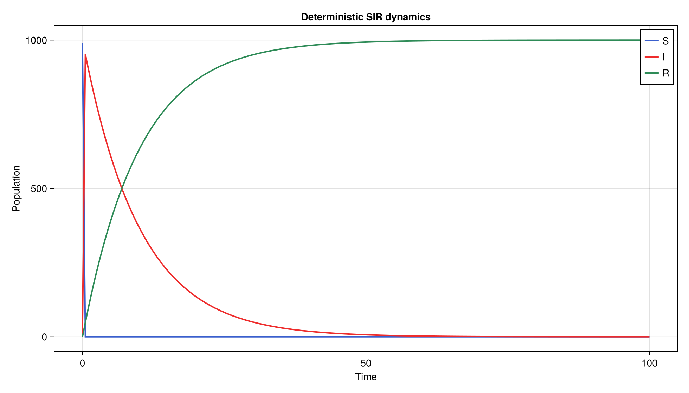
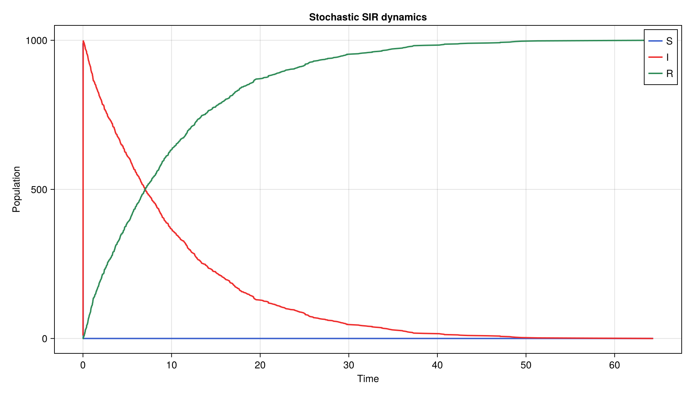
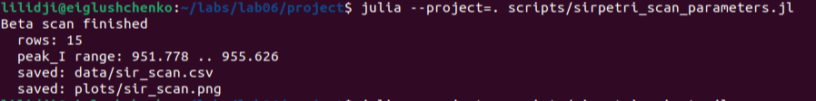
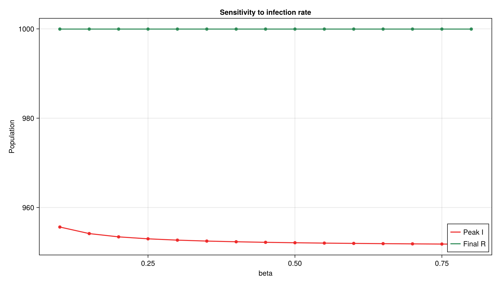
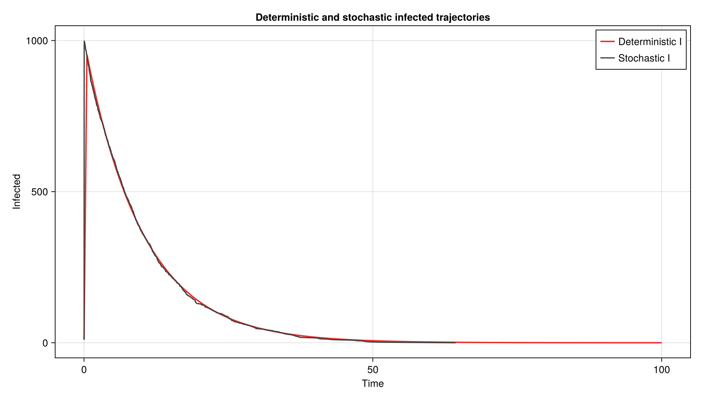
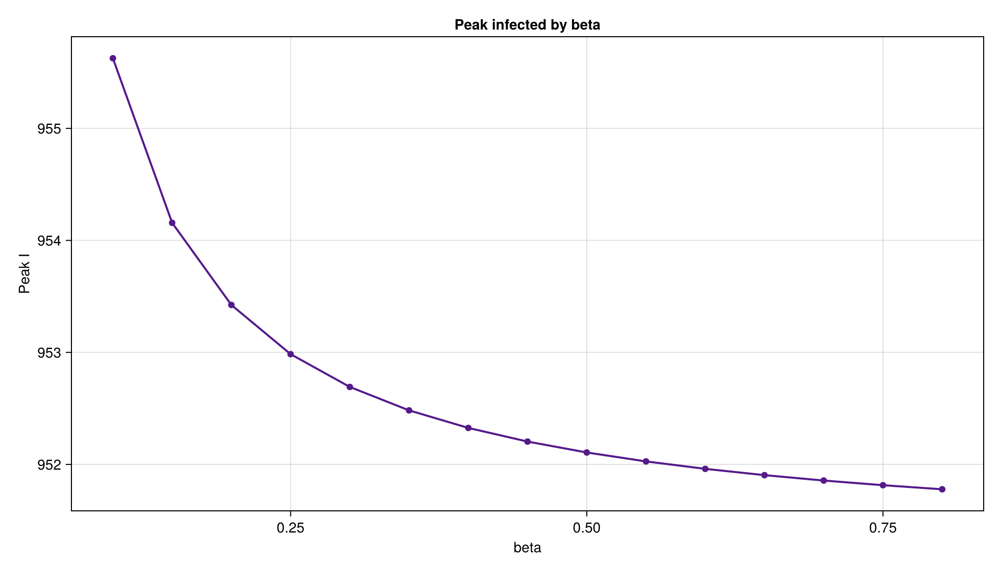
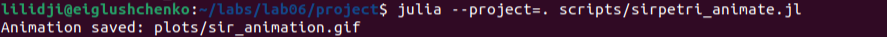
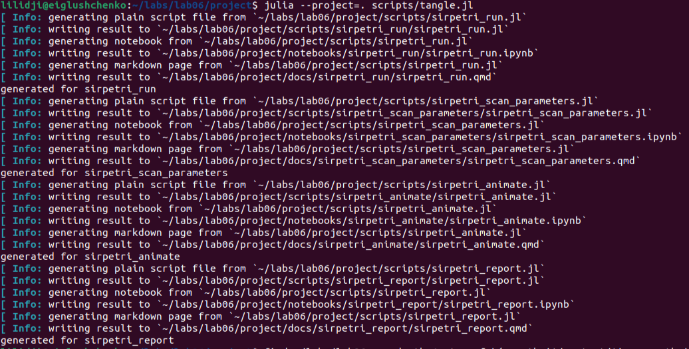

---
author:
  name: Глущенко Евгений Игоревич
  affiliation:
    - name: Российский университет дружбы народов имени Патриса Лумумбы
      country: Российская Федерация
      postal-code: 117198
      city: Москва
      address: ул. Миклухо-Маклая, д. 6
title: Имитационное моделирование
subtitle: "Лабораторная работа №6. Реализация модели SIR в подходе сетей Петри"
license: CC BY
date: 2026-05-01
date-format: "YYYY-MM-DD"
---

# Информация

## Докладчик и работа

:::::::::::::: {.columns align=center}
::: {.column width="67%"}

- Глущенко Евгений Игоревич
- студент группы НФИбд-01-23
- студенческий билет: 1132239110
- РУДН имени Патриса Лумумбы
- тема: модель SIR в подходе сетей Петри
- средства: Julia, DrWatson, CairoMakie, CSV, DataFrames, Literate.jl

:::
::: {.column width="30%"}

{width=72%}

:::
::::::::::::::

# Цель и задачи

## Цель работы

- Изучить реализацию SIR через сеть Петри
- Построить модуль модели на Julia
- Выполнить детерминированную симуляцию
- Выполнить стохастическую симуляцию
- Провести исследование по коэффициенту заражения
- Подготовить графики, CSV, GIF и literate-форматы

## Задание

1. Создать проект Julia в структуре `DrWatson`
2. Реализовать `src/SIRPetri.jl`
3. Запустить базовый сценарий SIR
4. Построить графики динамики `S`, `I`, `R`
5. Просканировать параметр `beta`
6. Сгенерировать `.jl`, `.qmd`, `.ipynb`

# Теоретическое введение

## Сеть Петри

:::::::::::::: {.columns}
::: {.column width="50%"}

$$
N = (P, T, F, M_0)
$$

- `P` -- позиции
- `T` -- переходы
- `F` -- дуги
- `M_0` -- начальная маркировка

:::
::: {.column width="50%"}

- позиции задают состояния
- переходы задают события
- фишки задают текущую маркировку
- срабатывание перехода меняет маркировку

:::
::::::::::::::

## Модель SIR

:::::::::::::: {.columns}
::: {.column width="48%"}

Состояния:

- `S` -- восприимчивые
- `I` -- инфицированные
- `R` -- выздоровевшие

:::
::: {.column width="52%"}

Переходы:

- `infection`: `S + I -> I + I`
- `recovery`: `I -> R`

Начальная маркировка:

```text
S = 990, I = 10, R = 0
```

:::
::::::::::::::

## Детерминированная форма

$$
\frac{dS}{dt} = -\beta SI
$$

$$
\frac{dI}{dt} = \beta SI - \gamma I
$$

$$
\frac{dR}{dt} = \gamma I
$$

Эта форма даёт гладкую усреднённую траекторию.

## Стохастическая форма

- используется прямой метод Гиллеспи
- на каждом шаге считаются интенсивности событий
- случайно выбирается время следующего события
- случайно выбирается переход `infection` или `recovery`
- маркировка меняется дискретно

# Реализация

## Структура проекта

:::::::::::::: {.columns}
::: {.column width="50%"}

- `src/SIRPetri.jl`
- `scripts/sirpetri_run.jl`
- `scripts/sirpetri_scan_parameters.jl`

:::
::: {.column width="50%"}

- `scripts/sirpetri_animate.jl`
- `scripts/sirpetri_report.jl`
- `scripts/tangle.jl`

:::
::::::::::::::

## Переход в каталог

{width=82%}

Рабочие сценарии запускались из каталога `~/labs/lab06/project`.

## Структура сети

```julia
struct PetriNet
    places::Vector{Symbol}
    transitions::Vector{Symbol}
    pre::Matrix{Int}
    post::Matrix{Int}
    rates::Vector{Float64}
end
```

`pre` описывает входы переходов, `post` описывает выходы переходов.

## Переходы SIR

:::::::::::::: {.columns}
::: {.column width="50%"}

```julia
pre = [
    1 0
    1 1
    0 0
]
```

:::
::: {.column width="50%"}

```julia
post = [
    0 0
    2 0
    0 1
]
```

:::
::::::::::::::

Первый столбец задаёт заражение, второй -- выздоровление.

# Базовый эксперимент

## Параметры запуска

- `beta = 0.3`
- `gamma = 0.1`
- `tmax = 100.0`
- `seed = 123`
- детерминированных строк: `201`
- стохастических строк: `1991`

## Запуск базового сценария

{width=96%}

## Детерминированная динамика

{width=88%}

## Результат детерминированной модели

- максимальное число инфицированных: `952.691`
- время пика: `0.5`
- финальное `S` практически равно нулю
- финальное `I = 0.045`
- финальное `R = 999.955`

## Стохастическая динамика

{width=88%}

## Результат стохастической модели

- максимальное число инфицированных: `999`
- время пика: `0.037`
- процесс завершился при `t = 64.352`
- финальное состояние: `S = 0`, `I = 0`, `R = 1000`

# Анализ параметров

## Сканирование beta

- фиксировано `gamma = 0.1`
- проверены значения `beta` от `0.10` до `0.80`
- шаг сетки: `0.05`
- всего строк в таблице: `15`
- результат сохранён в `data/sir_scan.csv`

## Запуск сканирования beta

{width=96%}

## График чувствительности

{width=88%}

## Вывод по beta

- пик `I` лежит в диапазоне `951.778 .. 955.626`
- финальное `R` остаётся около `999.954`
- для всех проверенных `beta` эпидемия охватывает почти всю популяцию
- высокая скорость заражения связана с формой интенсивности `beta * S * I`

# Итоговые материалы

## Сравнение траекторий

{width=88%}

## Запуск отчётного сценария

{width=96%}

## Пик инфицированных

{width=88%}

## Анимация

:::::::::::::: {.columns}
::: {.column width="55%"}

Файл результата:

```text
plots/sir_animation.gif
```

:::
::: {.column width="45%"}

- показывает маркировку `S`, `I`, `R`
- строится по детерминированной траектории
- удобна для демонстрации переходов сети

:::
::::::::::::::

## Запуск анимации

{width=96%}

## Literate-версии

Для каждого сценария получены:

- clean-скрипт `.jl`
- Quarto-документ `.qmd`
- Jupyter notebook `.ipynb`

Сценарии:

- `sirpetri_run`
- `sirpetri_scan_parameters`
- `sirpetri_animate`
- `sirpetri_report`

## Генерация literate-файлов

{width=96%}

## Проверка итоговых файлов

{width=96%}

# Выводы

## Основные результаты

- SIR-модель реализована как сеть Петри
- построены детерминированная и стохастическая симуляции
- сохранены CSV-файлы и графики
- проведено исследование по `beta`
- создана GIF-анимация маркировки
- подготовлены literate-представления сценариев

## Итоговый вывод

Модель SIR естественно описывается сетью Петри с двумя переходами: заражением и выздоровлением. Детерминированная форма даёт гладкую динамику, а стохастическая форма показывает дискретные события, но обе модели демонстрируют один и тот же процесс распространения инфекции.
