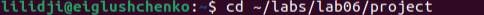
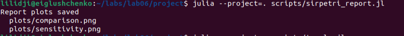
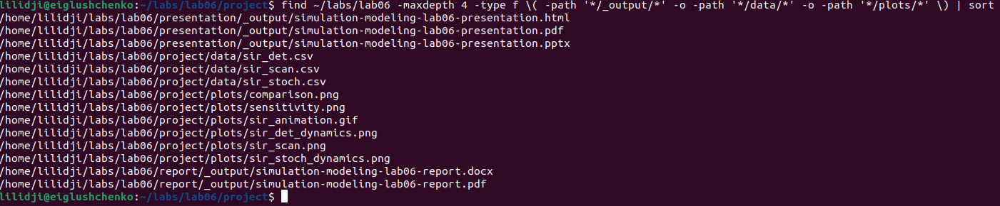

---
author:
  - name: Глущенко Евгений Игоревич
    affiliation:
      - name: Российский университет дружбы народов имени Патриса Лумумбы
        country: Российская Федерация
        city: Москва
title: "Отчёт по лабораторной работе №6"
subtitle: "Реализация модели SIR в подходе сетей Петри"
license: "CC BY"
date: 2026-05-01
date-format: "YYYY-MM-DD"
---

# Цель работы

Изучить реализацию эпидемической модели SIR в аппарате сетей Петри, построить вычислительный модуль на Julia, выполнить детерминированное и стохастическое моделирование, провести параметрическое исследование и подготовить воспроизводимые материалы лабораторной работы.

Исполнитель работы: Глущенко Евгений Игоревич.  
Группа: НФИбд-01-23.  
Студенческий билет: 1132239110.

# Задание

В рамках лабораторной работы требовалось:

1. Создать рабочий каталог и проект Julia в структуре `DrWatson`.
2. Реализовать модель SIR как сеть Петри.
3. Описать переходы заражения и выздоровления через матрицы входов и выходов.
4. Выполнить детерминированную симуляцию модели.
5. Выполнить стохастическую симуляцию методом Гиллеспи.
6. Сохранить результаты экспериментов в CSV-файлы.
7. Построить графики динамики `S`, `I`, `R`.
8. Провести исследование чувствительности по коэффициенту заражения `beta`.
9. Построить GIF-анимацию изменения маркировки.
10. Сформировать clean-скрипты, Quarto-документы и notebook-файлы через `Literate.jl`.

# Теоретическое введение

## Сети Петри

Сеть Петри представляет собой двудольный ориентированный граф, в котором вершины разделены на позиции и переходы. Позиции описывают состояния системы, переходы задают события, а маркировка показывает текущее число фишек в каждой позиции [@peterson_1981].

Формально сеть Петри можно записать как

$$
N = (P, T, F, M_0),
$$

где `P` -- множество позиций, `T` -- множество переходов, `F` -- множество дуг, а `M_0` -- начальная маркировка. Переход срабатывает, если входные позиции содержат требуемые фишки, после чего фишки удаляются из входов и добавляются в выходные позиции.

## Модель SIR

Модель SIR описывает распространение инфекции в популяции. Используются три состояния:

- `S` -- восприимчивые к заболеванию;
- `I` -- инфицированные;
- `R` -- выздоровевшие и не участвующие в дальнейшем заражении.

В сети Петри для SIR используются два перехода:

- `infection`: `S + I -> I + I`;
- `recovery`: `I -> R`.

Переход `infection` уменьшает число восприимчивых и увеличивает число инфицированных. Переход `recovery` переносит фишку из позиции `I` в позицию `R`.

## Детерминированная и стохастическая формы

Детерминированная форма модели задаётся системой:

$$
\frac{dS}{dt} = -\beta SI,\qquad
\frac{dI}{dt} = \beta SI - \gamma I,\qquad
\frac{dR}{dt} = \gamma I.
$$

Эта система описывает усреднённую непрерывную динамику по закону действующих масс. В стохастической форме используется прямой метод Гиллеспи [@gillespie_1977]. На каждом шаге вычисляются интенсивности событий:

$$
a_{inf} = \beta S I,\qquad a_{rec} = \gamma I,
$$

после чего случайно выбираются время следующего события и тип перехода. В текущей реализации коэффициент заражения используется без нормировки на размер популяции, поэтому рост числа инфицированных получается очень быстрым.

Лабораторная работа оформлена как воспроизводимый проект. Для структуры проекта используется `DrWatson.jl` [@drwatson], вычисления выполнены на Julia [@julia_2017], а производные представления сценариев получены с помощью `Literate.jl` [@literate_jl], что соответствует идее литературного программирования [@knuth_1984].

# Выполнение лабораторной работы

## Структура проекта

Работа выполнялась в каталоге `~/labs/lab06/project`. Основные файлы проекта:

{#fig-cd-project width=72%}

- `src/SIRPetri.jl` -- модуль с описанием сети Петри, симуляторов и функций визуализации;
- `scripts/sirpetri_run.jl` -- базовый запуск детерминированной и стохастической модели;
- `scripts/sirpetri_scan_parameters.jl` -- исследование чувствительности по `beta`;
- `scripts/sirpetri_animate.jl` -- построение GIF-анимации;
- `scripts/sirpetri_report.jl` -- итоговые сравнительные графики;
- `scripts/tangle.jl` -- генерация clean-скриптов, Quarto-документов и notebook-файлов.

## Описание программной модели

В модуле `SIRPetri.jl` задана структура сети:

```julia
struct PetriNet
    places::Vector{Symbol}
    transitions::Vector{Symbol}
    pre::Matrix{Int}
    post::Matrix{Int}
    rates::Vector{Float64}
end
```

Матрица `pre` хранит число фишек, необходимое для срабатывания перехода, а `post` -- число фишек, которое добавляется после срабатывания. Для модели SIR используются позиции `S`, `I`, `R` и переходы `infection`, `recovery`.

### Построение сети Петри

Функция `build_sir_network(beta, gamma)` создаёт сеть Петри и начальную маркировку:

```julia
function build_sir_network(beta::Real = 0.3, gamma::Real = 0.1)
    places = [:S, :I, :R]
    transitions = [:infection, :recovery]
    pre = [
        1 0
        1 1
        0 0
    ]
    post = [
        0 0
        2 0
        0 1
    ]
    net = PetriNet(places, transitions, pre, post, Float64[beta, gamma])
    u0 = Float64[990, 10, 0]
    return net, u0, places
end
```

Матрицы `pre` и `post` задают два перехода. Первый столбец соответствует заражению `S + I -> I + I`, второй -- выздоровлению `I -> R`. Начальная маркировка фиксирует популяцию из `1000` элементов: `990 + 10 + 0`.

### Правая часть детерминированной модели

Для детерминированной симуляции реализована функция правой части:

```julia
function sir_ode(net::PetriNet, rates::AbstractVector{<:Real} = net.rates)
    beta, gamma = Float64.(rates)
    function f(u)
        s, i, r = u
        infection_rate = beta * s * i
        recovery_rate = gamma * i
        return Float64[-infection_rate,
                       infection_rate - recovery_rate,
                       recovery_rate]
    end
    return f
end
```

Далее эта функция используется в методе Рунге-Кутты четвёртого порядка. Такая реализация не зависит от внешнего решателя ОДУ и напрямую повторяет уравнения SIR.

### Стохастическая симуляция

Стохастическая модель реализована прямым методом Гиллеспи:

```julia
while t < tmax
    s, i, r = u
    a_inf = beta * s * i
    a_rec = gamma * i
    a0 = a_inf + a_rec
    a0 <= 0 && break

    t += -log(rand(rng)) / a0
    t <= tmax || break

    if rand(rng) * a0 < a_inf && u[1] > 0
        u[1] -= 1
        u[2] += 1
    elseif u[2] > 0
        u[2] -= 1
        u[3] += 1
    end
end
```

На каждом шаге вычисляются интенсивности заражения и выздоровления. Затем случайно выбирается время следующего события и тип перехода, после чего маркировка изменяется на целочисленную величину.

## Базовый эксперимент

Базовый эксперимент выполняется скриптом `scripts/sirpetri_run.jl`. В нём использованы параметры:

- `beta = 0.3`;
- `gamma = 0.1`;
- `tmax = 100.0`;
- начальное состояние `S = 990`, `I = 10`, `R = 0`;
- зерно генератора случайных чисел `seed = 123` для стохастической симуляции.

После запуска были сформированы файлы:

- `data/sir_det.csv`;
- `data/sir_stoch.csv`;
- `plots/sir_det_dynamics.png`;
- `plots/sir_stoch_dynamics.png`.

Детерминированная таблица содержит `201` строку, стохастическая -- `1991` строку. Максимальное число инфицированных в детерминированном прогоне равно `952.691`, в стохастическом прогоне -- `999`.

Сводные численные характеристики двух прогонов приведены в @tbl-baseline-summary. Финальные маркировки вынесены отдельно в @tbl-baseline-final, чтобы таблицы оставались читаемыми в PDF.

| Модель | Строки | Пик `I` | `t_peak` | `t_final` |
|---|---:|---:|---:|---:|
| Детерм. | 201 | 952.691 | 0.500 | 100.000 |
| Стох. | 1991 | 999.000 | 0.037 | 64.352 |

: Сводная таблица базового эксперимента {#tbl-baseline-summary}

| Модель | Финальное `S` | Финальное `I` | Финальное `R` |
|---|---:|---:|---:|
| Детерм. | 0.000 | 0.045 | 999.955 |
| Стох. | 0 | 0 | 1000 |

: Финальные маркировки базового эксперимента {#tbl-baseline-final}

На @fig-run-baseline показан запуск базового сценария в терминале. Вывод подтверждает создание CSV-файлов и двух графиков динамики.

{#fig-run-baseline width=95%}

На @fig-det показана детерминированная динамика SIR.

{#fig-det width=92%}

График показывает быстрый переход почти всей популяции из состояния `S` в состояние `I`, а затем постепенный переход из `I` в `R`. К моменту `t = 100` остаётся около `0.045` инфицированного в непрерывной модели, а число выздоровевших равно примерно `999.955`.

На @fig-stoch показана стохастическая динамика.

{#fig-stoch width=92%}

В стохастической модели состояния являются целочисленными. Процесс завершился в момент времени `64.352`, когда все `1000` элементов популяции перешли в состояние `R`, а `S` и `I` стали равны нулю.

### Фрагменты CSV-таблиц базового эксперимента

В @tbl-det-sample приведены выбранные строки из `sir_det.csv`. Уже при `t = 0.5` значение `S` практически зануляется, а число инфицированных достигает максимума.

| `time` | `S` | `I` | `R` |
|---:|---:|---:|---:|
| 0.0 | 990.000 | 10.000 | 0.000 |
| 0.5 | 0.000 | 952.691 | 47.309 |
| 1.0 | 0.000 | 906.228 | 93.772 |
| 2.0 | 0.000 | 819.989 | 180.011 |
| 5.0 | 0.000 | 607.463 | 392.537 |
| 10.0 | 0.000 | 368.445 | 631.555 |
| 20.0 | 0.000 | 135.543 | 864.457 |
| 50.0 | 0.000 | 6.748 | 993.252 |
| 100.0 | 0.000 | 0.045 | 999.955 |

: Фрагмент таблицы `sir_det.csv` {#tbl-det-sample}

В @tbl-stoch-sample показаны первые события из `sir_stoch.csv`. Они демонстрируют дискретную природу стохастической модели: на каждом шаге `S` уменьшается на единицу, а `I` увеличивается на единицу.

| `time` | `S` | `I` | `R` |
|---:|---:|---:|---:|
| 0.000000 | 990 | 10 | 0 |
| 0.000219 | 989 | 11 | 0 |
| 0.000255 | 988 | 12 | 0 |
| 0.000435 | 987 | 13 | 0 |
| 0.001242 | 986 | 14 | 0 |
| 0.001373 | 985 | 15 | 0 |
| 0.001518 | 984 | 16 | 0 |
| 0.002194 | 983 | 17 | 0 |
| 0.002396 | 982 | 18 | 0 |
| 0.002458 | 981 | 19 | 0 |
| 0.002531 | 980 | 20 | 0 |

: Начальный фрагмент таблицы `sir_stoch.csv` {#tbl-stoch-sample}

Последние строки `sir_stoch.csv` приведены в @tbl-stoch-tail. Они показывают заключительный каскад выздоровлений, после которого в состоянии `I` не остаётся фишек.

| `time` | `S` | `I` | `R` |
|---:|---:|---:|---:|
| 45.684577 | 0 | 9 | 991 |
| 47.073102 | 0 | 8 | 992 |
| 47.090907 | 0 | 7 | 993 |
| 48.169597 | 0 | 6 | 994 |
| 48.425841 | 0 | 5 | 995 |
| 48.835457 | 0 | 4 | 996 |
| 49.502953 | 0 | 3 | 997 |
| 51.277630 | 0 | 2 | 998 |
| 57.393895 | 0 | 1 | 999 |
| 64.351667 | 0 | 0 | 1000 |

: Финальный фрагмент таблицы `sir_stoch.csv` {#tbl-stoch-tail}

## Параметрическое исследование

Сценарий `scripts/sirpetri_scan_parameters.jl` выполняет серию детерминированных запусков при фиксированном `gamma = 0.1` и значениях

$$
\beta \in \{0.10, 0.15, \ldots, 0.80\}.
$$

Для каждого значения `beta` сохраняются пик инфицированных и финальное число выздоровевших. Результаты записаны в `data/sir_scan.csv`, график сохранён в `plots/sir_scan.png`.

На @fig-run-scan показан запуск параметрического исследования. По выводу видно, что было сформировано `15` строк результатов, а диапазон пика `I` составил `951.778 .. 955.626`.

{#fig-run-scan width=95%}

{#fig-scan width=92%}

В рассматриваемом диапазоне пик `I` изменяется от `951.778` до `955.626`, а финальное число выздоровевших остаётся около `999.954`. Это означает, что при выбранной начальной маркировке и интенсивности выздоровления эпидемия охватывает практически всю популяцию для всех проверенных значений `beta`.

Полная таблица параметрического исследования приведена в @tbl-scan.

| `beta` | `peak_I` | `final_R` |
|---:|---:|---:|
| 0.10 | 955.626 | 999.954390 |
| 0.15 | 954.157 | 999.954460 |
| 0.20 | 953.424 | 999.954495 |
| 0.25 | 952.984 | 999.954516 |
| 0.30 | 952.691 | 999.954530 |
| 0.35 | 952.482 | 999.954540 |
| 0.40 | 952.326 | 999.954548 |
| 0.45 | 952.204 | 999.954554 |
| 0.50 | 952.106 | 999.954558 |
| 0.55 | 952.027 | 999.954562 |
| 0.60 | 951.960 | 999.954565 |
| 0.65 | 951.904 | 999.954568 |
| 0.70 | 951.856 | 999.954570 |
| 0.75 | 951.814 | 999.954572 |
| 0.80 | 951.778 | 999.954574 |

: Полная таблица `sir_scan.csv` {#tbl-scan}

## Анимация маркировки

Скрипт `scripts/sirpetri_animate.jl` создаёт GIF-анимацию изменения маркировки сети. Результат сохранён в файл:

{#fig-run-animation width=95%}

```text
plots/sir_animation.gif
```

В анимации каждый кадр показывает распределение фишек между позициями `S`, `I`, `R`. Такой формат удобно использовать при защите, потому что он показывает процесс перехода популяции из восприимчивого состояния в инфицированное, а затем в выздоровевшее.

## Итоговый отчётный сценарий

Скрипт `scripts/sirpetri_report.jl` читает ранее сохранённые CSV-файлы и строит итоговые графики:

- `plots/comparison.png` -- сравнение детерминированной и стохастической траекторий по `I`;
- `plots/sensitivity.png` -- отдельный график пика инфицированных по `beta`.

На @fig-run-report показан запуск итогового отчётного сценария. Он сохраняет оба изображения, которые затем используются в отчёте и презентации.

{#fig-run-report width=95%}

На @fig-comparison приведено сравнение траекторий.

{#fig-comparison width=92%}

Детерминированная траектория является гладкой, а стохастическая состоит из скачков, соответствующих отдельным событиям сети Петри. При этом обе траектории отражают один и тот же качественный процесс: резкий рост числа инфицированных и последующее убывание за счёт выздоровления.

На @fig-sensitivity показан итоговый график чувствительности.

{#fig-sensitivity width=92%}

С увеличением `beta` максимум `I` немного уменьшается в выбранной сетке параметров. Это связано с тем, что при очень быстром заражении фаза роста становится почти мгновенной, и сохранение траектории с шагом `saveat = 0.5` фиксирует пик с ограниченной временной точностью.

## Генерация literate-форматов

После выполнения вычислительных сценариев был запущен `scripts/tangle.jl`. Он сформировал производные версии для каждого сценария:

{#fig-run-tangle width=95%}

- clean-скрипты в `scripts/<name>/<name>.jl`;
- Quarto-документы в `docs/<name>/<name>.qmd`;
- notebook-файлы в `notebooks/<name>/<name>.ipynb`.

Итоговые literate-представления получены для сценариев:

- `sirpetri_run`;
- `sirpetri_scan_parameters`;
- `sirpetri_animate`;
- `sirpetri_report`.

## Проверка созданных файлов

После выполнения всех сценариев была проверена итоговая структура результатов. На @fig-check-files видны созданные PDF, DOCX, HTML и PPTX-файлы, CSV-таблицы, графики и GIF-анимация.

{#fig-check-files width=95%}

# Анализ результатов

Полученные файлы согласуются между собой:

- `sir_det.csv` и `sir_det_dynamics.png` описывают гладкую непрерывную траекторию;
- `sir_stoch.csv` и `sir_stoch_dynamics.png` описывают дискретную событийную траекторию;
- `sir_scan.csv` и `sir_scan.png` показывают влияние коэффициента заражения;
- `comparison.png` сопоставляет две формы модели;
- `sensitivity.png` выделяет зависимость максимального числа инфицированных от `beta`;
- `sir_animation.gif` показывает изменение маркировки во времени.

Главный результат состоит в том, что модель SIR естественно выражается через сеть Петри с двумя переходами. Детерминированная и стохастическая формы дают одинаковую содержательную картину, но различаются типом траектории: непрерывная модель сглаживает процесс, а стохастическая фиксирует отдельные события.

# Выводы

В ходе лабораторной работы была реализована модель SIR в подходе сетей Петри. Был создан модуль `SIRPetri.jl`, построены функции детерминированной и стохастической симуляции, сохранены CSV-таблицы и построены графики динамики `S`, `I`, `R`.

При параметрах `beta = 0.3`, `gamma = 0.1` и начальной маркировке `[990, 10, 0]` эпидемия быстро охватывает почти всю популяцию. Детерминированная модель дала максимум `I = 952.691`, а стохастическая модель достигла пика `I = 999`. Параметрическое исследование по `beta` показало, что во всех проверенных случаях финальное число выздоровевших близко к `1000`.

Также были подготовлены literate-версии сценариев в форматах `.jl`, `.qmd` и `.ipynb`, что обеспечивает воспроизводимость лабораторной работы.
