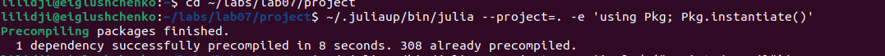
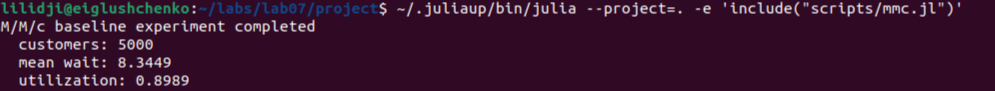
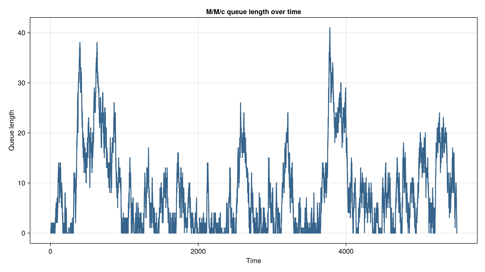
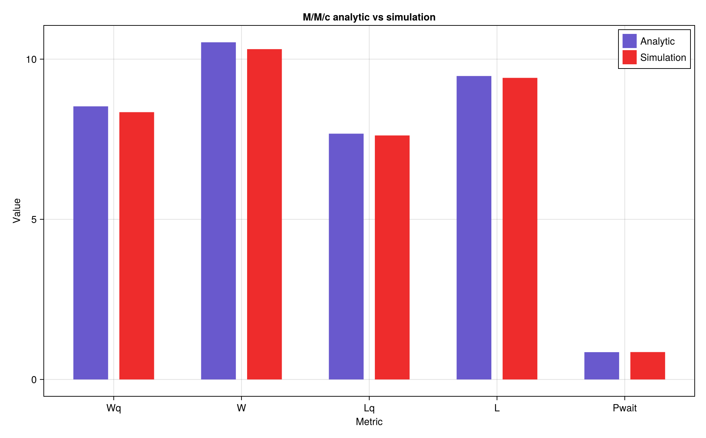
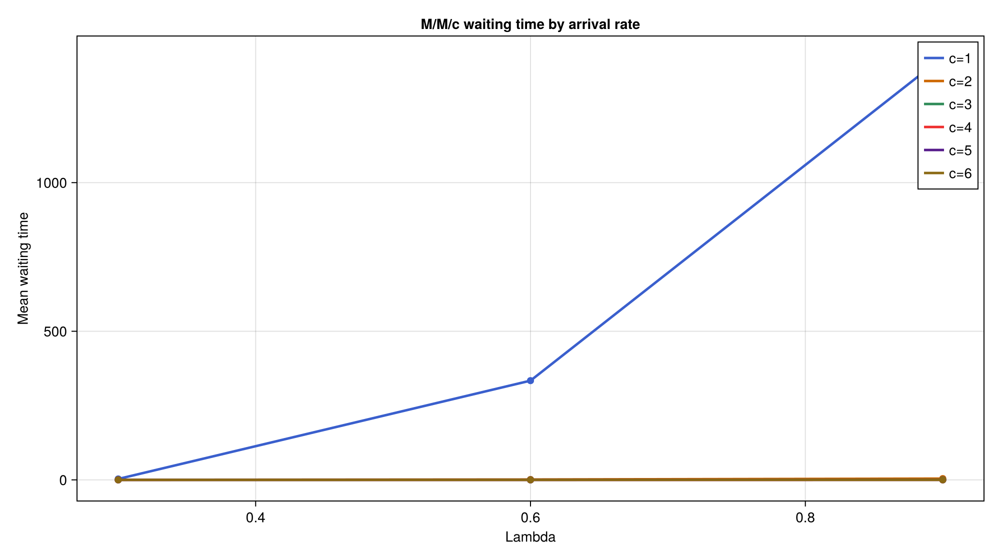
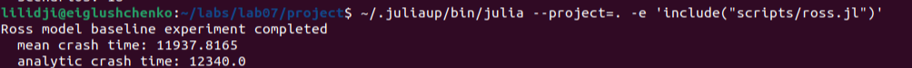
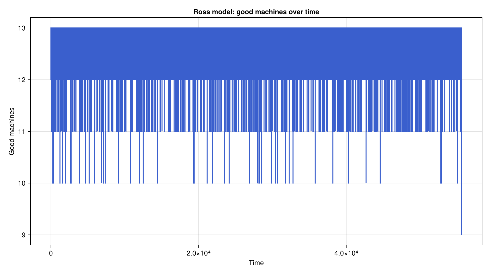
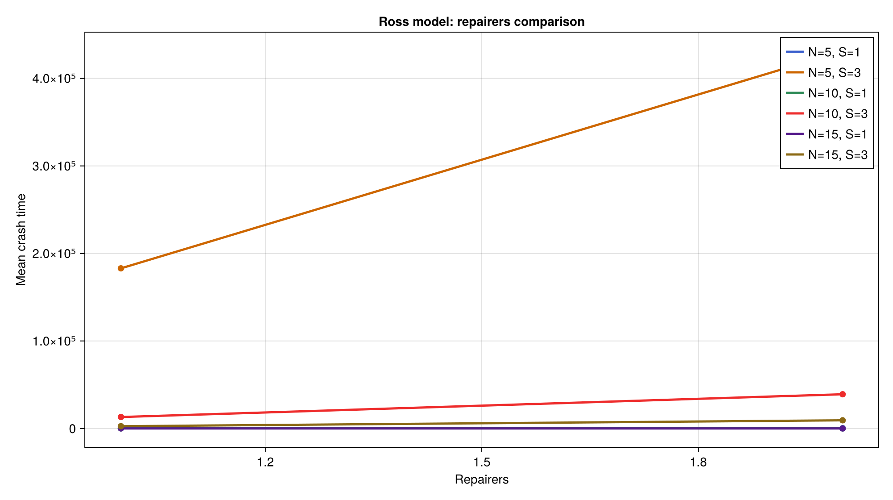
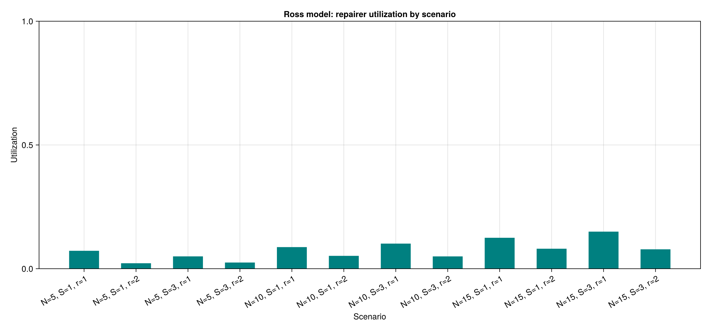
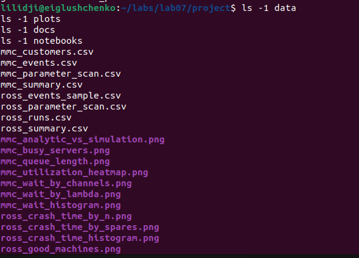

---
author:
  name: Глущенко Евгений Игоревич
  affiliation:
    - name: Российский университет дружбы народов имени Патриса Лумумбы
      country: Российская Федерация
      postal-code: 117198
      city: Москва
      address: ул. Миклухо-Маклая, д. 6
title: Имитационное моделирование
subtitle: "Лабораторная работа №7. Дискретно-событийное моделирование: M/M/c и модель Росса"
license: CC BY
date: 2026-05-15
date-format: "YYYY-MM-DD"
---

# Информация

## Докладчик и работа

:::::::::::::: {.columns align=center}
::: {.column width="67%"}

- Глущенко Евгений Игоревич
- студент группы НФИбд-01-23
- студенческий билет: 1132239110
- РУДН имени Патриса Лумумбы
- тема: `M/M/c` и модель Росса
- средства: Julia, DrWatson, CSV, DataFrames, CairoMakie, Literate.jl

:::
::: {.column width="30%"}

{width=72%}

:::
::::::::::::::

# Цель и задачи

## Цель и постановка

- Реализовать дискретно-событийные модели `M/M/c` и Росса
- Сопоставить имитацию `M/M/c` с аналитическими формулами
- Исследовать время до отказа системы в модели Росса
- Провести параметрические эксперименты
- Подготовить воспроизводимый набор скриптов, таблиц и графиков

## Что требовалось сделать

1. Создать Julia-проект в структуре `DrWatson`
2. Реализовать общий модуль `src/QueueingModels.jl`
3. Выполнить базовые сценарии и параметрические сканы
4. Построить графики и сохранить CSV-таблицы
5. Сгенерировать `clean`, `markdown` и `ipynb`-материалы

# Теоретическая часть

## Модель `M/M/c`

:::::::::::::: {.columns}
::: {.column width="50%"}

Основные параметры:

- `lambda` — интенсивность входного потока
- `mu` — интенсивность обслуживания
- `c` — число каналов

$$
\rho = \frac{\lambda}{c \mu}
$$

:::
::: {.column width="50%"}

Характеристики:

- вероятность ожидания `P_{wait}`
- среднее ожидание `W_q`
- среднее число в очереди `L_q`
- среднее число в системе `L`

При `rho >= 1` система неустойчива.

:::
::::::::::::::

## Модель Росса

:::::::::::::: {.columns}
::: {.column width="49%"}

Параметры модели:

- `N` рабочих машин
- `S` резервных машин
- `repairers` ремонтников
- `tau_f` среднее время до отказа
- `tau_r` среднее время ремонта

:::
::: {.column width="51%"}

События:

- отказ машины
- постановка в ремонт
- завершение ремонта
- системный отказ при пустом резерве

Аналитика строится по линейной системе для `T_k`.

:::
::::::::::::::

# Реализация

## Структура проекта и запуск

:::::::::::::: {.columns}
::: {.column width="50%"}

Основные файлы:

- `src/QueueingModels.jl`
- `scripts/mmc.jl`
- `scripts/mmc_parameters.jl`
- `scripts/ross.jl`
- `scripts/ross_parameters.jl`

:::
::: {.column width="50%"}

Основные команды:

```bash
cd ~/labs/lab07/project
~/.juliaup/bin/julia --project=. -e 'using Pkg; Pkg.instantiate()'
~/.juliaup/bin/julia --project=. -e 'include("scripts/mmc.jl")'
~/.juliaup/bin/julia --project=. -e 'include("scripts/ross.jl")'
~/.juliaup/bin/julia --project=. scripts/tangle.jl
```

:::
::::::::::::::

## Инициализация проекта и базовый запуск `M/M/c`

:::::::::::::: {.columns}
::: {.column width="50%"}

{width=100%}

:::
::: {.column width="50%"}

{width=100%}

:::
::::::::::::::

Сначала было активировано окружение проекта, затем запущен базовый сценарий `M/M/c`. По результату получены `customers = 5000`, `mean wait = 8.3449`, `utilization = 0.8989`.

## Параметрический запуск `M/M/c`

:::::::::::::: {.columns}
::: {.column width="52%"}

{width=100%}

:::
::: {.column width="48%"}

- исследовано `18` сценариев
- сетка: `lambda in [0.3, 0.6, 0.9]`
- число каналов: `c in 1:6`
- результат сохранён в `mmc_parameter_scan.csv`

:::
::::::::::::::

## Реализация в `QueueingModels.jl`

:::::::::::::: {.columns}
::: {.column width="50%"}

Для `M/M/c`:

- аналитика Эрланга;
- событийный цикл прихода и обслуживания;
- журнал заявок;
- журнал событий;
- time-weighted метрики.

:::
::: {.column width="50%"}

Для модели Росса:

- событийный цикл отказов и ремонтов;
- очередь на ремонт;
- несколько ремонтников;
- аналитическая оценка времени до отказа;
- пакет независимых прогонов.

:::
::::::::::::::

# Результаты `M/M/c`

## Базовый сценарий `M/M/c`

Параметры:

- `lambda = 0.9`
- `mu = 0.5`
- `c = 2`
- `num_customers = 5000`
- `seed = 123`

Результат:

- `sim_wq = 8.3449`
- `analytic_wq = 8.5263`
- `sim_pwait = 0.8556`
- `sim_utilization = 0.8989`

## Динамика очереди и каналов

:::::::::::::: {.columns}
::: {.column width="50%"}

{width=100%}

:::
::: {.column width="50%"}

{width=100%}

:::
::::::::::::::

Высокая загрузка `rho = 0.9` поддерживает длинные очереди и почти постоянную занятость обоих каналов.

## Распределение ожидания и сравнение с аналитикой

:::::::::::::: {.columns}
::: {.column width="52%"}

{width=100%}

:::
::: {.column width="48%"}

{width=100%}

:::
::::::::::::::

Базовый прогон хорошо согласуется с аналитикой. Наибольший интерес представляют `W_q` и `L_q`, потому что именно они чувствительны к режиму загрузки.

## Параметрический анализ `M/M/c`

:::::::::::::: {.columns}
::: {.column width="33%"}

{width=100%}

:::
::: {.column width="33%"}

{width=100%}

:::
::: {.column width="33%"}

{width=100%}

:::
::::::::::::::

Рост числа каналов быстро снижает `W_q`, а рост `lambda` переводит систему в область длинных очередей. Для `c = 1` и больших `lambda` проявляется неустойчивый режим.

# Результаты модели Росса

## Базовый сценарий модели Росса

Параметры:

- `N = 10`
- `S = 3`
- `repairers = 1`
- `runs = 300`
- `tau_f = 100.0`
- `tau_r = 1.0`

Результат:

- `mean_crash_time = 11937.8165`
- `analytic_crash_time = 12340.0`
- `mean_repair_queue = 0.0120`
- `repairer_utilization = 0.1010`

## Запуск сценариев модели Росса

:::::::::::::: {.columns}
::: {.column width="50%"}

{width=100%}

:::
::: {.column width="50%"}

{width=100%}

:::
::::::::::::::

Выполнены базовый сценарий и параметрический скан модели Росса. Во втором случае было рассчитано `12` конфигураций системы.

## Динамика исправных и резервных машин

:::::::::::::: {.columns}
::: {.column width="50%"}

{width=100%}

:::
::: {.column width="50%"}

{width=100%}

:::
::::::::::::::

Ключевым индикатором устойчивости является запас резерва. Пока резерв не исчерпан, число исправных машин остаётся высоким.

## Очередь на ремонт и статистика отказа

:::::::::::::: {.columns}
::: {.column width="33%"}

{width=100%}

:::
::: {.column width="34%"}

{width=100%}

:::
::: {.column width="33%"}

{width=100%}

:::
::::::::::::::

Базовый режим имеет почти нулевую очередь на ремонт, а имитационное среднее времени до отказа близко к аналитической оценке.

## Параметрический анализ модели Росса

:::::::::::::: {.columns}
::: {.column width="50%"}

{width=100%}

:::
::: {.column width="50%"}

{width=100%}

:::
::::::::::::::

Увеличение `N` ускоряет отказ, а увеличение `S` многократно повышает среднее время жизни системы.

## Роль числа ремонтников

:::::::::::::: {.columns}
::: {.column width="50%"}

{width=100%}

:::
::: {.column width="50%"}

{width=100%}

:::
::::::::::::::

Второй ремонтник помогает, но обычно слабее, чем увеличение резерва. Во многих сценариях ремонтники остаются загруженными умеренно.

# Воспроизводимость

## Literate-артефакты

После `scripts/tangle.jl` автоматически получены:

- `mmc_clean.jl`, `mmc.md`, `mmc.ipynb`
- `mmc_parameters_clean.jl`, `mmc_parameters.md`, `mmc_parameters.ipynb`
- `ross_clean.jl`, `ross.md`, `ross.ipynb`
- `ross_parameters_clean.jl`, `ross_parameters.md`, `ross_parameters.ipynb`

## Генерация и проверка артефактов

:::::::::::::: {.columns}
::: {.column width="62%"}

{width=100%}

:::
::: {.column width="38%"}

{width=100%}

:::
::::::::::::::

Сценарий `tangle.jl` сформировал `clean`-скрипты, `md`-файлы и `ipynb`-ноутбуки. После этого была проверена структура каталогов `data`, `plots`, `docs` и `notebooks`.

## Выводы

- Реализована корректная имитация `M/M/c` с сопоставлением с аналитикой
- Показаны устойчивые и неустойчивые режимы по `lambda` и `c`
- Реализована модель Росса с несколькими ремонтниками
- Сравнены имитационные и аналитические оценки времени до отказа
- Подготовлены скрипты, таблицы, графики, отчёт и презентация
