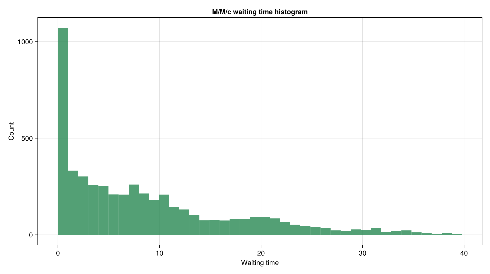
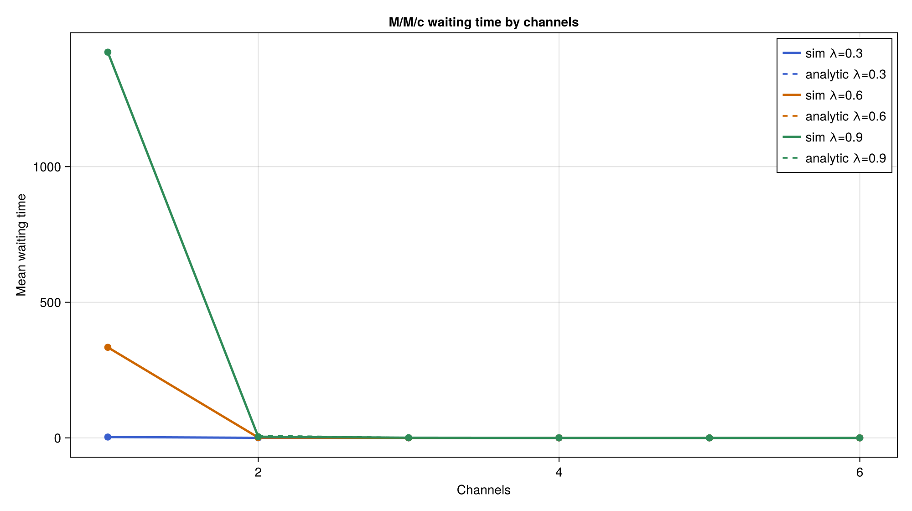
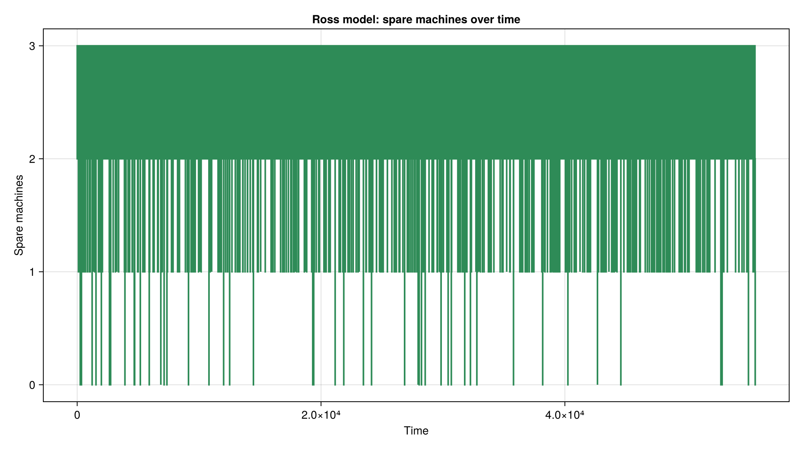
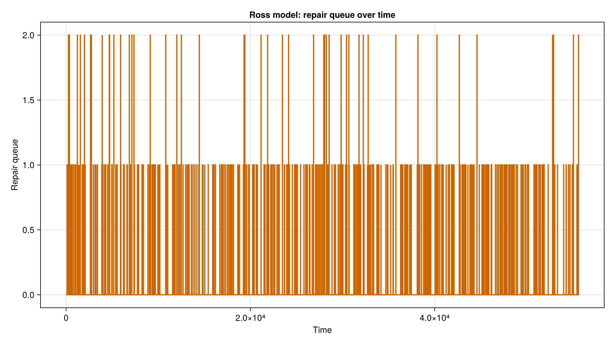
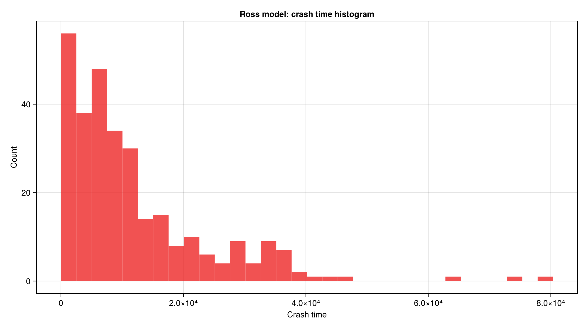
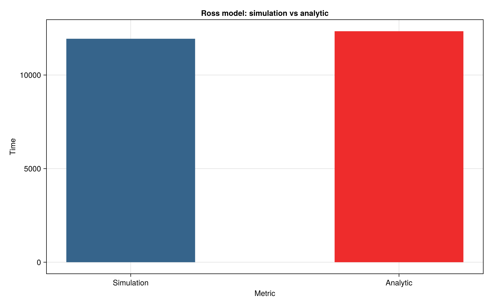
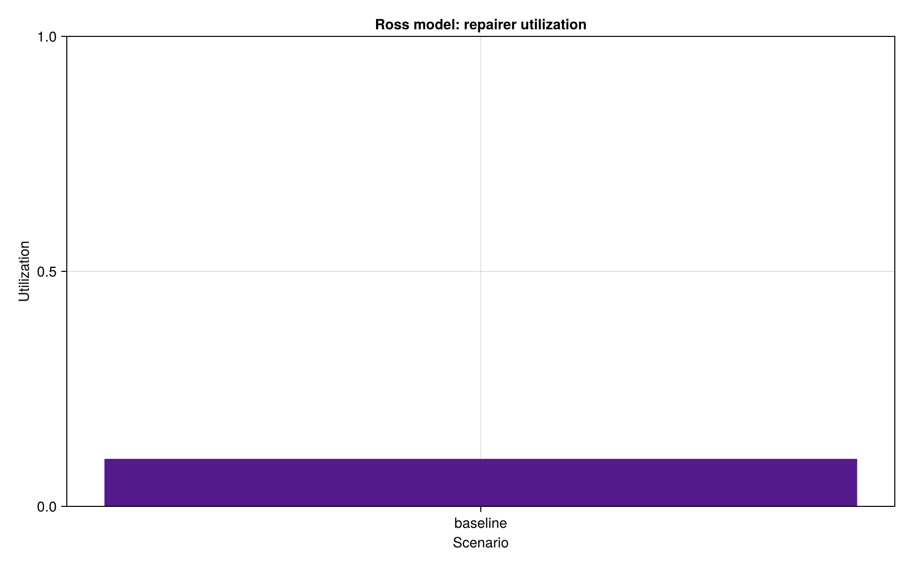
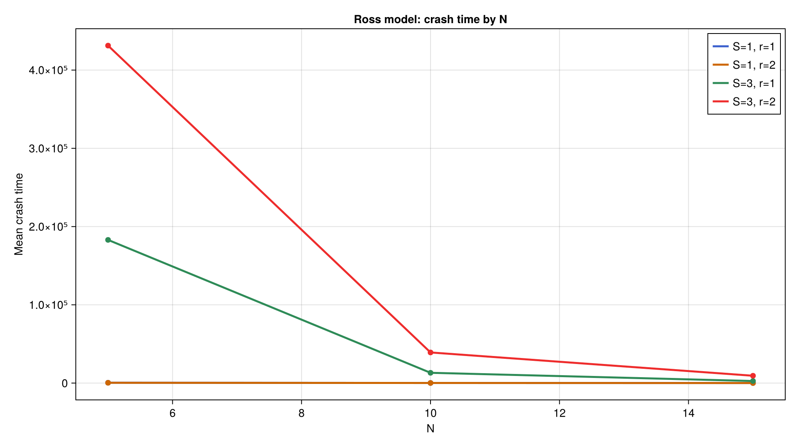
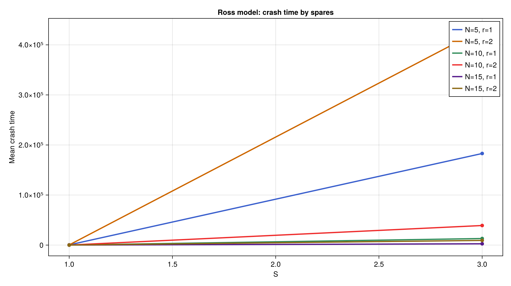

---
author:
  - name: Глущенко Евгений Игоревич
    affiliation:
      - name: Российский университет дружбы народов имени Патриса Лумумбы
        country: Российская Федерация
        city: Москва
title: "Отчёт по лабораторной работе №7"
subtitle: "Дискретно-событийное моделирование: M/M/c и модель Росса"
license: "CC BY"
date: 2026-05-15
date-format: "YYYY-MM-DD"
---

# Цель работы

Изучить дискретно-событийное моделирование на примере системы массового обслуживания `M/M/c` и модели отказов с ремонтом Росса, реализовать оба сценария на Julia, провести базовые и параметрические эксперименты, а также подготовить воспроизводимые отчётные материалы.

Исполнитель работы: Глущенко Евгений Игоревич.  
Группа: НФИбд-01-23.  
Студенческий билет: 1132239110.

# Задание

В лабораторной работе требовалось:

1. Создать рабочий каталог и оформить проект в структуре `DrWatson`.
2. Реализовать модель `M/M/c` и модель Росса на Julia.
3. Перенести сценарии в literate-формат.
4. Сформировать `clean`-скрипты, `markdown`-документы и `ipynb`-ноутбуки.
5. Для `M/M/c` построить графики длины очереди, числа занятых каналов, гистограмму ожидания и сравнение с аналитикой.
6. Для модели Росса реализовать несколько ремонтников, собрать статистику времени до отказа и сравнить моделирование с аналитическим расчётом.
7. Выполнить параметрические исследования и включить их результаты в отчёт.

# Теоретическое введение

## Система массового обслуживания `M/M/c`

Система `M/M/c` относится к классическим моделям теории массового обслуживания [@gross_harris_1998]. Обозначение `M/M/c` означает:

- входящий поток заявок является пуассоновским с интенсивностью `lambda`;
- времена обслуживания независимы и имеют экспоненциальное распределение с параметром `mu`;
- обслуживание выполняется `c` параллельными каналами;
- дисциплина обслуживания — FIFO.

Коэффициент загрузки системы определяется как

$$
\rho = \frac{\lambda}{c \mu}.
$$

При `rho < 1` существуют стационарные характеристики, которые в работе вычисляются через формулы Эрланга:

$$
a = \frac{\lambda}{\mu},
$$

$$
P_0 =
\left(
\sum_{n = 0}^{c - 1}\frac{a^n}{n!} + \frac{a^c}{c!(1-\rho)}
\right)^{-1},
$$

$$
P_{wait} = \frac{a^c}{c!(1-\rho)} P_0,
$$

$$
L_q = P_{wait}\frac{\rho}{1-\rho}, \qquad
W_q = \frac{L_q}{\lambda}, \qquad
W = W_q + \frac{1}{\mu}, \qquad
L = \lambda W.
$$

Эти значения используются как аналитическая база для сравнения с имитационным экспериментом.

## Модель Росса

Модель Росса рассматривает систему из `N` работающих машин и `S` резервных машин. Отказы происходят случайно, а неисправные элементы восстанавливаются ремонтниками. Если в момент отказа свободных резервов уже нет, система считается отказавшей [@ross_2014].

В реализации работы приняты следующие допущения:

- каждая рабочая машина имеет одинаковое среднее время до отказа `tau_f`;
- время ремонта подчиняется экспоненциальному распределению со средним `tau_r`;
- число ремонтников равно `repairers`;
- одновременно может выполняться не более `repairers` ремонтов, остальные неисправности ждут в очереди.

Для аналитической оценки используется система линейных уравнений по числу доступных резервов `k = 0, \dots, S`:

$$
\alpha = \frac{N}{\tau_f}, \qquad
\beta_k = \frac{\min(repairers, S-k)}{\tau_r},
$$

$$
(\alpha + \beta_k) T_k = 1 + \alpha T_{k-1} + \beta_k T_{k+1},
$$

где `T_k` — ожидаемое время до отказа системы при наличии `k` резервов, а граничное условие `T_{-1}=0` соответствует уже наступившему отказу. В коде эта система решается как линейная алгебраическая задача.

## Воспроизводимая организация проекта

Структура вычислительного проекта построена на `DrWatson.jl` [@drwatson]. Для генерации производных сценариев используются `Literate.jl` [@literate_jl], а сами расчёты выполнены на языке Julia [@julia_2017]. Такой подход позволяет поддерживать единый источник сценария и автоматически получать:

- исполняемый `clean`-скрипт;
- `markdown`-документ;
- Jupyter notebook;
- итоговые графики и таблицы.

# Выполнение лабораторной работы

## Структура проекта

Рабочий каталог лабораторной работы имеет следующий состав:

- `project/src/QueueingModels.jl` — модуль с аналитическими формулами, моделями и графиками;
- `project/scripts/mmc.jl` — базовый сценарий `M/M/c`;
- `project/scripts/mmc_parameters.jl` — параметрический сценарий `M/M/c`;
- `project/scripts/ross.jl` — базовый сценарий модели Росса;
- `project/scripts/ross_parameters.jl` — параметрический сценарий модели Росса;
- `project/scripts/tangle.jl` — генератор literate-артефактов;
- `project/data/` — таблицы результатов;
- `project/plots/` — итоговые графики;
- `project/docs/` — сгенерированные `markdown`-материалы;
- `project/notebooks/` — сгенерированные `ipynb`-файлы;
- `report/` и `presentation/` — оформление отчёта и презентации на Quarto.

Число сформированных основных артефактов:

- `mmc_customers.csv` — `5000` строк данных о заявках;
- `mmc_events.csv` — `15000` событий;
- `mmc_parameter_scan.csv` — `18` сценариев;
- `ross_events_sample.csv` — `10946` событий демонстрационного прогона;
- `ross_runs.csv` — `300` независимых запусков;
- `ross_parameter_scan.csv` — `12` сценариев;
- `docs/` — `4` markdown-файла;
- `notebooks/` — `4` исполняемых notebook-файла.

## Основные команды воспроизведения

Базовая последовательность команд для выполнения лабораторной работы выглядит так:

```bash
cd ~/labs/lab07/project
~/.juliaup/bin/julia --project=. -e 'using Pkg; Pkg.instantiate()'
~/.juliaup/bin/julia --project=. -e 'include("scripts/mmc.jl")'
~/.juliaup/bin/julia --project=. -e 'include("scripts/mmc_parameters.jl")'
~/.juliaup/bin/julia --project=. -e 'include("scripts/ross.jl")'
~/.juliaup/bin/julia --project=. -e 'include("scripts/ross_parameters.jl")'
~/.juliaup/bin/julia --project=. scripts/tangle.jl
```

Отдельный локальный файл с командами для записи видео вынесен в `commands-lab07.txt`.

### Фактическое выполнение команд

На @fig-instantiate показан переход в каталог проекта и активация зависимостей Julia через `Pkg.instantiate()`.

{#fig-instantiate width=96%}

Скриншот подтверждает, что окружение проекта было корректно поднято, а недостающие зависимости доустановлены и предварительно скомпилированы. После этого все последующие сценарии запускались уже в одном и том же воспроизводимом окружении.

## Реализация модели `M/M/c`

### Аналитические характеристики

Вычисление стационарных характеристик вынесено в функцию `analytic_mmc_metrics`:

```julia
function analytic_mmc_metrics(lambda::Real, mu::Real, c::Integer)
    lambda_f = Float64(lambda)
    mu_f = Float64(mu)
    rho = lambda_f / (c * mu_f)
    if rho >= 1
        return (rho = rho, p0 = NaN, pwait = NaN, lq = Inf, wq = Inf, w = Inf, l = Inf)
    end

    a = lambda_f / mu_f
    sum_terms = sum((a^n) / factorial(big(n)) for n in 0:(c - 1))
    tail_term = (a^c) / (factorial(big(c)) * (1 - rho))
    p0 = 1 / Float64(sum_terms + tail_term)
    pwait = Float64((a^c) / (factorial(big(c)) * (1 - rho))) * p0
    lq = pwait * rho / (1 - rho)
    wq = lq / lambda_f
    w = wq + 1 / mu_f
    l = lambda_f * w
    return (rho = rho, p0 = p0, pwait = pwait, lq = lq, wq = wq, w = w, l = l)
end
```

Если `rho >= 1`, функция корректно помечает сценарий как нестационарный через бесконечные значения характеристик очереди.

### Имитационный алгоритм

Сама модель `M/M/c` реализована на уровне событий прибытия, начала обслуживания и выхода из системы:

```julia
if process_arrival
    customer_id = next_customer_id
    next_customer_id += 1
    time = next_arrival
    arrival_time[customer_id] = time
    service_time[customer_id] = rand(rng, service_dist)

    if busy_servers < c
        sid = findfirst(!, server_busy)
        server_busy[sid] = true
        busy_servers += 1
        service_start[customer_id] = time
        wait_time[customer_id] = 0.0
        departure_time[customer_id] = time + service_time[customer_id]
    else
        push!(queue, customer_id)
    end
else
    time = next_departure
    customer_id = server_customer[departure_server]
    departed_customers += 1
    server_busy[departure_server] = false
    busy_servers -= 1
    ...
end
```

Дополнительно в реализации введён параметр `warmup_customers`, позволяющий исключить начальный переходный участок из расчёта средних значений.

## Базовый эксперимент `M/M/c`

Для базового сценария использованы параметры:

- `lambda = 0.9`;
- `mu = 0.5`;
- `c = 2`;
- `num_customers = 5000`;
- `seed = 123`;
- `warmup_customers = 500`.

Сценарий `scripts/mmc.jl` формирует:

- `data/mmc_customers.csv`;
- `data/mmc_events.csv`;
- `data/mmc_summary.csv`;
- `plots/mmc_queue_length.png`;
- `plots/mmc_busy_servers.png`;
- `plots/mmc_wait_histogram.png`;
- `plots/mmc_analytic_vs_simulation.png`.

Вывод базового запуска:

```text
M/M/c baseline experiment completed
  customers: 5000
  mean wait: 8.3449
  utilization: 0.8989
```

На @fig-mmc-baseline-run показан фактический запуск базового сценария `M/M/c` в терминале.

{#fig-mmc-baseline-run width=96%}

Основные численные результаты приведены в @tbl-mmc-summary.

| `lambda` | `mu` | `c` | `rho` | `analytic_wq` | `sim_wq` | `analytic_lq` | `sim_lq` | `analytic_pwait` | `sim_pwait` | `sim_utilization` |
|---:|---:|---:|---:|---:|---:|---:|---:|---:|---:|---:|
| 0.9 | 0.5 | 2 | 0.9 | 8.526 | 8.345 | 7.674 | 7.618 | 0.853 | 0.856 | 0.899 |

: Сводка базового эксперимента `M/M/c` {#tbl-mmc-summary}

На @fig-mmc-queue показана длина очереди во времени.

{#fig-mmc-queue width=92%}

График демонстрирует выраженные колебания очереди при высокой загрузке `rho = 0.9`. Очередь не расходится, но регулярно принимает двузначные значения, что соответствует работе системы вблизи границы устойчивости.

На @fig-mmc-busy показано число занятых каналов обслуживания.

{#fig-mmc-busy width=92%}

Большую часть времени оба канала заняты. Это согласуется с оценкой загрузки `0.8989`, то есть почти `90%` полезного времени каждый канал находится в работе.

На @fig-mmc-wait-hist показана гистограмма времени ожидания.

{#fig-mmc-wait-hist width=88%}

Распределение ожидания имеет длинный правый хвост: заметная часть заявок обслуживается быстро, но в периоды перегрузки отдельные заявки проводят в очереди существенное время.

На @fig-mmc-analytic показано сравнение аналитических и имитационных характеристик.

{#fig-mmc-analytic width=92%}

Для базового сценария имитационные оценки хорошо согласуются с аналитикой. Это особенно важно для `W_q` и `L_q`, поскольку именно эти величины наиболее чувствительны к режиму загрузки системы.

### Фрагмент таблицы заявок `mmc_customers.csv`

Первые строки таблицы заявок приведены в @tbl-mmc-customers.

| `id` | `arrival_time` | `service_start` | `departure_time` | `wait_time` | `service_time` | `system_time` | `server_id` |
|---:|---:|---:|---:|---:|---:|---:|---:|
| 1 | 0.145 | 0.145 | 0.953 | 0.000 | 0.808 | 0.808 | 1 |
| 2 | 1.100 | 1.100 | 1.235 | 0.000 | 0.135 | 0.135 | 1 |
| 3 | 1.167 | 1.167 | 2.261 | 0.000 | 1.094 | 1.094 | 2 |
| 4 | 3.246 | 3.246 | 4.663 | 0.000 | 1.417 | 1.417 | 1 |
| 5 | 5.091 | 5.091 | 6.565 | 0.000 | 1.474 | 1.474 | 1 |
| 6 | 6.233 | 6.233 | 11.540 | 0.000 | 5.307 | 5.307 | 2 |

: Первые строки `mmc_customers.csv` {#tbl-mmc-customers}

### Фрагмент журнала событий `mmc_events.csv`

Начало журнала событий приведено в @tbl-mmc-events.

| `time` | `event` | `customer_id` | `queue_length` | `busy_servers` | `system_size` |
|---:|---|---:|---:|---:|---:|
| 0.145 | `arrival` | 1 | 0 | 1 | 1 |
| 0.145 | `service_start` | 1 | 0 | 1 | 1 |
| 0.953 | `departure` | 1 | 0 | 0 | 0 |
| 1.100 | `arrival` | 2 | 0 | 1 | 1 |
| 1.100 | `service_start` | 2 | 0 | 1 | 1 |
| 1.167 | `arrival` | 3 | 0 | 2 | 2 |
| 1.167 | `service_start` | 3 | 0 | 2 | 2 |
| 1.235 | `departure` | 2 | 0 | 1 | 1 |

: Начало журнала событий `mmc_events.csv` {#tbl-mmc-events}

Журнал отражает трёхтипную логику модели: прибытие заявки, начало обслуживания и завершение обслуживания. На раннем участке очереди ещё нет, а оба канала заполняются по мере поступления заявок.

## Параметрическое исследование `M/M/c`

В сценарии `scripts/mmc_parameters.jl` исследование выполняется на сетке:

- `lambdas = [0.3, 0.6, 0.9]`;
- `channels = 1:6`;
- `mu = 0.5`;
- `num_customers = 3000`;
- `seed = 321`.

Вывод сценария:

```text
M/M/c parameter scan completed
  scenarios: 18
```

На @fig-mmc-scan-run показан запуск параметрического исследования `M/M/c`.

{#fig-mmc-scan-run width=96%}

Выбранные строки таблицы `mmc_parameter_scan.csv` приведены в @tbl-mmc-scan.

| `lambda` | `c` | `rho` | `analytic_wq` | `sim_wq` | `sim_utilization` |
|---:|---:|---:|---:|---:|---:|
| 0.3 | 1 | 0.6 | 3.000 | 3.078 | 0.579 |
| 0.3 | 2 | 0.3 | 0.198 | 0.194 | 0.294 |
| 0.3 | 3 | 0.2 | 0.021 | 0.021 | 0.204 |
| 0.6 | 1 | 1.2 | `Inf` | 333.856 | 0.999 |
| 0.6 | 2 | 0.6 | 1.125 | 1.248 | 0.610 |
| 0.6 | 3 | 0.4 | 0.157 | 0.159 | 0.410 |
| 0.9 | 1 | 1.8 | `Inf` | 1422.276 | 1.000 |
| 0.9 | 2 | 0.9 | 8.526 | 4.279 | 0.859 |
| 0.9 | 3 | 0.6 | 0.591 | 0.650 | 0.592 |

: Выбранные строки `mmc_parameter_scan.csv` {#tbl-mmc-scan}

Для сценариев с `c = 1` и `lambda >= 0.6` система становится неустойчивой, что сразу отражается как в аналитических значениях, так и в эмпирическом росте среднего времени ожидания. Для случая `lambda = 0.9`, `c = 2` заметна более сильная дисперсия оценки `W_q`, что естественно для режима, близкого к критической загрузке.

На @fig-mmc-by-c показано изменение среднего времени ожидания по числу каналов.

{#fig-mmc-by-c width=92%}

Добавление каналов резко снижает время ожидания, особенно в области от `c = 1` к `c = 2`. Далее выигрыш сохраняется, но становится менее драматичным.

На @fig-mmc-by-lambda показано изменение ожидания по интенсивности входящего потока.

{#fig-mmc-by-lambda width=92%}

Рост `lambda` при фиксированном `mu` быстро переводит систему в зону длинных очередей. Особенно чувствительны конфигурации с малым числом каналов.

На @fig-mmc-heatmap показана карта загрузки каналов.

{#fig-mmc-heatmap width=88%}

Тепловая карта подтверждает ожидаемую закономерность: при фиксированном потоке загрузка убывает по мере роста `c`, а при фиксированном числе каналов возрастает вместе с `lambda`.

## Реализация модели Росса

### Аналитическая часть

Оценка среднего времени до отказа системы реализована через решение линейной системы:

```julia
function analytic_ross_crash_time(N::Integer, S::Integer, repairers::Integer,
                                  mean_time_to_failure::Real, mean_repair_time::Real)
    failure_rate = N / Float64(mean_time_to_failure)
    nstates = S + 1
    A = zeros(Float64, nstates, nstates)
    b = ones(Float64, nstates)

    for k in 0:S
        row = k + 1
        repair_rate = min(repairers, S - k) / Float64(mean_repair_time)
        A[row, row] = failure_rate + repair_rate
        if k > 0
            A[row, row - 1] = -failure_rate
        end
        if k < S
            A[row, row + 1] = -repair_rate
        end
    end

    expected = A \ b
    return expected[end]
end
```

Такая реализация хорошо согласуется с постановкой через марковскую цепь по числу доступных резервов.

### Имитационный цикл отказов и ремонтов

Ключевая часть событийного алгоритма выглядит следующим образом:

```julia
if next_failure < next_repair - 1e-12
    time = next_failure
    if spares > 0
        spares -= 1
        broken += 1
        if busy_repairers < repairers
            busy_repairers += 1
            push!(active_repairs, time + rand(rng, Exponential(mean_repair_time)))
        else
            repair_queue += 1
        end
    else
        working -= 1
        broken += 1
        push!(events_internal, (..., event = "crash", ...))
        break
    end
else
    repair_idx = argmin(active_repairs)
    time = active_repairs[repair_idx]
    broken -= 1
    spares += 1
    ...
end
```

Таким образом модель различает два типа событий: отказ машины и завершение ремонта. Отказ без свободного резерва завершает эксперимент.

## Базовый эксперимент модели Росса

Для базового сценария использованы параметры:

- `N = 10`;
- `S = 3`;
- `repairers = 1`;
- `mean_time_to_failure = 100.0`;
- `mean_repair_time = 1.0`;
- `runs = 300`;
- `seed = 150`.

Сценарий `scripts/ross.jl` формирует:

- `data/ross_events_sample.csv`;
- `data/ross_runs.csv`;
- `data/ross_summary.csv`;
- `plots/ross_good_machines.png`;
- `plots/ross_spares.png`;
- `plots/ross_repair_queue.png`;
- `plots/ross_crash_time_histogram.png`;
- `plots/ross_simulation_vs_analytic.png`;
- `plots/ross_repairer_utilization.png`.

Вывод базового запуска:

```text
Ross model baseline experiment completed
  mean crash time: 11937.8165
  analytic crash time: 12340.0
```

На @fig-ross-baseline-run показан фактический запуск базового сценария модели Росса.

{#fig-ross-baseline-run width=96%}

Итоговая сводка приведена в @tbl-ross-summary.

| `N` | `S` | `repairers` | `runs` | `mean_crash_time` | `std_crash_time` | `analytic_crash_time` | `mean_repair_queue` | `repairer_utilization` |
|---:|---:|---:|---:|---:|---:|---:|---:|---:|
| 10 | 3 | 1 | 300 | 11937.816 | 11916.159 | 12340.000 | 0.0120 | 0.1010 |

: Сводка базового эксперимента модели Росса {#tbl-ross-summary}

На @fig-ross-good показано число исправных машин во времени.

{#fig-ross-good width=92%}

Пока резервы доступны, число исправных машин удерживается на высоком уровне. Непосредственно перед отказом системы траектория резко уходит вниз.

На @fig-ross-spares показана динамика резерва.

{#fig-ross-spares width=92%}

Резерв регулярно расходуется и пополняется за счёт завершения ремонтов. Именно состояние резерва служит главным индикатором близости системного отказа.

На @fig-ross-queue показана длина очереди на ремонт.

{#fig-ross-queue width=92%}

В базовом сценарии очередь почти всегда близка к нулю, что хорошо согласуется со средним значением `0.0120`.

На @fig-ross-hist показано распределение времени до отказа по `300` независимым прогонам.

{#fig-ross-hist width=88%}

Распределение заметно асимметрично и имеет длинный хвост. Это ожидаемо: часть прогонов завершается быстро, а часть продолжает работу значительно дольше среднего.

На @fig-ross-analytic показано сравнение имитационной и аналитической оценки времени до отказа.

{#fig-ross-analytic width=90%}

Имитационное среднее `11937.8165` близко к аналитическому значению `12340.0`. Разница порядка нескольких процентов укладывается в наблюдаемую дисперсию прогонов.

На @fig-ross-util показана средняя загрузка ремонтника.

{#fig-ross-util width=80%}

Полученная загрузка `0.1010` указывает, что единственный ремонтник большую часть времени свободен. Именно поэтому добавление второго ремонтника не всегда даёт столь же сильный выигрыш, как добавление резервных машин.

### Фрагмент журнала событий `ross_events_sample.csv`

Первые строки демонстрационного прогона приведены в @tbl-ross-events.

| `time` | `event` | `working` | `spares` | `broken` | `repair_queue` | `busy_repairers` | `good_machines` |
|---:|---|---:|---:|---:|---:|---:|---:|
| 1.947 | `failure` | 10 | 2 | 1 | 0 | 1 | 12 |
| 4.396 | `repair_complete` | 10 | 3 | 0 | 0 | 0 | 13 |
| 33.924 | `failure` | 10 | 2 | 1 | 0 | 1 | 12 |
| 34.126 | `repair_complete` | 10 | 3 | 0 | 0 | 0 | 13 |
| 35.593 | `failure` | 10 | 2 | 1 | 0 | 1 | 12 |
| 37.052 | `repair_complete` | 10 | 3 | 0 | 0 | 0 | 13 |
| 49.323 | `failure` | 10 | 2 | 1 | 0 | 1 | 12 |
| 50.985 | `repair_complete` | 10 | 3 | 0 | 0 | 0 | 13 |

: Начало журнала `ross_events_sample.csv` {#tbl-ross-events}

### Фрагмент таблицы прогонов `ross_runs.csv`

Некоторые независимые прогоны приведены в @tbl-ross-runs.

| `run_id` | `crash_time` | `mean_repair_queue` | `repairer_utilization` |
|---:|---:|---:|---:|
| 1 | 1260.232 | 0.0066 | 0.0829 |
| 2 | 20307.875 | 0.0099 | 0.0981 |
| 3 | 6130.477 | 0.0070 | 0.0968 |
| 4 | 1766.511 | 0.0159 | 0.0985 |
| 5 | 2450.059 | 0.0171 | 0.0942 |
| 6 | 2760.901 | 0.0084 | 0.1013 |

: Выбранные строки `ross_runs.csv` {#tbl-ross-runs}

Даже на первых шести прогонах видно, насколько велик разброс времени до отказа. Это и обуславливает необходимость усреднения по многим реализациям.

## Параметрическое исследование модели Росса

В сценарии `scripts/ross_parameters.jl` использована сетка:

- `N_values = [5, 10, 15]`;
- `S_values = [1, 3]`;
- `repairer_values = [1, 2]`;
- `mean_time_to_failure = 100.0`;
- `mean_repair_time = 1.0`;
- `runs = 20`;
- `seed = 500`.

Вывод сценария:

```text
Ross parameter scan completed
  scenarios: 12
```

На @fig-ross-scan-run показан запуск параметрического исследования модели Росса.

{#fig-ross-scan-run width=96%}

Сначала рассмотрим сценарии с одним резервом `S = 1` (@tbl-ross-s1).

| `N` | `repairers` | `mean_crash_time` | `analytic_crash_time` | `repairer_utilization` |
|---:|---:|---:|---:|---:|
| 5 | 1 | 438.678 | 440.000 | 0.0724 |
| 5 | 2 | 349.707 | 440.000 | 0.0221 |
| 10 | 1 | 115.946 | 120.000 | 0.0873 |
| 10 | 2 | 110.977 | 120.000 | 0.0520 |
| 15 | 1 | 59.630 | 57.778 | 0.1250 |
| 15 | 2 | 34.712 | 57.778 | 0.0808 |

: Сценарии `ross_parameter_scan.csv` при `S = 1` {#tbl-ross-s1}

При одном резерве система очень чувствительна к увеличению числа рабочих машин `N`: время до отказа быстро уменьшается. Добавление второго ремонтника помогает, но не всегда радикально меняет картину, поскольку запас резерва остаётся малым.

Теперь рассмотрим сценарии с тремя резервами `S = 3` (@tbl-ross-s3).

| `N` | `repairers` | `mean_crash_time` | `analytic_crash_time` | `repairer_utilization` |
|---:|---:|---:|---:|---:|
| 5 | 1 | 182977.323 | 177280.000 | 0.0498 |
| 5 | 2 | 431297.387 | 690080.000 | 0.0250 |
| 10 | 1 | 13106.329 | 12340.000 | 0.1014 |
| 10 | 2 | 39111.248 | 46540.000 | 0.0497 |
| 15 | 1 | 2602.452 | 2727.901 | 0.1498 |
| 15 | 2 | 9349.971 | 9927.901 | 0.0784 |

: Сценарии `ross_parameter_scan.csv` при `S = 3` {#tbl-ross-s3}

Увеличение числа резервов радикально повышает устойчивость системы. Это видно особенно на конфигурации `N = 5`: переход от `S = 1` к `S = 3` увеличивает время до отказа на несколько порядков.

На @fig-ross-by-n показано влияние числа рабочих машин на время до отказа.

{#fig-ross-by-n width=92%}

При фиксированном резерве рост `N` ускоряет расходование запаса и сокращает среднее время жизни системы. Эффект сильнее заметен в конфигурациях с малым числом резервов.

На @fig-ross-by-s показано сравнение по числу резервов.

{#fig-ross-by-s width=92%}

Добавление резервных машин является самым эффективным способом увеличить устойчивость. Это согласуется с самой логикой модели: резерв отодвигает момент, когда очередной отказ приведёт к системной аварии.

На @fig-ross-repairers показано сравнение числа ремонтников.

{#fig-ross-repairers width=92%}

Второй ремонтник особенно полезен там, где система действительно успевает накопить повреждённые элементы в ремонте. Если же резерв и так почти не исчерпывается, эффект выражен слабее.

На @fig-ross-util-scan показана загрузка ремонтников по сценариям.

{#fig-ross-util-scan width=92%}

Во всех рассмотренных конфигурациях средняя загрузка ремонтников остаётся умеренной. Это подтверждает, что узким местом модели чаще является объём резерва, а не дефицит ремонтных мощностей.

## Генерация literate-материалов

Сценарий `scripts/tangle.jl` автоматически формирует производные представления:

```julia
function main()
    scripts = isempty(ARGS) ? [
        scriptsdir("mmc_literate.jl"),
        scriptsdir("mmc_parameters_literate.jl"),
        scriptsdir("ross_literate.jl"),
        scriptsdir("ross_parameters_literate.jl"),
    ] : ARGS

    for script_path in scripts
        stem = splitext(basename(script_path))[1]
        name = replace(stem, "_literate" => "")
        Literate.script(script_path, scriptsdir(); name = "$(name)_clean", credit = false)
        Literate.notebook(script_path, projectdir("notebooks"); name = name, execute = true, credit = false)
        Literate.markdown(script_path, projectdir("docs"); name = name, credit = false)
    end
end
```

После запуска были получены:

- `docs/mmc.md`;
- `docs/mmc_parameters.md`;
- `docs/ross.md`;
- `docs/ross_parameters.md`;
- `notebooks/mmc.ipynb`;
- `notebooks/mmc_parameters.ipynb`;
- `notebooks/ross.ipynb`;
- `notebooks/ross_parameters.ipynb`;
- `scripts/mmc_clean.jl`;
- `scripts/mmc_parameters_clean.jl`;
- `scripts/ross_clean.jl`;
- `scripts/ross_parameters_clean.jl`.

Вывод сценария `tangle.jl` имеет вид:

```text
generated for mmc
generated for mmc_parameters
generated for ross
generated for ross_parameters
```

На @fig-tangle-run показан фактический запуск `scripts/tangle.jl` с генерацией `clean`-скриптов, `markdown`-документов и исполняемых notebook-файлов.

{#fig-tangle-run width=92%}

После генерации была выполнена быстрая проверка состава каталогов `data/`, `plots/`, `docs/` и `notebooks/`. Она подтверждает наличие таблиц, графиков и literate-артефактов, необходимых для включения в релиз и в отчётные материалы (@fig-check-files).

{#fig-check-files width=78%}

Таким образом, лабораторная работа подготовлена в полностью воспроизводимом формате: исходные сценарии, их чистые версии, markdown-документы и notebook-файлы остаются синхронизированными.

# Выводы

В лабораторной работе были реализованы две модели дискретно-событийного моделирования. Для системы `M/M/c` получены журналы заявок и событий, подтверждено согласование базового имитационного сценария с аналитическими характеристиками и показано влияние числа каналов и интенсивности потока на устойчивость системы. Для модели Росса реализованы несколько ремонтников, вычислено время до отказа как имитационно, так и аналитически, а также показано, что ключевую роль в устойчивости системы играет объём резервных машин.

Использование `DrWatson.jl` и `Literate.jl` позволило оформить результат как воспроизводимый вычислительный проект. В итоге подготовлены исходные скрипты, `clean`-версии, `markdown`-документы, `ipynb`-ноутбуки, отчёт и презентация.

# Приложение. Команды воспроизведения

```bash
cd ~/labs/lab07/project
~/.juliaup/bin/julia --project=. -e 'using Pkg; Pkg.instantiate()'
~/.juliaup/bin/julia --project=. -e 'include("scripts/mmc.jl")'
~/.juliaup/bin/julia --project=. -e 'include("scripts/mmc_parameters.jl")'
~/.juliaup/bin/julia --project=. -e 'include("scripts/ross.jl")'
~/.juliaup/bin/julia --project=. -e 'include("scripts/ross_parameters.jl")'
~/.juliaup/bin/julia --project=. scripts/tangle.jl
cd ~/labs/lab07/report
quarto render simulation-modeling-lab07-report.qmd --to pdf
quarto render simulation-modeling-lab07-report.qmd --to docx
cd ~/labs/lab07/presentation
quarto render simulation-modeling-lab07-presentation.qmd --to beamer
quarto render simulation-modeling-lab07-presentation.qmd --to revealjs
quarto render simulation-modeling-lab07-presentation.qmd --to pptx
```
