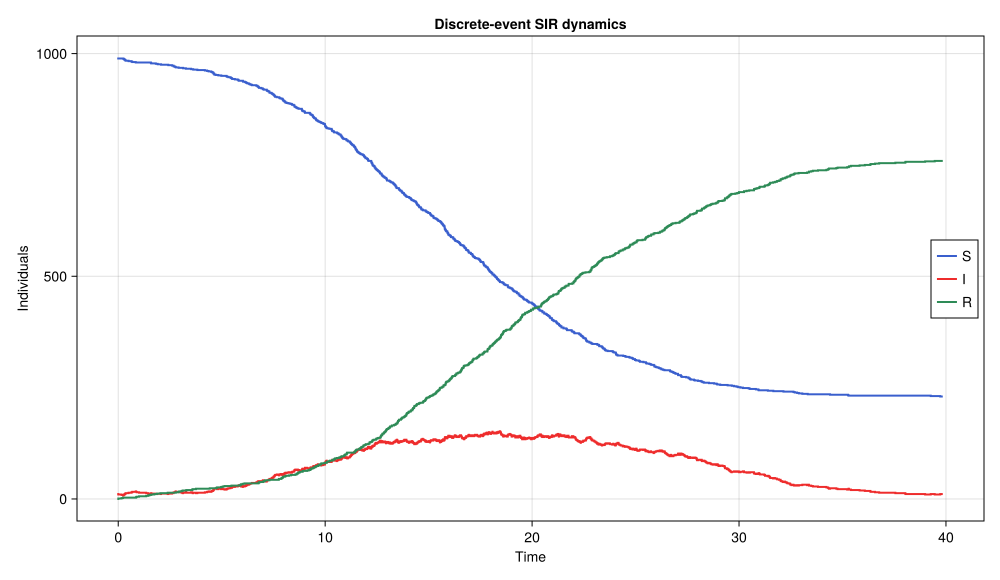

---
author:
  name: Глущенко Евгений Игоревич
  affiliation:
    - name: Российский университет дружбы народов имени Патриса Лумумбы
      country: Российская Федерация
      postal-code: 117198
      city: Москва
      address: ул. Миклухо-Маклая, д. 6
title: Имитационное моделирование
subtitle: "Лабораторная работа №8. Реализация модели SIR в дискретно-событийном подходе"
license: CC BY
date: 2026-05-29
date-format: "YYYY-MM-DD"
---

# Информация

## Докладчик и работа

:::::::::::::: {.columns align=center}
::: {.column width="67%"}

- Глущенко Евгений Игоревич
- студент группы НФИбд-01-23
- студенческий билет: 1132239110
- РУДН имени Патриса Лумумбы
- тема: дискретно-событийная модель SIR
- средства: Julia, DrWatson, ConcurrentSim, ResumableFunctions, CairoMakie, Literate.jl

:::
::: {.column width="30%"}

{width=72%}

:::
::::::::::::::

# Цель и задачи

## Цель и постановка

- Изучить дискретно-событийный подход к имитационному моделированию
- Реализовать стохастическую модель SIR на `ConcurrentSim`
- Сравнить имитацию со стохастическим ансамблем и детерминированной ОДУ
- Провести анализ чувствительности к параметрам `β`, `c`, `γ`
- Оценить производительность и подготовить воспроизводимые материалы

## Что требовалось сделать

1. Создать Julia-проект в структуре `DrWatson`
2. Реализовать модуль `src/SIRModels.jl`
3. Преобразовать код в литературный стиль
4. Сгенерировать `clean`, `markdown` и `ipynb`-материалы
5. Добавить вычисление для набора параметров и интегрировать в отчёт

# Теоретическая часть

## Модель SIR

:::::::::::::: {.columns}
::: {.column width="52%"}

Классы популяции размера `N`:

- `S` — восприимчивые
- `I` — инфицированные
- `R` — переболевшие

$$
\frac{dS}{dt} = -\beta c \frac{SI}{N}
$$
$$
\frac{dI}{dt} = \beta c \frac{SI}{N} - \gamma I
$$

:::
::: {.column width="48%"}

Параметры:

- `β` — вероятность передачи
- `c` — частота контактов
- `γ` — интенсивность выздоровления

$$
R_0 = \frac{\beta c}{\gamma}
$$

При `R_0 > 1` — вспышка, при `R_0 \le 1` — затухание.

:::
::::::::::::::

## Дискретно-событийный подход

:::::::::::::: {.columns}
::: {.column width="50%"}

- Состояние меняется только в моменты событий
- Каждый индивид — отдельный процесс
- `ResumableFunctions`: `@resumable` и `@yield`
- `ConcurrentSim`: виртуальное время, `timeout`, `run`

:::
::: {.column width="50%"}

Логика индивида:

- пока `:S` — ждёт контакт через `Exp(1/c)`
- выбирает случайного собеседника
- если тот `:I`, заражается с вероятностью `β`
- став `:I`, выздоравливает через `Exp(1/γ)`

:::
::::::::::::::

## Конечный размер эпидемии

- Итоговая доля переболевших `z = R(\infty)/N`
- Удовлетворяет уравнению конечного размера:

$$
z = 1 - e^{-R_0 z}
$$

- При `R_0 \le 1` корень `z = 0` (эпидемии нет)
- При `R_0 > 1` положительный корень определяет масштаб эпидемии
- Решается методом простых итераций, служит аналитической базой для сравнения

# Реализация

## Структура проекта и запуск

:::::::::::::: {.columns}
::: {.column width="52%"}

- `src/SIRModels.jl` — модель, ОДУ, скан, графики
- `scripts/sir.jl` — базовый эксперимент
- `scripts/sir_parameters.jl` — анализ чувствительности
- `scripts/tangle.jl` — генерация literate-артефактов

:::
::: {.column width="48%"}

```bash
cd ~/labs/lab08/project
julia --project=. -e \
  'include("scripts/sir.jl")'
julia --project=. -e \
  'include("scripts/sir_parameters.jl")'
julia --project=. scripts/tangle.jl
```

:::
::::::::::::::

## Инициализация и базовый запуск

:::::::::::::: {.columns}
::: {.column width="50%"}

{width=100%}

:::
::: {.column width="50%"}

{width=100%}

:::
::::::::::::::

## Процесс агента `live`

```julia
@resumable function live(env, individual, m)
    while individual.status == :S
        @yield timeout(env, rand(m.rng, Exponential(1 / m.c)))
        alter = individual
        while alter === individual
            alter = m.individuals[rand(m.rng, 1:length(m.individuals))]
        end
        if alter.status == :I && rand(m.rng) < m.β
            individual.status = :I
            infection_update!(env, m)
        end
    end
    if individual.status == :I
        @yield timeout(env, rand(m.rng, Exponential(1 / m.γ)))
        individual.status = :R
        recovery_update!(env, m)
    end
end
```

## Создание и запуск модели

- `make_sir_model(u0, p)` — создаёт популяцию индивидов и временные ряды
- `activate_sir!(m)` — регистрирует процессы агентов
- `run_sir!(m, tf)` — продвигает виртуальное время до `tf`
- `out(m)` — собирает результат в `DataFrame` с колонками `t`, `S`, `I`, `R`
- `StableRNG` обеспечивает полную воспроизводимость прогонов

# Результаты базового эксперимента

## Базовый сценарий

:::::::::::::: {.columns}
::: {.column width="50%"}

Параметры:

- `u0 = [990, 10, 0]`
- `p = [0.05, 10.0, 0.25]`
- `tmax = 40`, `seed = 1234`
- `R_0 = 2.0`

:::
::: {.column width="50%"}

Результаты:

- пик инфицированных: `152`
- время пика: `t ≈ 18.4`
- переболело: `759` (`0.759`)
- аналитика: `0.797`
- событий: `1519`

:::
::::::::::::::

## Динамика численности `S`, `I`, `R`

{width=82%}

## Сравнение с детерминированной моделью

{width=80%}

Детерминированная ОДУ: пик `158` в `t = 17.5`, доля `0.776` — имитация согласуется в пределах стохастического разброса.

## Ансамбль стохастических реализаций

:::::::::::::: {.columns}
::: {.column width="58%"}

{width=100%}

:::
::: {.column width="42%"}

- средний пик: `172.0`
- разброс пика: `133…217`
- средняя доля: `0.771`
- ранних затуханий нет: при `R_0 = 2` и `I_0 = 10` эпидемия разгорается почти всегда

:::
::::::::::::::

## Фазовый портрет

{width=58%}

Пик достигается вблизи `S = N/R_0 = 500` — порога устойчивости.

# Анализ чувствительности

## Сетка параметров и результаты

Сетка `β × c × γ` (`3×3×3 = 27` сценариев) при `c = 10`:

| `β` | `γ` | `R0` | `mean_peak_I` | `final` | `analytic` |
|---:|---:|---:|---:|---:|---:|
| 0.03 | 0.33 | 0.91 | 14.0 | 0.052 | 0.000 |
| 0.03 | 0.25 | 1.20 | 37.3 | 0.199 | 0.314 |
| 0.05 | 0.25 | 2.00 | 192.3 | 0.793 | 0.797 |
| 0.07 | 0.25 | 2.80 | 292.5 | 0.929 | 0.925 |
| 0.07 | 0.20 | 3.50 | 373.8 | 0.967 | 0.966 |

При `R_0 \le 1` эпидемии нет; при `R_0 > 1` масштаб растёт.

## Запуск анализа чувствительности

{width=86%}

## Высота пика по `β` и `c`

:::::::::::::: {.columns}
::: {.column width="50%"}

{width=100%}

:::
::: {.column width="50%"}

{width=100%}

:::
::::::::::::::

`β` и `c` входят в `R_0` через произведение `βc` и действуют симметрично.

## Конечный размер и тепловая карта

:::::::::::::: {.columns}
::: {.column width="50%"}

{width=100%}

:::
::: {.column width="50%"}

{width=100%}

:::
::::::::::::::

Имитация близка к кривой `z = 1 - e^{-R_0 z}`; вблизи `R_0 = 1` лежит ниже из-за стохастического затухания.

# Модификации и производительность

## Дополнительные модификации

:::::::::::::: {.columns}
::: {.column width="50%"}

Детерминированная длительность болезни:

- флаг `det_recovery`
- `Exp(1/γ)` заменяется на `1/γ`
- выздоровления синхроннее, пик уже

:::
::: {.column width="50%"}

Производительность `sir_run`:

| `N` | время, с |
|---:|---:|
| 1000 | 0.23 |
| 2000 | 1.07 |
| 5000 | 1.94 |
| 10000 | 5.63 |

:::
::::::::::::::

Рост времени близок к линейному по числу событий.

# Воспроизводимость

## Literate-артефакты

- Единый источник `*_literate.jl` через `Literate.jl` порождает:
  - `clean`-скрипт (чистый код)
  - `markdown`-документ
  - исполняемый `ipynb`-ноутбук
- Генерация выполняется одним сценарием `scripts/tangle.jl`
- Notebook-файлы выполняются при генерации (`execute = true`)

```text
generated for sir
generated for sir_parameters
```

## Генерация и проверка артефактов

:::::::::::::: {.columns}
::: {.column width="55%"}

{width=100%}

:::
::: {.column width="45%"}

{width=92%}

:::
::::::::::::::

## Выводы

- Реализована стохастическая дискретно-событийная модель SIR на `ConcurrentSim`
- Базовый прогон (`R_0 = 2`): пик `152`, доля `0.759` — согласуется с ОДУ (`158`, `0.776`) и аналитикой (`0.797`)
- Ансамбль подтвердил стохастический разброс и низкую вероятность раннего вымирания
- Анализ чувствительности выявил пороговое поведение по `R_0`
- Реализованы детерминированная длительность болезни и оценка производительности
- Проект оформлен воспроизводимо с помощью `DrWatson` и `Literate`
