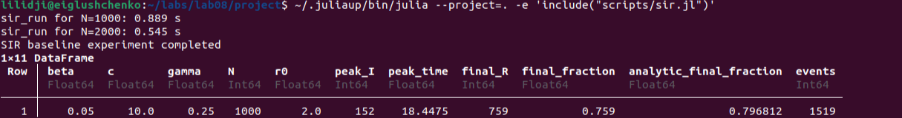
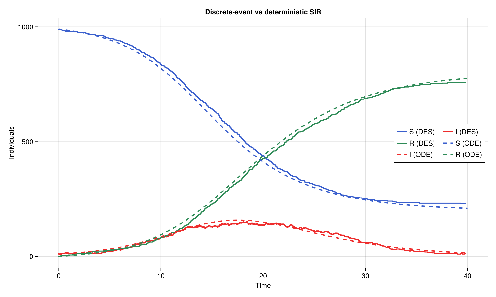
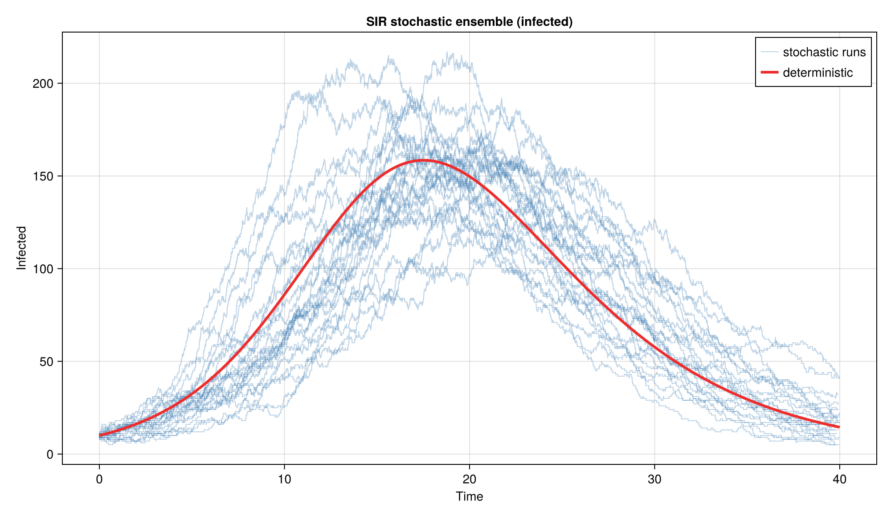
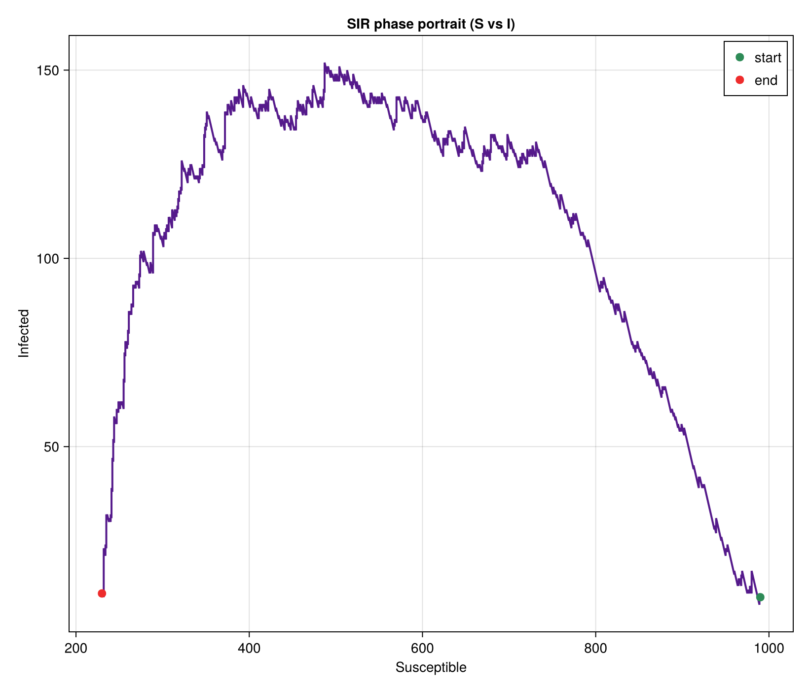
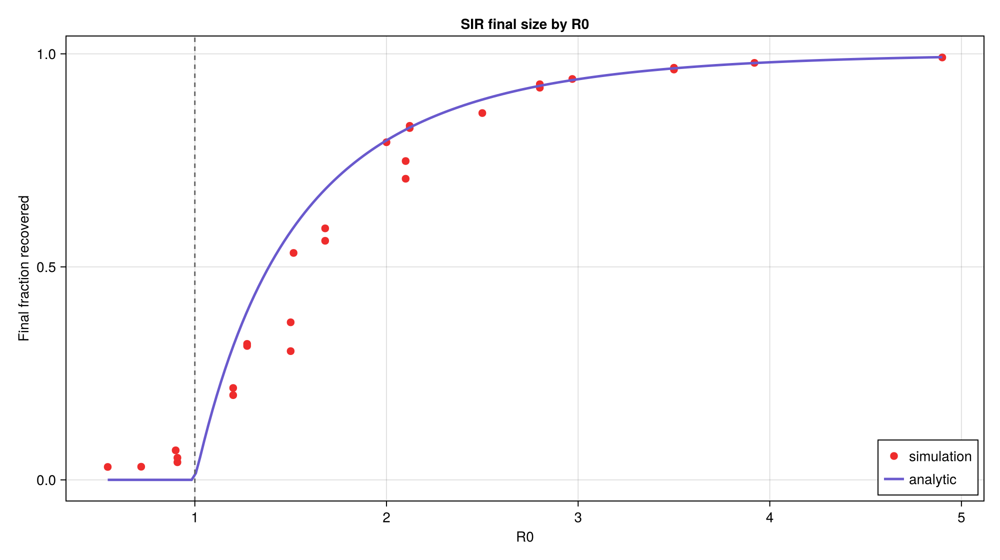
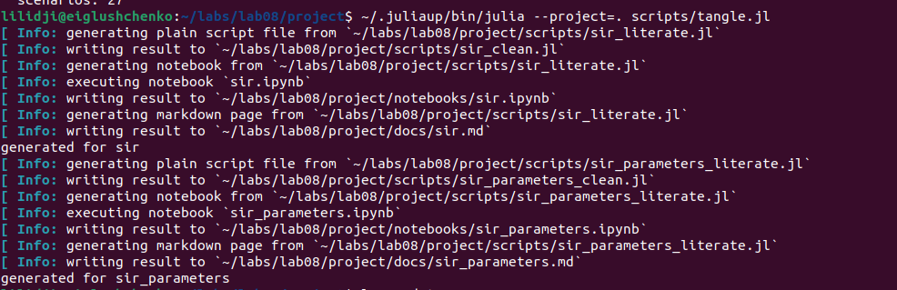
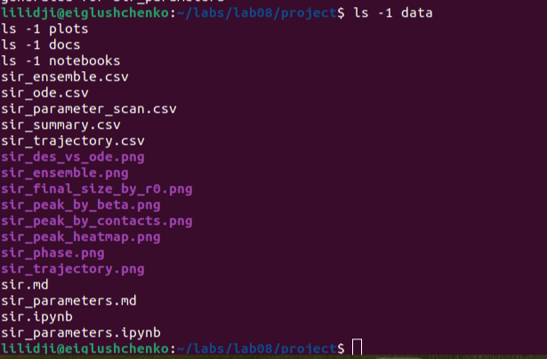

# Отчёт по лабораторной работе №8
Глущенко Евгений Игоревич
2026-05-29

- [<span class="toc-section-number">1</span> Цель работы](#цель-работы)
- [<span class="toc-section-number">2</span> Задание](#задание)
- [<span class="toc-section-number">3</span> Теоретическое
  введение](#теоретическое-введение)
  - [<span class="toc-section-number">3.1</span> Модель
    SIR](#модель-sir)
  - [<span class="toc-section-number">3.2</span> Конечный размер
    эпидемии](#конечный-размер-эпидемии)
  - [<span class="toc-section-number">3.3</span> Дискретно-событийный
    подход](#дискретно-событийный-подход)
  - [<span class="toc-section-number">3.4</span> Воспроизводимая
    организация проекта](#воспроизводимая-организация-проекта)
- [<span class="toc-section-number">4</span> Выполнение лабораторной
  работы](#выполнение-лабораторной-работы)
  - [<span class="toc-section-number">4.1</span> Структура
    проекта](#структура-проекта)
  - [<span class="toc-section-number">4.2</span> Основные команды
    воспроизведения](#основные-команды-воспроизведения)
  - [<span class="toc-section-number">4.3</span> Реализация
    модели](#реализация-модели)
  - [<span class="toc-section-number">4.4</span> Базовый
    эксперимент](#базовый-эксперимент)
  - [<span class="toc-section-number">4.5</span> Анализ чувствительности
    к параметрам](#анализ-чувствительности-к-параметрам)
  - [<span class="toc-section-number">4.6</span> Дополнительные
    модификации](#дополнительные-модификации)
  - [<span class="toc-section-number">4.7</span> Генерация
    literate-материалов](#генерация-literate-материалов)
- [<span class="toc-section-number">5</span> Выводы](#выводы)
- [<span class="toc-section-number">6</span> Приложение. Команды
  воспроизведения](#приложение-команды-воспроизведения)

# Цель работы

Изучить дискретно-событийный подход к имитационному моделированию на
примере классической модели распространения инфекции SIR. Реализовать
стохастическую дискретно-событийную модель в виде программного комплекса
на языке Julia, провести анализ влияния параметров, сравнить результаты
со стохастическим ансамблем и детерминированной системой ОДУ, оценить
производительность и модифицировать модель.

Исполнитель работы: Глущенко Евгений Игоревич. Группа: НФИбд-01-23.
Студенческий билет: 1132239110.

# Задание

В лабораторной работе требовалось:

1.  Создать рабочий каталог для кода и установить необходимые пакеты.
2.  Реализовать дискретно-событийную модель SIR на `ConcurrentSim` и
    `ResumableFunctions`.
3.  Преобразовать код в литературный стиль и сгенерировать из него
    чистый код, Jupyter notebook и документацию в формате Quarto.
4.  Выполнить код из notebook и интегрировать документацию в отчёт.
5.  Добавить в литературный код вычисление для набора параметров (анализ
    чувствительности) и повторить генерацию артефактов.
6.  В качестве дополнительных модификаций: сравнить со стохастическим
    ансамблем и детерминированной системой ОДУ, реализовать
    детерминированную длительность болезни и оценить производительность.

# Теоретическое введение

## Модель SIR

Модель SIR описывает распространение инфекции в популяции постоянного
размера `N`, разбитой на три непересекающихся класса \[1\]:

- `S` (susceptible) — восприимчивые индивиды;
- `I` (infected) — инфицированные и заразные;
- `R` (recovered) — переболевшие и получившие иммунитет.

В детерминированном пределе динамика описывается системой обыкновенных
дифференциальных уравнений

$$\frac{dS}{dt} = -\beta c \frac{S I}{N}, \qquad
\frac{dI}{dt} = \beta c \frac{S I}{N} - \gamma I, \qquad
\frac{dR}{dt} = \gamma I,$$

где `β` — вероятность передачи инфекции при контакте, `c` — частота
контактов одного индивида в единицу времени, `γ` — интенсивность
выздоровления (величина, обратная средней длительности болезни `1/γ`).

Ключевой характеристикой является базовое репродуктивное число

$$R_0 = \frac{\beta c}{\gamma},$$

равное среднему числу вторичных заражений от одного инфицированного в
полностью восприимчивой популяции. При `R_0 > 1` начальное заражение
приводит к эпидемической вспышке, при `R_0 \le 1` инфекция затухает.

## Конечный размер эпидемии

Для модели SIR итоговая доля переболевших `z = R(\infty)/N` при
начальной популяции, близкой к полностью восприимчивой, удовлетворяет
трансцендентному уравнению конечного размера эпидемии \[2\]:

$$z = 1 - e^{-R_0 z}.$$

При `R_0 \le 1` единственным решением является `z = 0` (эпидемии нет),
при `R_0 > 1` появляется положительный корень, который и определяет долю
переболевших. В работе это уравнение решается методом простых итераций и
используется как аналитическая база для сравнения с имитацией.

## Дискретно-событийный подход

В дискретно-событийном моделировании состояние системы меняется только в
моменты наступления событий, а виртуальное время продвигается от события
к событию \[3\]. В отличие от детерминированной системы ОДУ, здесь
воспроизводится стохастическая динамика эпидемии: наблюдаются случайные
флуктуации и возможно раннее вымирание инфекции при малом начальном
числе `I`.

Каждый индивид моделируется как отдельный процесс. Для их реализации
используются возобновляемые функции-генераторы пакета
`ResumableFunctions` \[4\]: макрос `@resumable` позволяет
приостанавливать выполнение функции на операторе `@yield`, не блокируя
поток. Ядром моделирования служит `ConcurrentSim` \[5\], который
управляет виртуальным временем и очередью событий: вызов `timeout`
планирует событие через заданный интервал, а `run` обрабатывает события
в хронологическом порядке.

Пока индивид восприимчив, он ожидает экспоненциально распределённое
время до следующего контакта с параметром `1/c`, выбирает случайного
собеседника и, если тот инфицирован, с вероятностью `β` заражается.
После заражения индивид ждёт экспоненциальное время выздоровления с
параметром `1/γ`. Эффективная интенсивность заражения одного
восприимчивого равна `c \cdot \beta \cdot I/N`, что согласуется с членом
силы инфекции в системе ОДУ. Экспоненциальные распределения времён
обеспечивают марковость процесса.

## Воспроизводимая организация проекта

Структура вычислительного проекта построена на `DrWatson.jl` \[6\], а
сами расчёты выполнены на языке Julia \[7\]. Для генерации производных
представлений единого литературного источника используется `Literate.jl`
\[8\]: из одного файла автоматически получаются исполняемый «чистый»
скрипт, документ Markdown и исполняемый Jupyter notebook \[9\].

# Выполнение лабораторной работы

## Структура проекта

Рабочий каталог лабораторной работы имеет следующий состав:

- `project/src/SIRModels.jl` — модуль с дискретно-событийной моделью,
  детерминированной ОДУ-версией, анализом чувствительности и функциями
  построения графиков;
- `project/scripts/sir.jl` — базовый дискретно-событийный эксперимент;
- `project/scripts/sir_parameters.jl` — анализ чувствительности к
  параметрам;
- `project/scripts/sir_literate.jl`, `sir_parameters_literate.jl` —
  литературные источники;
- `project/scripts/tangle.jl` — генератор literate-артефактов;
- `project/data/` — таблицы результатов в формате CSV;
- `project/plots/` — итоговые графики;
- `project/docs/` — сгенерированные `markdown`-материалы;
- `project/notebooks/` — сгенерированные `ipynb`-файлы;
- `report/` и `presentation/` — оформление отчёта и презентации на
  Quarto.

Сформированные основные артефакты:

- `sir_trajectory.csv` — `1520` точек временного ряда базового прогона;
- `sir_ode.csv` — `801` точка детерминированного решения;
- `sir_summary.csv` — сводка базового прогона;
- `sir_ensemble.csv` — `24` независимых стохастических прогона;
- `sir_parameter_scan.csv` — `27` сценариев анализа чувствительности;
- `docs/` — `2` markdown-файла;
- `notebooks/` — `2` исполняемых notebook-файла;
- `plots/` — `8` графиков PNG.

## Основные команды воспроизведения

Базовая последовательность команд для выполнения лабораторной работы:

``` bash
cd ~/labs/lab08/project
~/.juliaup/bin/julia --project=. -e 'using Pkg; Pkg.instantiate()'
~/.juliaup/bin/julia --project=. -e 'include("scripts/sir.jl")'
~/.juliaup/bin/julia --project=. -e 'include("scripts/sir_parameters.jl")'
~/.juliaup/bin/julia --project=. scripts/tangle.jl
```

Отдельный локальный файл с командами для записи видео вынесен в
`commands-lab08.txt`.

### Фактическое выполнение команд

На <a href="#fig-instantiate" class="quarto-xref">Рисунок 1</a> показан
переход в каталог проекта и активация зависимостей Julia через
`Pkg.instantiate()`.

<div id="fig-instantiate">


Рисунок 1: Инициализация Julia-проекта `lab08`

</div>

Скриншот подтверждает, что окружение проекта поднято из `Project.toml` и
`Manifest.toml`, после чего все последующие сценарии запускались в одном
и том же воспроизводимом окружении.

## Реализация модели

### Структуры данных

Индивид описывается уникальным идентификатором и статусом, а полное
состояние модели хранит объект симуляции, параметры, генератор случайных
чисел и временные ряды численности:

``` julia
mutable struct SIRPerson
    id::Int
    status::Symbol      # :S, :I, :R
end

mutable struct SIRModel
    sim::Simulation
    β::Float64
    c::Float64
    γ::Float64
    det_recovery::Bool
    rng::AbstractRNG
    ta::Vector{Float64}
    Sa::Vector{Int}
    Ia::Vector{Int}
    Ra::Vector{Int}
    individuals::Vector{SIRPerson}
end
```

Для воспроизводимости в модель добавлен генератор `StableRNG`, а флаг
`det_recovery` позволяет переключать длительность болезни между
экспоненциальной и детерминированной.

### Обновление статистики при событиях

Временные ряды `Sa`, `Ia`, `Ra` хранят численность классов: каждая
операция добавляет новую точку, соответствующую текущему модельному
времени.

``` julia
increment!(a::Vector{Int}) = push!(a, a[end] + 1)
decrement!(a::Vector{Int}) = push!(a, a[end] - 1)
carryover!(a::Vector{Int}) = push!(a, a[end])

function infection_update!(sim::Simulation, m::SIRModel)
    push!(m.ta, now(sim))
    decrement!(m.Sa); increment!(m.Ia); carryover!(m.Ra)
end

function recovery_update!(sim::Simulation, m::SIRModel)
    push!(m.ta, now(sim))
    carryover!(m.Sa); decrement!(m.Ia); increment!(m.Ra)
end
```

### Основной процесс агента

Жизненный цикл индивида реализован как возобновляемая функция:

``` julia
@resumable function live(env::Simulation, individual::SIRPerson, m::SIRModel)
    while individual.status == :S
        @yield timeout(env, rand(m.rng, Exponential(1 / m.c)))
        alter = individual
        while alter === individual
            alter = m.individuals[rand(m.rng, 1:length(m.individuals))]
        end
        if alter.status == :I
            if rand(m.rng) < m.β
                individual.status = :I
                infection_update!(env, m)
            end
        end
    end
    if individual.status == :I
        recovery_delay = m.det_recovery ? 1 / m.γ : rand(m.rng, Exponential(1 / m.γ))
        @yield timeout(env, recovery_delay)
        individual.status = :R
        recovery_update!(env, m)
    end
end
```

Благодаря конкурентному выполнению всех агентов (каждый запущен как
отдельный процесс) симуляция естественно воспроизводит стохастическую
динамику эпидемии.

### Создание и запуск модели

Функция `make_sir_model` создаёт популяцию с заданными начальными
статусами и инициализирует временные ряды; `activate_sir!` регистрирует
процессы агентов; `run_sir!` продвигает виртуальное время; `out`
собирает результат в `DataFrame`.

``` julia
function run_sir_des(u0, p, tf; seed = 1234, det_recovery = false)
    m = make_sir_model(u0, p; seed = seed, det_recovery = det_recovery)
    activate_sir!(m)
    run_sir!(m, tf)
    return out(m)
end
```

## Базовый эксперимент

Для базового сценария использованы параметры:

- `u0 = [990, 10, 0]` — начальные `S`, `I`, `R`;
- `p = [0.05, 10.0, 0.25]` — `β`, `c`, `γ`;
- `tmax = 40.0`;
- `seed = 1234`.

Базовое репродуктивное число `R_0 = \beta c / \gamma = 2.0`. Вывод
базового запуска (тайминги отдельных прогонов включают разовый прогрев
JIT-компилятора, систематическая оценка приведена в разделе
производительности):

``` text
sir_run for N=1000: 0.889 s
sir_run for N=2000: 0.545 s
SIR baseline experiment completed
```

После строки завершения сценарий печатает сводный `DataFrame` с
метриками прогона. На
<a href="#fig-sir-baseline-run" class="quarto-xref">Рисунок 2</a>
показан фактический запуск базового сценария `scripts/sir.jl` в
терминале.

<div id="fig-sir-baseline-run">



Рисунок 2: Запуск базового сценария `scripts/sir.jl`

</div>

Основные численные результаты приведены в
<a href="#tbl-sir-summary" class="quarto-xref">Таблица 1</a>.

<div id="tbl-sir-summary">

Таблица 1: Сводка базового эксперимента SIR

| `β` | `c` | `γ` | `R0` | `peak_I` | `peak_time` | `final_R` | `final_fraction` | `analytic_final` | `events` |
|---:|---:|---:|---:|---:|---:|---:|---:|---:|---:|
| 0.05 | 10.0 | 0.25 | 2.0 | 152 | 18.447 | 759 | 0.759 | 0.797 | 1519 |

</div>

На <a href="#fig-sir-trajectory" class="quarto-xref">Рисунок 3</a>
показана динамика численности `S`, `I`, `R` во времени.

<div id="fig-sir-trajectory">


Рисунок 3: Динамика численности `S`, `I`, `R` в базовом сценарии

</div>

Кривая восприимчивых монотонно убывает, число инфицированных проходит
через выраженный пик `152` в момент времени `t ≈ 18.4`, после чего
эпидемия идёт на спад. Итоговое число переболевших `759` близко к
аналитической оценке конечного размера `0.797·1000 ≈ 797`; небольшое
занижение объясняется стохастическим характером дискретной модели и
конечным размером популяции.

### Сравнение с детерминированной моделью

Та же система проинтегрирована как детерминированная система ОДУ методом
Рунге–Кутты 4-го порядка. На
<a href="#fig-sir-des-ode" class="quarto-xref">Рисунок 4</a> наложены
дискретно-событийная (сплошные линии) и детерминированная (штриховые)
траектории.

<div id="fig-sir-des-ode">



Рисунок 4: Сравнение дискретно-событийной и детерминированной моделей

</div>

Детерминированное решение даёт пик `158` инфицированных в момент
`t = 17.5` и итоговую долю переболевших `0.776`. Имитационные значения
(`152` в `t ≈ 18.4`, доля `0.759`) хорошо согласуются с
детерминированной кривой: дискретная модель воспроизводит общую форму
эпидемии, отклоняясь в пределах стохастического разброса. Главное
качественное отличие — наличие случайных флуктуаций, которых лишена
гладкая детерминированная траектория.

### Ансамбль стохастических реализаций

Для оценки разброса выполнено `24` независимых прогона с разными
зёрнами. На
<a href="#fig-sir-ensemble" class="quarto-xref">Рисунок 5</a> тонкими
линиями показаны траектории числа инфицированных, жирной красной —
детерминированная кривая.

<div id="fig-sir-ensemble">



Рисунок 5: Ансамбль стохастических траекторий числа инфицированных

</div>

Средняя высота пика по ансамблю составила `172.0`, средняя итоговая доля
переболевших `0.771`. Отдельные прогоны приведены в
<a href="#tbl-sir-ensemble" class="quarto-xref">Таблица 2</a>.

<div id="tbl-sir-ensemble">

Таблица 2: Выбранные прогоны `sir_ensemble.csv`

| `run_id` | `peak_I` | `peak_time` | `final_R` | `final_fraction` | `extinct` |
|---------:|---------:|------------:|----------:|-----------------:|:---------:|
|        1 |      172 |      16.730 |       781 |            0.781 |   false   |
|        7 |      195 |      12.072 |       818 |            0.818 |   false   |
|       17 |      215 |      15.631 |       841 |            0.841 |   false   |
|       22 |      133 |      26.640 |       724 |            0.724 |   false   |
|       23 |      217 |      18.797 |       796 |            0.796 |   false   |

</div>

Высота пика по прогонам меняется от `133` до `217`, а время пика — от
`12` до `27`. При `R_0 = 2` и начальном `I_0 = 10` ни один из `24`
прогонов не затух на ранней стадии: вероятность вымирания инфекции при
достаточно большом начальном числе заражённых мала.

### Фазовый портрет

На <a href="#fig-sir-phase" class="quarto-xref">Рисунок 6</a> показан
фазовый портрет: зависимость числа инфицированных от числа
восприимчивых.

<div id="fig-sir-phase">



Рисунок 6: Фазовый портрет `S`–`I` базового прогона

</div>

Траектория начинается в правом нижнем углу (много восприимчивых, мало
инфицированных), поднимается к пику по мере исчерпания восприимчивых и
возвращается к нулю инфицированных. Пик достигается вблизи
`S = N/R_0 = 500` — порога, при котором сила инфекции перестаёт
компенсировать выздоровления.

### Фрагмент временного ряда `sir_trajectory.csv`

Первые строки временного ряда базового прогона приведены в
<a href="#tbl-sir-traj" class="quarto-xref">Таблица 3</a>.

<div id="tbl-sir-traj">

Таблица 3: Начало временного ряда `sir_trajectory.csv`

|   `t` | `S` | `I` | `R` |
|------:|----:|----:|----:|
| 0.000 | 990 |  10 |   0 |
| 0.004 | 989 |  11 |   0 |
| 0.161 | 989 |  10 |   1 |
| 0.235 | 989 |   9 |   2 |
| 0.250 | 989 |   8 |   3 |
| 0.276 | 988 |   9 |   3 |

</div>

Каждая строка соответствует одному событию (заражению или
выздоровлению): при заражении `S` уменьшается, а `I` растёт, при
выздоровлении `I` уменьшается, а `R` растёт.

## Анализ чувствительности к параметрам

В сценарии `scripts/sir_parameters.jl` исследование выполняется на
сетке:

- `betas = [0.03, 0.05, 0.07]`;
- `contacts = [6.0, 10.0, 14.0]`;
- `gammas = [0.2, 0.25, 0.33]`;
- `tmax = 40.0`, `runs = 6`, `seed = 2000`.

Для каждого из `27` наборов параметров выполняется `6` независимых
прогонов, метрики усредняются. Вывод сценария:

``` text
SIR parameter scan completed
  scenarios: 27
```

На <a href="#fig-sir-scan-run" class="quarto-xref">Рисунок 7</a> показан
фактический запуск анализа чувствительности `scripts/sir_parameters.jl`.

<div id="fig-sir-scan-run">


Рисунок 7: Запуск сценария `scripts/sir_parameters.jl`

</div>

Влияние параметров удобно выразить через `R_0`. В
<a href="#tbl-sir-scan-c10" class="quarto-xref">Таблица 4</a> приведены
сценарии при фиксированной частоте контактов `c = 10`.

<div id="tbl-sir-scan-c10">

Таблица 4: Сценарии при `c = 10`

|  `β` |  `γ` | `R0` | `mean_peak_I` | `mean_final_fraction` | `analytic_final` |
|-----:|-----:|-----:|--------------:|----------------------:|-----------------:|
| 0.03 | 0.33 | 0.91 |          14.0 |                 0.052 |            0.000 |
| 0.03 | 0.25 | 1.20 |          37.3 |                 0.199 |            0.314 |
| 0.03 | 0.20 | 1.50 |          78.2 |                 0.370 |            0.583 |
| 0.05 | 0.25 | 2.00 |         192.3 |                 0.793 |            0.797 |
| 0.05 | 0.20 | 2.50 |         244.5 |                 0.861 |            0.893 |
| 0.07 | 0.25 | 2.80 |         292.5 |                 0.929 |            0.925 |
| 0.07 | 0.20 | 3.50 |         373.8 |                 0.967 |            0.966 |

</div>

Видно пороговое поведение: при `R_0 < 1` (например `R_0 = 0.91`)
эпидемия не развивается, пик остаётся вблизи начального `I_0 = 10`, а
доля переболевших близка к нулю. С ростом `R_0` высота пика и итоговая
доля переболевших монотонно растут, приближаясь к единице при больших
`R_0`.

Отдельного внимания заслуживает область умеренных `R_0 ≈ 1.2…1.5`: здесь
имитационная доля переболевших систематически ниже аналитической
(`0.199` против `0.314` при `R_0 = 1.2`; `0.370` против `0.583` при
`R_0 = 1.5`). Причина в том, что при малом избытке `R_0` над единицей
значительная часть стохастических прогонов затухает рано, занижая
среднее, тогда как аналитическая формула описывает лишь те реализации, в
которых эпидемия успела разгореться.

На <a href="#fig-sir-peak-beta" class="quarto-xref">Рисунок 8</a>
показана высота пика как функция вероятности передачи `β`.

<div id="fig-sir-peak-beta">


Рисунок 8: Высота пика инфицированных по вероятности передачи `β`

</div>

На <a href="#fig-sir-peak-c" class="quarto-xref">Рисунок 9</a> показана
высота пика как функция частоты контактов `c`.

<div id="fig-sir-peak-c">


Рисунок 9: Высота пика инфицированных по частоте контактов `c`

</div>

Оба параметра, `β` и `c`, входят в `R_0` симметрично через произведение
`βc`, поэтому увеличение любого из них одинаково усиливает эпидемию: пик
растёт, а его положение смещается на более ранние сроки.

На <a href="#fig-sir-final-r0" class="quarto-xref">Рисунок 10</a>
показана итоговая доля переболевших в зависимости от `R_0` вместе с
аналитической кривой конечного размера.

<div id="fig-sir-final-r0">



Рисунок 10: Итоговая доля переболевших по `R0`

</div>

Имитационные точки близки к аналитической кривой `z = 1 - e^{-R_0 z}`
при `R_0 > 2`. Вблизи порога `R_0 = 1` имитация лежит ниже кривой по
описанной выше причине стохастического затухания.

На <a href="#fig-sir-heatmap" class="quarto-xref">Рисунок 11</a>
показана тепловая карта высоты пика по сетке `(β, γ)` при `c = 6`.

<div id="fig-sir-heatmap">


Рисунок 11: Тепловая карта высоты пика по `(β, γ)`

</div>

Карта подтверждает закономерность: пик растёт с увеличением вероятности
передачи `β` и с уменьшением интенсивности выздоровления `γ` (то есть с
увеличением длительности болезни `1/γ`), поскольку обе тенденции
увеличивают `R_0`.

## Дополнительные модификации

### Детерминированная длительность болезни

В модель добавлен флаг `det_recovery`, заменяющий экспоненциальное время
выздоровления `rand(Exponential(1/γ))` на фиксированную величину `1/γ`.
При одинаковом зерне детерминированная длительность убирает «хвосты»
распределения времени болезни и делает выздоровления более синхронными,
что слегка сужает пик эпидемии. Реализация выполнена без дублирования
логики — выбор делается одной строкой внутри процесса `live`.

### Оценка производительности

Время одного прогона `run_sir_des` измерено для популяций разного
размера после прогрева компилятора (медиана нескольких прогонов),
<a href="#tbl-sir-bench" class="quarto-xref">Таблица 5</a>. В отличие от
разовых таймингов базового запуска, эти значения монотонно растут с
числом агентов.

<div id="tbl-sir-bench">

Таблица 5: Время выполнения `sir_run` по размеру популяции

|   `N` | Время прогона, с |
|------:|-----------------:|
|  1000 |            0.229 |
|  2000 |            1.074 |
|  5000 |            1.944 |
| 10000 |            5.628 |

</div>

Число обрабатываемых событий растёт примерно линейно с числом агентов,
поэтому время также растёт близко к линейному. Для популяции `10000`
индивидов один прогон занимает около `5.6` с. Возможные направления
оптимизации: предварительная генерация случайных чисел, замена
индивидуальных процессов агрегированным событийным циклом (как в прямом
методе Гиллеспи \[10\]), а также повторное использование объектов
распределений вместо их создания на каждом контакте.

## Генерация literate-материалов

Сценарий `scripts/tangle.jl` автоматически формирует производные
представления из литературных источников:

``` julia
for script_path in scripts
    stem = splitext(basename(script_path))[1]
    name = replace(stem, "_literate" => "")
    Literate.script(script_path, scriptsdir(); name = "$(name)_clean", credit = false)
    Literate.notebook(script_path, projectdir("notebooks"); name = name, execute = true, credit = false)
    Literate.markdown(script_path, projectdir("docs"); name = name, credit = false)
end
```

После запуска были получены:

- `docs/sir.md`, `docs/sir_parameters.md`;
- `notebooks/sir.ipynb`, `notebooks/sir_parameters.ipynb`;
- `scripts/sir_clean.jl`, `scripts/sir_parameters_clean.jl`.

Вывод сценария:

``` text
generated for sir
generated for sir_parameters
```

На <a href="#fig-tangle-run" class="quarto-xref">Рисунок 12</a> показан
фактический запуск `scripts/tangle.jl` с генерацией `clean`-скриптов,
`markdown`-документов и исполняемых notebook-файлов.

<div id="fig-tangle-run">



Рисунок 12: Запуск сценария `scripts/tangle.jl`

</div>

Notebook-файлы выполняются при генерации (`execute = true`), поэтому их
вывод подтверждает работоспособность кода.

После генерации была выполнена проверка состава каталогов `data/`,
`plots/`, `docs/` и `notebooks/`
(<a href="#fig-check-files" class="quarto-xref">Рисунок 13</a>). Она
подтверждает наличие таблиц, графиков и literate-артефактов, необходимых
для включения в релиз и отчётные материалы.

<div id="fig-check-files">



Рисунок 13: Проверка содержимого каталогов результатов

</div>

Таким образом, лабораторная работа подготовлена в полностью
воспроизводимом формате: исходные сценарии, их чистые версии,
markdown-документы и notebook-файлы остаются синхронизированными.

# Выводы

В лабораторной работе реализована стохастическая дискретно-событийная
модель распространения инфекции SIR на основе `ConcurrentSim` и
`ResumableFunctions`, где каждый индивид моделируется как отдельный
конкурентный процесс. Базовый эксперимент при `R_0 = 2` дал пик `152`
инфицированных и итоговую долю переболевших `0.759`, что согласуется как
с детерминированным решением системы ОДУ (`158` и `0.776`), так и с
аналитической оценкой конечного размера эпидемии (`0.797`).

Ансамбль из `24` прогонов показал стохастический разброс высоты пика
(`133…217`) и подтвердил низкую вероятность раннего вымирания инфекции
при `R_0 = 2`. Анализ чувствительности на сетке из `27` наборов
параметров выявил пороговое поведение по `R_0`: при `R_0 \le 1` эпидемия
затухает, при `R_0 > 1` её масштаб монотонно растёт, а вблизи порога
проявляется характерное занижение средней доли переболевших из-за
стохастического затухания.

Дополнительно реализована детерминированная длительность болезни,
выполнена оценка производительности (до `10000` агентов) и проведено
сравнение со стохастическим и детерминированным вариантами.
Использование `DrWatson.jl` и `Literate.jl` позволило оформить результат
как воспроизводимый вычислительный проект с чистыми скриптами,
markdown-документами и исполняемыми notebook-файлами.

# Приложение. Команды воспроизведения

``` bash
cd ~/labs/lab08/project
~/.juliaup/bin/julia --project=. -e 'using Pkg; Pkg.instantiate()'
~/.juliaup/bin/julia --project=. -e 'include("scripts/sir.jl")'
~/.juliaup/bin/julia --project=. -e 'include("scripts/sir_parameters.jl")'
~/.juliaup/bin/julia --project=. scripts/tangle.jl
cd ~/labs/lab08/report
quarto render simulation-modeling-lab08-report.qmd --to pdf
quarto render simulation-modeling-lab08-report.qmd --to docx
cd ~/labs/lab08/presentation
quarto render simulation-modeling-lab08-presentation.qmd --to beamer
quarto render simulation-modeling-lab08-presentation.qmd --to revealjs
quarto render simulation-modeling-lab08-presentation.qmd --to pptx
```

<div id="refs" class="references csl-bib-body" entry-spacing="0">

<div id="ref-kermack_mckendrick_1927" class="csl-entry">

<span class="csl-left-margin">1.
</span><span class="csl-right-inline">Kermack W. O., McKendrick A. G. [A
Contribution to the Mathematical Theory of
Epidemics](https://doi.org/10.1098/rspa.1927.0118) // Proceedings of the
Royal Society A. 1927. Т. 115, № 772. С. 700–721.</span>

</div>

<div id="ref-allen_2010" class="csl-entry">

<span class="csl-left-margin">2.
</span><span class="csl-right-inline">Allen L. J. S. An Introduction to
Stochastic Processes with Applications to Biology. 2-е изд. Boca Raton:
CRC Press, 2010.</span>

</div>

<div id="ref-banks_2010" class="csl-entry">

<span class="csl-left-margin">3.
</span><span class="csl-right-inline">Banks J. и др. Discrete-Event
System Simulation. 5-е изд. Upper Saddle River, NJ: Pearson,
2010.</span>

</div>

<div id="ref-lauwens_2017" class="csl-entry">

<span class="csl-left-margin">4.
</span><span class="csl-right-inline">Lauwens B. [ResumableFunctions: C#
Sharp Style Generators in
Julia](https://github.com/BenLauwens/ResumableFunctions.jl) //
Proceedings of JuliaCon. 2017.</span>

</div>

<div id="ref-concurrentsim" class="csl-entry">

<span class="csl-left-margin">5.
</span><span class="csl-right-inline"><span class="nocase">Lauwens B.,
contributors</span>. [ConcurrentSim.jl: Discrete Event Process Oriented
Simulation
Framework](https://github.com/JuliaDynamics/ConcurrentSim.jl).
2024.</span>

</div>

<div id="ref-drwatson" class="csl-entry">

<span class="csl-left-margin">6.
</span><span class="csl-right-inline"><span class="nocase">Datseris G. и
др.</span> [DrWatson.jl
Documentation](https://juliadynamics.github.io/DrWatson.jl/stable/).
2024.</span>

</div>

<div id="ref-julia_2017" class="csl-entry">

<span class="csl-left-margin">7.
</span><span class="csl-right-inline">Bezanson J. и др. [Julia: A Fresh
Approach to Numerical Computing](https://doi.org/10.1137/141000671).
2017.</span>

</div>

<div id="ref-literate_jl" class="csl-entry">

<span class="csl-left-margin">8.
</span><span class="csl-right-inline"><span class="nocase">Ekre F.,
contributors</span>. [Literate.jl
Documentation](https://fredrikekre.github.io/Literate.jl/v2/).
2024.</span>

</div>

<div id="ref-knuth_1984" class="csl-entry">

<span class="csl-left-margin">9.
</span><span class="csl-right-inline">Knuth D. E. [Literate
Programming](https://doi.org/10.1093/comjnl/27.2.97) // The Computer
Journal. 1984. Т. 27, № 2. С. 97–111.</span>

</div>

<div id="ref-gillespie_1977" class="csl-entry">

<span class="csl-left-margin">10.
</span><span class="csl-right-inline">Gillespie D. T. [Exact Stochastic
Simulation of Coupled Chemical
Reactions](https://doi.org/10.1021/j100540a008) // The Journal of
Physical Chemistry. 1977. Т. 81, № 25. С. 2340–2361.</span>

</div>

</div>
